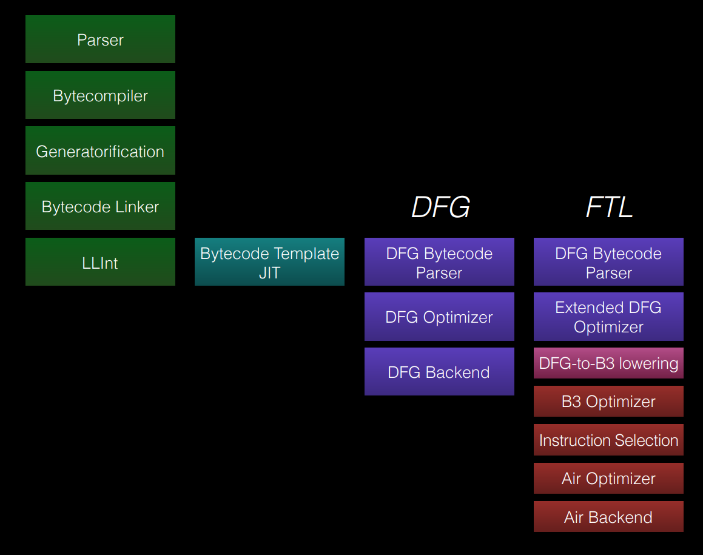
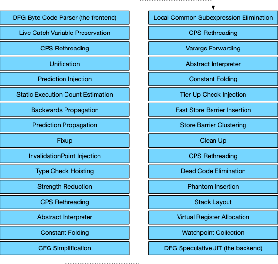
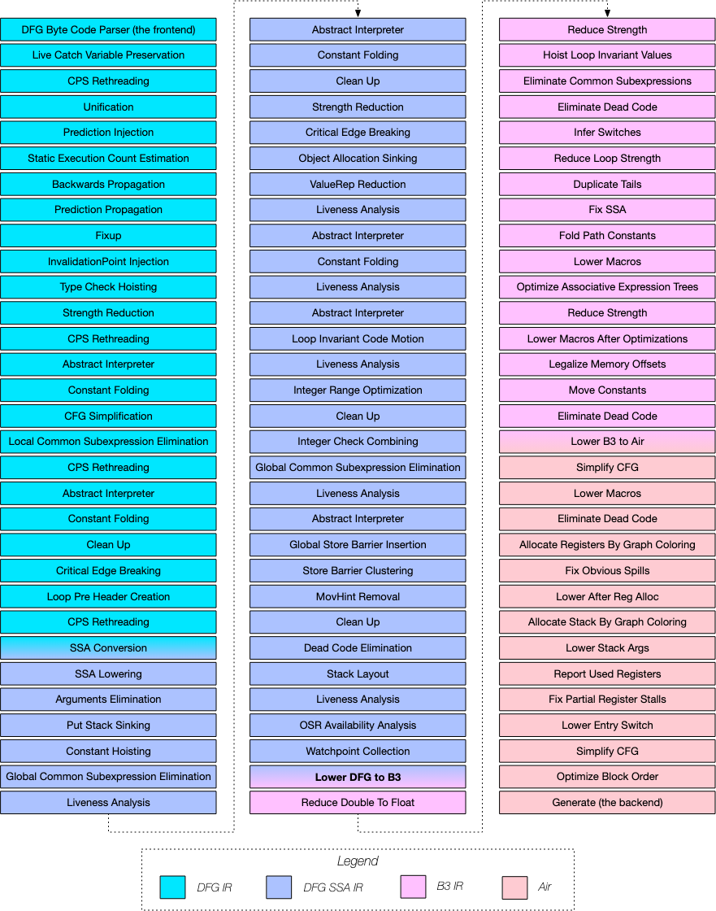
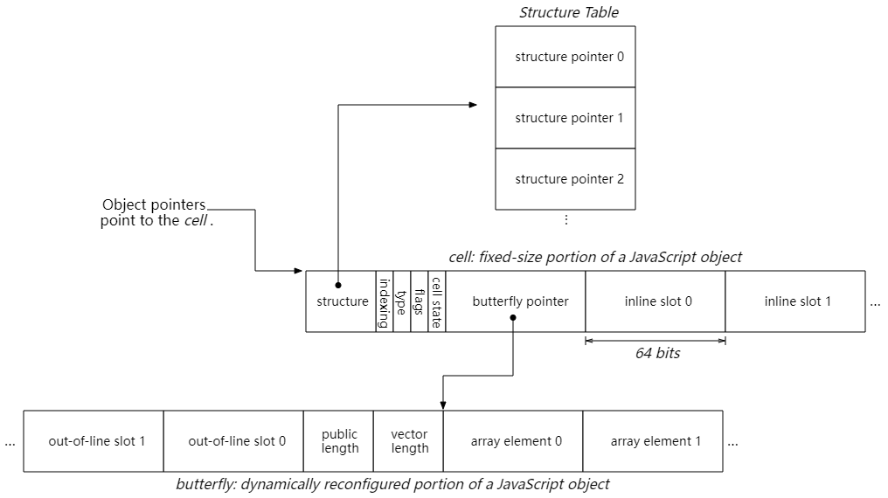

# JavaScriptCore Root Cause 分析要点

## 概述

JavaScriptCore Root Cause 分析主要围绕执行层级、JIT 优化链路和对象模型展开。执行层级用于定位问题暴露位置，优化链路用于检查语义和推测条件是否被正确保留，对象模型用于核对运行时内存布局。

## 引擎架构

JSC 执行链路包括 Parser、Bytecode、LLInt、Baseline JIT、DFG JIT 和 FTL JIT。Root Cause 分析应首先确定异常暴露在哪一层。

LLInt 与 Baseline 问题通常与字节码语义、inline cache、对象布局或 runtime helper 相关。DFG 与 FTL 问题通常与类型推测、图变换、lowering、clobber 信息、OSR entry、OSR exit 状态同步相关。

## DFG 与 FTL 优化 Pipeline

冷代码先经过 LLInt 与 Baseline 执行，并在执行过程中收集 profile。热代码进入 DFG，DFG 基于 profile 建立更激进的类型与控制流推测。继续升温后进入 FTL，FTL 将 DFG 图 lowering 到 B3 与 Air 后端并生成机器码。

DFG 层问题重点检查 phase 是否错误删除、重排或弱化语义节点。FTL 层问题重点检查 DFG-to-B3 lowering、B3 优化、Air 优化、指令选择和寄存器分配。JIT 类型漏洞常见根因是上层推测条件未在后续层级持续维护。

## 对象模型

JSC 对象访问主要涉及 `JSCell`、`Structure` 和 `Butterfly`。

| 结构 | 说明 |
|---|---|
| `JSCell` | 保存对象基础元信息 |
| `Structure` | 描述对象形状、类型和属性布局 |
| `Butterfly` | 保存 indexed storage 与 out-of-line property |

分析对象相关问题时，应比较代码推测布局与对象真实布局。`Structure` transition、`Butterfly` 重分配、indexed storage 模式切换都会影响偏移、类型判断和 alias 关系。

## 分析流程

### 确认异常层级

先区分异常发生在解释器、Baseline、DFG 还是 FTL。若 PoC 仅在 DFG 或 FTL 下触发，分析范围可收敛到优化层和后端生成路径。

### 区分语义问题与布局问题

语义问题通常表现为 side effect、exception edge、ToNumber、ToString、call clobber 等语义未被正确保留。布局问题通常表现为 `Structure` 变化未被观察、数组 indexing type 切换后仍按旧布局访问、`Butterfly` 状态与访问路径不一致。

### 对齐字节码、图和机器码

分析顺序建议为 `bytecode -> graph -> disassembly`。字节码异常说明前端或 bytecode generator 已产生错误语义；图异常说明 DFG / FTL phase 存在错误变换；机器码异常说明 lowering、后端优化或指令选择阶段存在问题。

## 检查项

- 异常是否只在特定执行层级出现
- `JSValue` 表示是否被错误判定为 `Int32`、`Double` 或 Cell 指针
- `Structure` transition、watchpoint、speculation check 是否正确失效
- `Butterfly` 与 indexed storage 模式变化是否反映到后续访问
- side effect、call、exception edge、clobber 信息是否被低估
- OSR entry / exit 前后值表示和对象状态是否一致
- DFG、FTL、B3、Air 各层是否持续维护相同前提条件

## 输出材料

Root Cause 分析常用材料包括：

- `jsc -d` 输出的字节码
- `--verboseCompilation` 输出的编译日志
- `--verboseOSR` 输出的 OSR 信息
- `--dumpGraphAtEachPhase` 输出的优化图
- `--dumpDFGGraphAtEachPhase`、`--dumpDFGFTLGraphAtEachPhase`、`--dumpB3GraphAtEachPhase`、`--dumpAirGraphAtEachPhase` 输出的分层图
- `--dumpDisassembly` 与 `--dumpFTLDisassembly` 输出的反汇编
