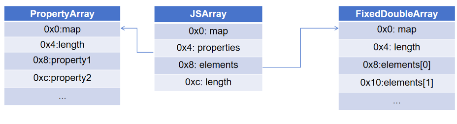
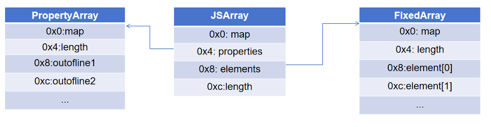

JavaScript 里的数组在 V8 里仍然是对象，只是命名属性和整数下标走的是两条路径。`arr.a = 1` 走 `properties`，`arr[0] = 1` 走 `elements`。

下面几张图都是逻辑布局图，不对应某个固定版本下的精确偏移。

## JSArray 先看哪几块

一个普通 `JSArray` 先看四块：`map`、`properties`、`elements`、`length`。`map` 决定对象怎么解释，`elements` 指向数组元素的 backing store，`length` 是 JavaScript 层看到的长度。

## Map 和 elements kind

数组这里最关键的是 `map`。不同 `map` 对应不同 `elements kind`，也就决定了 `elements` 应该按什么类型去读。`PACKED_SMI_ELEMENTS` 是小整数数组，`PACKED_DOUBLE_ELEMENTS` 是浮点数组，`PACKED_ELEMENTS` 是通用 tagged 数组；前面加上 `HOLEY`，表示数组里允许空洞。

## `FixedDoubleArray` 和 `FixedArray`

像 `let arr = [1.1, 2.2, 3.3]` 这种纯浮点数组，`elements` 通常指向 `FixedDoubleArray`。后面的元素按连续的 8 字节 double 存放。

*图：`PACKED_DOUBLE_ELEMENTS` 一类数组的 `elements` 通常指向 `FixedDoubleArray`。数组对象本体和 double backing store 是两块独立对象。*

对象数组、混合类型数组，以及已经泛化后的数组，`elements` 更常见的是 `FixedArray`。这里的槽位放的是 tagged value；在 64 位并启用 pointer compression 的场景下，通常按 4 字节看。

*图：对象数组只是 `PACKED_ELEMENTS` 的常见形态。`FixedArray` 里放的是 tagged 槽位，槽位内容往往还要继续跟着引用追下去。*

`PACKED_SMI_ELEMENTS` 也走 `FixedArray`，只是槽位里装的是 `Smi`。

## elements kind 的变化

`elements kind` 不是固定的，通常只会往更通用的方向变化。最常见的是 `PACKED_SMI_ELEMENTS -> PACKED_DOUBLE_ELEMENTS -> PACKED_ELEMENTS`：一开始全是小整数时走 `PACKED_SMI_ELEMENTS`，写入浮点数后会变成 `PACKED_DOUBLE_ELEMENTS`，这时 `elements` 会从 `FixedArray` 换成 `FixedDoubleArray`；再写入对象、字符串这类普通 tagged 值后，会继续降级成 `PACKED_ELEMENTS`，`elements` 又回到 `FixedArray`，原来的 double 也会按 `HeapNumber` 引用来存。

另一条常见变化是 `PACKED_* -> HOLEY_*`。数组里一旦出现空洞，`map` 就会切到对应的 `HOLEY` 版本。这个变化通常不改 backing store 的大类：`*_DOUBLE_*` 还是 `FixedDoubleArray`，其余一般还是 `FixedArray`，只是数组从密集模式变成了稀疏模式。

## 常用对应表

  <table class="comparison-table__table">
    <thead>
      <tr>
        <th>elements kind</th>
        <th>backing store</th>
        <th>槽大小</th>
        <th>典型内容</th>
      </tr>
    </thead>
    <tbody>
      <tr>
        <td>
          

            PACKED_SMI_ELEMENTS
            HOLEY_SMI_ELEMENTS
          

        </td>
        <td><code>FixedArray</code></td>
        <td><strong>4</strong> 字节</td>
        <td><code>Smi</code></td>
      </tr>
      <tr>
        <td>
          

            PACKED_DOUBLE_ELEMENTS
            HOLEY_DOUBLE_ELEMENTS
          

        </td>
        <td><code>FixedDoubleArray</code></td>
        <td><strong>8</strong> 字节</td>
        <td><code>Float64</code></td>
      </tr>
      <tr>
        <td>
          

            PACKED_ELEMENTS
            HOLEY_ELEMENTS
          

        </td>
        <td><code>FixedArray</code></td>
        <td><strong>4</strong> 字节</td>
        <td>tagged value / 对象引用</td>
      </tr>
    </tbody>
  </table>

## 参考资料

[V8 Team, Fast properties in V8](https://v8.dev/blog/fast-properties)

[V8 Team, Elements kinds in V8](https://v8.dev/blog/elements-kinds)

[V8 Team, Pointer Compression in V8](https://v8.dev/blog/pointer-compression)
