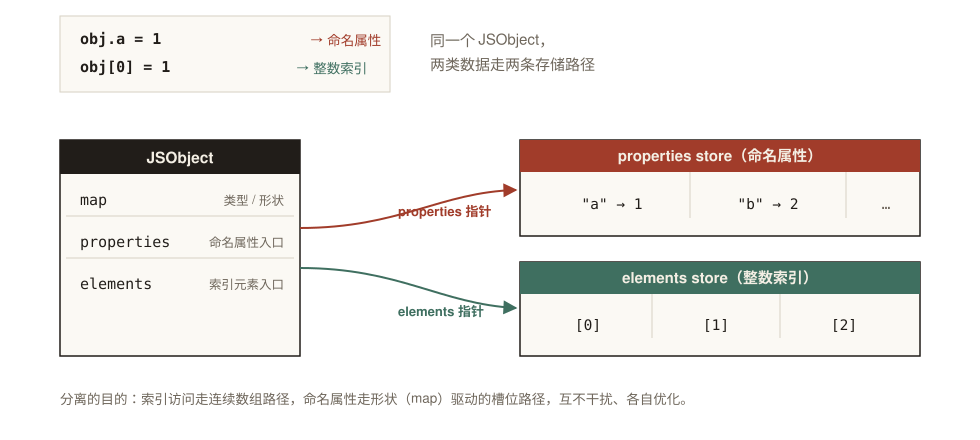
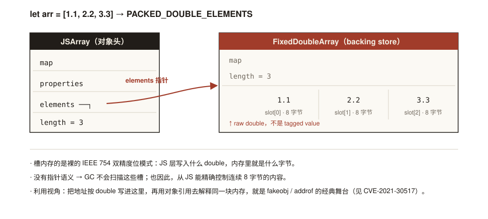
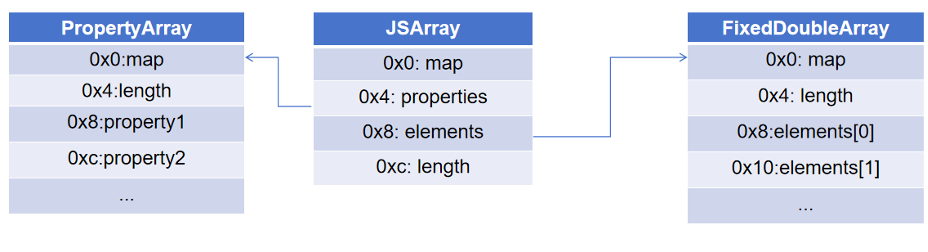
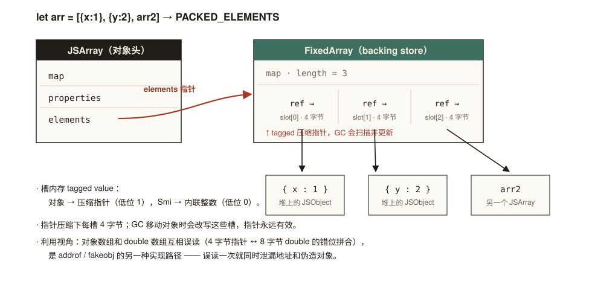
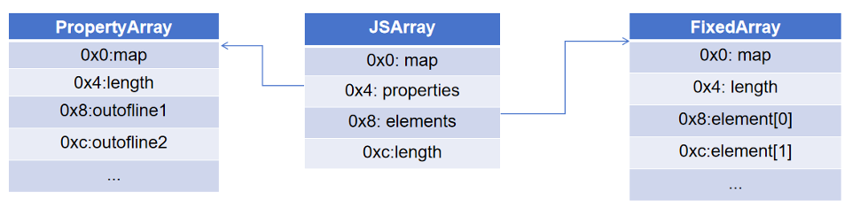
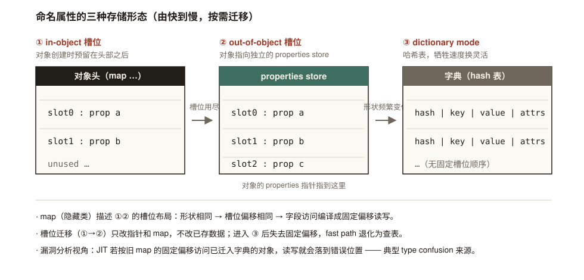

# V8 数组的内存布局

## 为什么从数组讲起

V8 的漏洞利用，绝大多数最终都落在"数组的内存表示"上：越界读写发生在 elements 里，`addrof`/`fakeobj` 靠 double 数组和对象数组的互相误读，伪造对象头摆在 double 数组的 backing store 里。不理解数组的真实内存形态，就看不懂利用代码在做什么。

这篇文章用一个数组从创建到变形的全过程，把对象头、elements、properties 三件事讲清楚。所有结论都可以用 `%DebugPrint` 亲手验证。

## 一、一个数组，其实是"对象 + 仓库"

先建立总的图景。JavaScript 里 `obj.a = 1` 和 `obj[0] = 1` 看起来只是写法不同，在 V8 内部却走两条完全不同的存储路径：



每个 JSObject 头部都有三个关键字段：

| 字段 | 作用 |
|---|---|
| `map` | 描述这个对象的形状：类型、elements kind、属性槽位布局 |
| `properties` | 命名属性的入口（指向属性仓库，见第五节） |
| `elements` | 整数索引元素的入口（指向本节的主角） |

用 `%DebugPrint` 看一个最普通的数组：

```js
// arr.js
let arr = [1.1, 2.2, 3.3];
%DebugPrint(arr);
```

```bash
./d8 --allow-natives-syntax arr.js
```

输出里能看到 elements kind、`elements` 指针和 length 字段。**先看 elements kind，再看 elements 指针，最后才看 length**——这个顺序是后面所有分析的习惯。

## 二、elements 的两种仓库

### 1. 纯浮点数组：FixedDoubleArray

```js
let arr = [1.1, 2.2, 3.3];
```



调试输出中的实际观察：



三个关键事实：

1. **槽里是裸的 8 字节 IEEE 754 double**，不是 tagged value。你在 JS 层写 `1.1`，内存里就是 `1.1` 的位模式，精确可控。
2. **GC 不扫描这些槽**（没有指针语义），所以内容不会被 GC 意外改写。
3. 正因为"JS 层能精确控制连续 8 字节"，double 数组的 backing store 成了**摆放伪造对象头的标准工地**——[CVE-2021-30517](CVE-2021-30517分析.md) 的 fake array 就是这么布置的。

### 2. 对象数组：FixedArray

```js
let objs = [{x:1}, {y:2}, anotherArr];
```



调试输出中的实际观察：



与 double 数组的本质区别：**槽里是 tagged value**——对象存压缩指针（4 字节，低位 1），小整数存 Smi（低位 0）。GC 移动对象时会扫描并改写这些指针。

纯 `PACKED_SMI_ELEMENTS` 数组也用 FixedArray，只是槽里全是 Smi。

**利用视角——为什么两种数组的互转是经典原语**：double 槽按 8 字节解释、对象槽按 4 字节压缩指针解释。一旦让引擎"用对象数组的眼睛看 double 数组的内存"（或反过来），一次错位读就同时得到 `addrof`（把指针当 double 读出地址）和 `fakeobj`（把 double 当指针造出对象）。30517 的 SuperIC confusion、以及众多历史漏洞，本质都是制造这种互读。

## 三、elements kind 会"单向升级"

写入不同类型的值，数组的 elements kind 沿一个方向迁移，backing store 跟着换：

```text
PACKED_SMI_ELEMENTS → PACKED_DOUBLE_ELEMENTS → PACKED_ELEMENTS
        （任何一步出现空洞）→ HOLEY_*
```

亲手观察一次（接前面的 `arr.js`）：

```js
let a = [1, 2, 3];        // PACKED_SMI_ELEMENTS
%DebugPrint(a);
a.push(1.1);              // 迁移到 PACKED_DOUBLE_ELEMENTS，换 FixedDoubleArray
%DebugPrint(a);
a.push({});               // 迁移到 PACKED_ELEMENTS，换 FixedArray
%DebugPrint(a);
```

两次迁移，注意两件事同时变化：**map 变了**（elements kind 记录在 map 里），**elements 指针变了**（旧仓库内容被搬运到新类型仓库）。两次迁移的结构变化：

![let a = [1, 2, 3]; a.push(1.1) — SMI 数组迁移为 double 数组](images/v8-elements-transition-smi-to-double.svg)

![a = [1.0, 2.0]; a.push({x:1}) — double 数组迁移为对象数组](images/v8-elements-transition-double-to-object.svg)

迁移规则对漏洞分析的含义：

- **只升不降**：`[1.1]` 写回整数 `1` 不会变回 SMI 数组，double 仓库里存的是 `1.0`。
- **map 变更 = 优化代码失效点**：JIT 按"当前 map + elements kind"生成固定偏移的访问代码；迁移后旧代码必须 deopt 或被 CheckGuard 拦截。绕过这个检查的漏洞（如 [CVE-2025-12433](CVE-2025-12433分析.md) 一类"检查被消掉"的问题）就会让旧布局代码跑在新布局内存上。
- **HOLEY 的代价**：一旦出现空洞，访问必须经过 hole 检查（`the_hole` 不能泄漏到 JS 层）。12433 正是 hole 检查被错误消除的案例。

## 四、length、capacity 与越界

JSArray 头部的 `length` 是 JS 层可见长度；backing store 自己还有 `length`（容量）。两者由引擎负责保持一致：

- 正常扩容：先分配更大 backing store、搬数据、再更新 JSArray 的 `length`——一套动作。
- 越界漏洞的统一形态：**让两者（或与优化器的认知）失配**。索引边界检查如果基于过期/错误的长度信息，写 `arr[n]` 就落到了仓库之外，破坏相邻对象——这就是 OOB 的全部原理。

分析任何数组相关漏洞时，先问三个问题：边界检查用的长度来自哪里？它何时更新？优化器对它的假设是否和运行时一致？

## 五、命名属性的另一条路：properties

数组也是对象，`arr.name = value` 走的是 properties 路径。它有自己的三种形态，迁移方向同样"由快到慢"：



- **in-object 槽位**：对象创建时预留在头部之后，访问最快。
- **properties store**：槽位用尽后，对象通过 `properties` 指针指向独立仓库。
- **dictionary mode**：属性增删频繁、形状退化为哈希表，失去固定偏移。

map（隐藏类）记录着 ①② 的槽位布局：**形状相同的对象共享同一个 map，字段访问因此能编译成固定偏移读写**。这是 V8 快速路径的根基，也是 type confusion 的常见发源地——JIT 若按旧 map 的偏移访问已变形的对象，读写就落到错误位置（ChakraCore 的 [CVE-2019-0567](../chakracore/CVE-2019-0567.md) 就是同类机制在另一个引擎上的版本）。

## 分析检查项

- map 与 elements kind 是否符合预期（先看 map，再看 elements，最后看 length）
- elements 指向 FixedArray 还是 FixedDoubleArray，槽按 tagged 还是 raw double 解释
- 数组是否从 PACKED 迁移到了 HOLEY，迁移点在哪次写入
- `length` 与 backing store 容量是否一致，边界检查的长度来源是否新鲜
- 命名属性处于 in-object / store / dictionary 哪种形态，map 是否还匹配

## 参考资料

1. [V8 Team, Elements kinds in V8](https://v8.dev/blog/elements-kinds)
2. [V8 Team, Fast properties in V8](https://v8.dev/blog/fast-properties)
3. [V8 Team, Pointer Compression in V8](https://v8.dev/blog/pointer-compression)

> 站内相关：[V8 堆的内存布局](V8堆的内存布局.md)（对象住哪个空间、地址何时稳定） · [V8 指针压缩机制](V8指针压缩机制.md) · [CVE-2021-30517 分析](CVE-2021-30517分析.md)（elements 布局的实战利用） · [CVE-2025-12433 分析](CVE-2025-12433分析.md)（hole 与边界检查）
