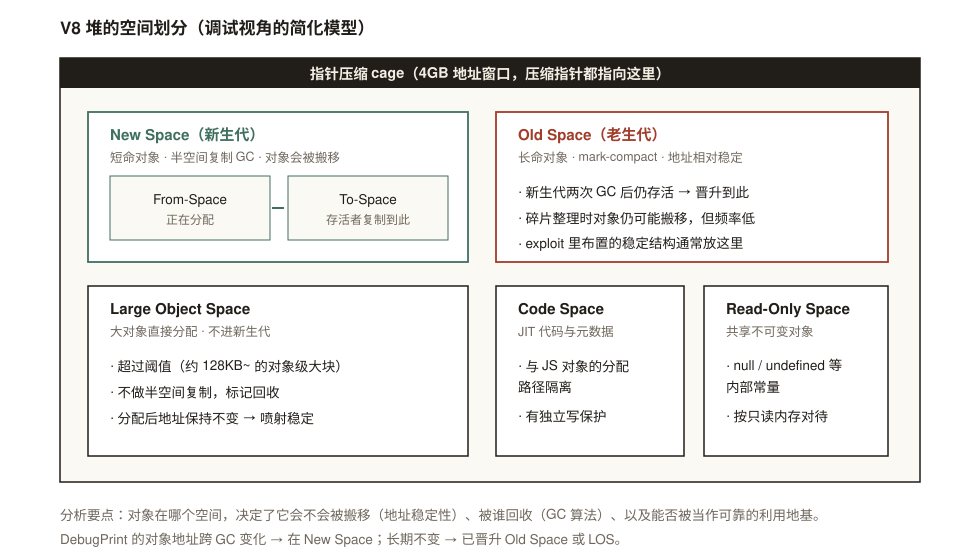
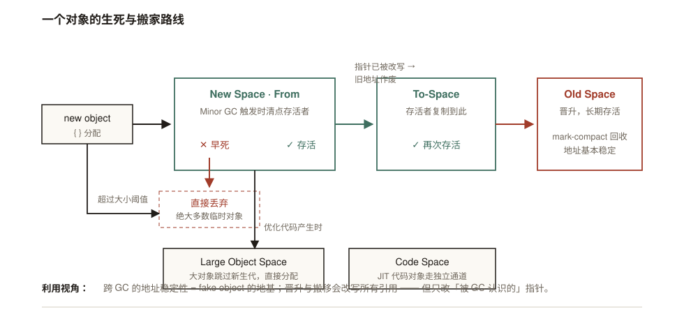

# V8 堆的内存布局

## 为什么安全分析要关心"对象住哪"

漏洞分析里有一个常被忽略的隐变量：**地址稳定性**。伪造对象需要一块"放进去什么、读出来还是什么"的内存；泄漏的指针要能在崩溃复现之间保持有效；GC 一旦搬移对象，所有指向它的指针都必须被改写。这些行为全部由"对象住在堆的哪个空间"决定——所以堆布局是内存模型的地基，不是背景知识。

> 本文的布局图为调试视角的简化模型，不代表所有 V8 版本的精确空间枚举。

## 一、堆的空间划分



| 空间 | 住着谁 | 回收方式 | 地址稳定性 |
|---|---|---|---|
| New Space（From/To） | 新创建、短命对象 | Minor GC，半空间复制 | **差**：每次 GC 存活者都被搬到 To-Space |
| Old Space | 晋升后的长命对象 | Major GC，mark-compact | 较好：仅整理碎片时搬移 |
| Large Object Space | 超过阈值的大对象 | 标记回收，不做复制 | **好**：分配后不动 |
| Code Space | JIT 代码与元数据 | 独立管理 | 独立通道，且有写保护 |
| Read-Only Space | null/undefined 等内部常量 | 不回收 | 最好：只读共享 |

每个空间对利用的意义不同：**Old Space 和 LOS 适合布置稳定结构**（地址不漂移），**New Space 的搬移语义**则是另一类漏洞的原材料——比如 [CVE-2024-23222](../jsc/CVE-2024-23222分析.md) 里，编译线程保存的旧 `JSCell` 引用在 GC 搬移/回收后变成悬垂指针。

## 二、一个对象的生死与搬家路线



用文字把流程再走一遍：

1. `{}` 分配 → 直接落在 **New Space 的 From-Space**。
2. Minor GC 触发：存活者被**复制**到 To-Space，死亡的直接丢弃（绝大多数临时对象死在这里）。
3. 复制过去之后，**所有指向它的引用被 GC 改写**——旧地址从此作废。
4. 再次 Minor GC 仍存活 → **晋升 Old Space**，此后只有 mark-compact 整理时才可能搬移。
5. 例外通道：大对象跳过新生代直接进 **LOS**；JIT 代码进 **Code Space**。

**这里有一个贯穿所有利用技术的推论**：GC 会忠实地改写"它认识的"指针——map、elements、properties、FixedArray 槽位里的压缩指针。但 GC 不认识的内存（double 数组里你亲手写的位模式、被误释放后残留的 stale 引用）它不会碰。**利用的本质，很大程度上就是让"GC 的世界观"和"内存的真实内容"出现一条缝，然后住进这条缝里。**

## 三、亲手验证地址稳定性

```js
// addr.js
let obj = {a: 1};
%DebugPrint(obj);          // 记下地址
for (let i = 0; i < 100; i++) { let junk = {x: i}; }  // 制造分配压力
gc();                       // d8 需要 --expose-gc
%DebugPrint(obj);          // 再看地址
```

```bash
./d8 --allow-natives-syntax --expose-gc addr.js
```

两种结果对应两个阶段：地址**变了**——对象还在 New Space，被半空间复制搬走了；地址**没变**——已被晋升到 Old Space。把这个实验的直觉带进调试：复现 UAF 时看到的"同一对象两个地址"、exploit 里 heap spray 为什么偏好触发晋升，都来自这条路线图。

## 四、这些空间都关在一个"笼子"里

以上所有空间，连同它们内部对象的压缩指针，都落在指针压缩的 **4GB cage 地址窗口**内。cage 决定了"一个指针只需要 4 字节就能表示"，也决定了 cage 内读写原语的攻击边界（拿到 cage 内读写 ≠ 任意进程内存读写——后者还需要跨出 cage，见现代 V8 沙箱的 external pointer table 等机制）。

压缩表示、tagged value 与解压细节在专文中展开：**[V8 指针压缩机制](V8指针压缩机制.md)**。

## 分析检查项

- 目标对象位于 New / Old / LOS 哪个空间——决定地址会不会变
- 崩溃现场与对象分配之间隔了几次 GC，指针是否已被搬移改写
- 利用的稳定结构（fake header、spray 对象）是否已晋升或进了 LOS
- 代码对象走 Code Space，别用普通对象的分析方法硬套
- 观察到的地址是否需要结合 cage base 解压还原

## 参考资料

1. [V8 Team, Trash talk: the Orinoco garbage collector](https://v8.dev/blog/trash-talk)
2. [V8 Team, Pointer Compression in V8](https://v8.dev/blog/pointer-compression)

> 站内相关：[V8 指针压缩机制](V8指针压缩机制.md) · [V8 数组的内存布局](V8%20数组的内存布局.md)（对象内部的字段布局） · [CVE-2024-23222 分析](../jsc/CVE-2024-23222分析.md)（GC 搬移语义被利用的真实案例）
